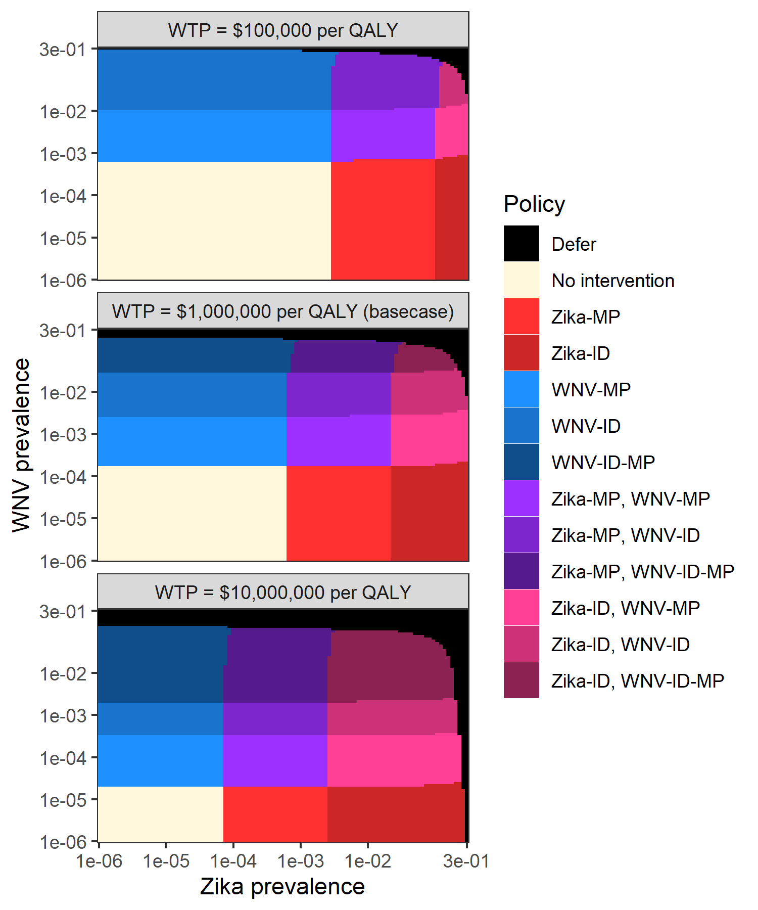

\newcommand{\E}{\mathbb{E}}
\newcommand{\Prob}{\mathbb{P}}
\newcommand{\C}{\mathcal{C}}
\newcommand{\ind}{\mathbb{1}}
\newcommand{\1}{\textbf{1}}


#### Blinded submission

<!--
#### W. Alton Russell^1^,  Brian Custer^2,3^, Margaret L. Brandeau^1^

<br> <br>

#### Running head: TBD

#### Word count: TBD 

<br> <br>

^1^Department of Management Science and Engineering, Stanford University, Stanford, CA

^2^Vitalant Research Institute, San Francisco, CA

^3^The University of California, San Francisco, San Francisco, CA   

<br> <br>

  

Corresponding author:   W. Alton Russell, Department of Management Science and Engineering, Stanford University, Stanford, CA, altonr@stanford.edu

<br> <br>

Abstract word count: XX

Text word count: XX

<br> <br>

Acknowledgements: Alton Russell was supported by a dissertation grant from Vitalant Research Institute as well by the Hsieh Family Fellowship, a Stanford Interdisciplinary Graduate Fellowship.


#####
-->

# Abstract

A safe supply of blood for transfusion is a critical component of the healthcare system in all countries. Most health systems manage the risk of transfusion-transmissible infections (TTIs) through a portfolio of blood safety interventions. These portfolios must be updated periodically to reflect shifting epidemiological conditions, emerging infectious diseases, and new technologies. However, the number of available blood safety portfolios grows exponentially with the number of available interventions, making it impossible for policy makers to evaluate all feasible portfolios without the assistance of a computer model. We develop a novel optimization model for evaluating blood safety portfolios that enables systematic comparison of all feasible portfolios of deferral, testing, and modification interventions to identify the portfolio that is preferred from a cost-utility perspective. We present structural properties that reduce the state space and required computation time in certain cases. We apply the model to retrospectively evaluate U.S. blood safety policies for Zika and West Nile virus for the years 2017, 2018, and 2019, defining donor groups based on season and geography. We find that the optimal portfolio varies geographically, seasonally, and over time. Our method enables systematic identification of the optimal blood safety portfolio in any setting and any time period, thereby supporting decision makers in efforts to ensure the safety of the blood supply.

<br>

**Keywords:** Blood safety, public health policy, binary integer programing, cost-effectiveness


#####

# 1. Introduction

> A safe supply of blood for transfusion is a critical component of the healthcare system in high-, middle-, and low-income countries alike [@WHOBlood2019]. In most health systems, the risk of transfusion-transmissible infections (TTIs) is managed through a portfolio of blood safety interventions. These portfolios consist of three types of interventions. *Donor deferral policies* turn away potential donors who have characteristics associated with increased risk for harboring a TTI. *Disease marker tests* are used to screen out donations with detectable disease markers. *Risk-reducing modifications* like pathogen inactivation or leukoreduction reduce the likelihood that a TTI, if present in a transfused donation, is transmitted to a recipient. Because of shifting epidemiological conditions, emerging infectious diseases, and new technologies, blood safety portfolios should be periodically reassessed. However, the number of available blood safety portfolios grows exponentially with the number of available interventions, making it impossible for policy makers to systematically enumerate, much less evaluate, all feasible portfolios without the assistance of a computer model. 

> In recent years, decision analytic modeling has played a growing role in informing decisions regarding blood safety portfolios. Because the health and economic consequences of a blood safety intervention depend on local epidemiological conditions, the existing blood safety portfolio, and the larger healthcare system, analyses of blood safety interventions are necessarily for a specific jurisdiction at a specific time. Most studies have been cost-utility analyses that incorporate relevant risks, costs, and health consequences. These studies typically consider adding or changing one intervention while keeping others constant. Such analyses have been conducted to evaluate disease marker tests [@Russell2019; @Custer2005; @Jackson2003; @Bish2015b; @Sanchez2016; @Teljeur2012], pathogen inactivation technologies (a new category of risk-reducing modifications) [@Bell2003; @Pereira1999; @Custer2010; @Agapova2015], and donor deferral policies [@deKort2014]. Methods have recently been proposed to systematically select a portfolio of disease marker tests for a specific context, assuming that deferral and modification interventions are held constant [@Bish2014; @Bish2011; @Bish2018]. These optimization-based frameworks are designed to ensure that risk is sufficiently reduced, with considerations for waste and robustness, but are not designed to evaluate changes in deferral or modification interventions and are not necessarily consistent with finding the optimal policy from a cost-utility perspective. 

> In this paper, we develop a new framework for evaluating blood safety portfolios that uses a definition of optimality that is consistent with standard cost-utility analysis methods [@Neumann2016]. In this framework, health outcomes are expressed as costs, and the optimal set of blood safety interventions minimizes the net present monetary cost of the blood safety portfolio and of any infectious donations that are released. Unlike currently available methods, this framework enables the systematic comparison of all feasible portfolios of deferral, testing, and modification interventions to identify the portfolio that is preferred from a cost-utility perspective.

> In the following sections, we derive our model by first introducing a simple model and progressively adding complexity. The model is a binary integer program (whether to implement each possible blood safety intervention). We present structural properties that reduce the state space and required computation time to find an optimal solution in certain cases, and we suggest a heuristic solution approach for problems that are too large to be solved exactly. We apply the model to analyze U.S. policies for two TTIs that have been difficult to manage due to geographical and seasonal variations in prevalence and infectiousness, Zika virus and West Nile virus. We conclude with a discussion of implications and potential extensions of our modeling framework.

# 2. Model Specification

> In this section we derive our model by first developing the components for donor deferral, risk-reducing modification, and disease marker testing. All notation is summarized in Table 1.

## 2.1 Donor deferral model

> We begin with a simplified model for deciding whether to accept a donation based on risk of a single TTI. A donation may be infectious for the TTI ($y=1$) or not ($y=0$), and the decision is to accept ($z=1$) or reject ($z=0$) the donation. If the donation is rejected (also called deferring the donor), a replacement cost $d$ is incurred because another donor must be recruited to meet demand. If the donation is accepted, a processing cost $w$ is incurred. We assume $w < d$; otherwise, the optimal decision would be to always reject donations regardless of blood safety concerns.

> If the donation is accepted and is infectious for the TTI ($z=1, y=1$) then, in the absence of testing or modification interventions, an infectious donation is released for transfusion. Because donations are typically fractionated into multiple components, one infectious donation can expose multiple recipients to infection. We use the variable $c$ to represent the expected net monetary cost of releasing an infectious donation. We estimate this cost as $c = l + \gamma q$, where $l$ is the net present expected cost of a breakthrough infectious donation, $\gamma$ is the decision maker's willingness to pay to avert the loss of one quality-adjusted life year (QALY), and $q$ is the net present expected QALYs lost. Estimating $c$ is a nontrivial exercise; its value depends on the TTI, the donor's stage of infection, transfusion recipient characteristics, and how recipient exposures are treated in a particular health system. 

> Using the above notation, we express the cost function $\C(y,z)$ as:

$$
\C(y,z) = \ind_{\{z=0\}}d + \ind_{\{z=1\}}w + \ind_{\{z=1, y=1\}}c.
$$
For TTIs of concern, we assume $c > d$ (the net monetary cost of releasing an infectious donation exceeds the replacement cost of rejecting a donation), which ensures that optimal decision is to reject a donation if it is known to be infectious. In practice, a blood center does not know whether a donation will be infectious, but several methods are available for estimating the risk, which we denote by $p = \Prob(y=1)$. 

> Given $p$, the optimal policy is to choose $z$ (accept or reject) such that the expected cost $\E [\C(z)]$ is minimized:

$$
\min_z \quad \E [\C(z \mid p)] = (1-z)d + z\big(pc + w\big).
$$

From this equation, one can see that a decision maker should be indifferent between rejecting and accepting the donation when $p = \frac{d-w}{c}$. When $p < \frac{d-w}{c}$, the optimal decision is to accept the donation ($z=1$), and when $p > \frac{d-w}{c}$, the optimal decision is to reject the donation ($z=0$).

> Policymakers are typically concerned about multiple TTIs. We now consider multiple TTIs indexed by $k=1, ..., K$. We define a vector $\textbf{y}$ where entry $y_k \in \{0, 1\}$ indicates whether the potential donation is infectious for TTI $k$, and a vector $\textbf{c}$ where entry $c_k = l_k + \gamma  q_k$ ($c_k \geq 0$) represents the expected cost of releasing a donation that is infectious for TTI $k$. Our new cost function is

$$
\C(\textbf{y},z) = \ind_{\{z=0\}}d + \ind_{\{z=1\}}[w + \textbf{y}^\top \textbf{c}].
$$
Taking the expectation, we obtain
$$
\E[\C(z \mid \textbf{p})] = (1-z)d + z\big(w + \textbf{p}^\top \textbf{c}\big),
$$

where $\textbf{p}$ is a vector for which $p_k = \Prob(y_k=1)$. The decision maker should reject the donation when $\textbf{p}^\top \textbf{c} > d - w$, accept when $\textbf{p}^\top \textbf{c} < d - w$, and be indifferent when $\textbf{p}^\top \textbf{c} = d - w$.

> Finally, we consider the case of deferral with multiple TTIs and donor groups. Rather than deciding whether to accept the entire potential donor population, policymakers often consider various donor groups, defined based on factors such as geographic location or the donor's response to a pre-donation questionnaire.  Donor groups may be defined in ways that facilitate temporary deferrals (e.g., "travel to Mexico within the past 60 days") or according to the level of demand for the donor's blood (e.g., by blood type).

> We assume that the potential donor population has been segmented into $I$ mutually exclusive and exhaustive groups indexed by $i$, and the decision to accept or reject donations from a specific group is represented by a vector $\textbf{z}$ with elements $z_i \in \{0, 1\}$. We introduce a prevalence matrix $\textbf{P}$ with rows that correspond to donor groups and with columns that correspond to TTIs. Entry $p_{ik}$ represents the risk of infectiousness for TTI $k$ in donations from donor group $i$ (i.e., $\Prob(y_k = 1 \mid i=i)$). We define $\textbf{d}$ where $d_i$ represents the replacement cost of a donation from group $i$. It is possible that donor groups have different associated processing costs, so we define $\textbf{w}$ where $w_i$ represents the cost of processing a donation from group $i$. Finally, we define $\textbf{n}$ where $n_i$ is the estimated number of donors from each group to present for donation in the period of analysis. Using this notation, the total expected cost of a given deferral policy is

$$
\E[C(\textbf{z} \mid \textbf{P})] =  \big((\1-\textbf{z} )\circ \textbf{n}\big)^\top  \textbf{d} + (\textbf{z} \circ \textbf{n})^\top(\textbf{w} + \textbf{P} \textbf{c}),
$$
where $\1$ is a vector of all 1's, in this case with length $I$.

## 2.2 Disease marker testing model

> We now consider disease marker testing. We start with the  case of one test for one TTI. We introduce a binary decision variable $a$, where $a=1$ if the test is used and 0 otherwise. The test has an associated cost $\phi$, sensitivity $r$, and specificity $q$. The probability of a positive test result is $r p+(1-q)(1-p)$ and the probability of a false negative is $(1-r)p$. We assume the blood center will always dispose of donations that test positive for a TTI, incurring a per donation cost of $g$ for a donation that tests positive. The constant $g$ should reflect the costs of any confirmatory testing, donor notification and counseling, and the cost of replacing the donation. Expected cost is

$$
\E [\C(z, a \mid p)] = (1-z)d + z\bigg(w + a\phi + ag\big(r p+(1-q)(1-p)\big) + a(1-r)pc + (1-a)pc \bigg).
$$
Note that not using a test is equivalent to using a test with sensitivity of 0 and specificity of 1; the expression $ra$ will equal $r$ when $a=1$ and $0$ when $a=0$t and the expression $1+a(q-1)$ will equal $q$ when $a=1$ and will equal $1$ when $a=0$. Using these, we can rewrite the cost function as

$$
\E [\C(z, a \mid p)] = (1-z)d + z\bigg(w + a\phi + ag(rp + (1-q)(1-p)) + (1-ra)pc  \bigg).
$$

> For the case of testing for more than one TTI, we define $\textbf{r}$ where $r_k$ is the sensitivity for detecting TTI $k$, $\textbf{q}$ where $q_k$ is the specificity for detecting TTI $k$, and $\textbf{p}$ is as defined above. The probability that a single test returns a negative result is $(1-p)q+p(1-r)$. The probability that *any* TTI tests positive is one minus the probability that *all* TTIs test negative and is computed as $s_1 = 1 - \prod_{k=1}^K \big[(1-p_k)  q_k+ p_k (1-r_k)\big]$. Using $s_1$, the expected cost for one test and multiple TTIs is

$$
\E [\C(z, a \mid \textbf{p})] = (1-z)d + z\Big(w + a\phi  + (1-s_1) ((\1-a \textbf{r}) \circ \textbf{p})^\top \textbf{c} + a g  s_1 \Big).
$$


> We now consider multiple tests and multiple TTIs. We assume that  tests are independent. We define a matrix $\textbf{Q}$ where $q_{jk}$ is the sensitivity of test $j$ for TTI $k$ and a matrix $\textbf{R}$ where $r_{jk}$ is the specificity of test $j$ for TTI $k$, and a vector $\boldsymbol{\phi}$ where $\phi_j$ is the cost of test $j$. We use the decision variable $\textbf{a}$ where $a_j=1$ when disease marker test $j$ is used. 

> Assuming that every available test is used, the probability of any positive result is $1 - \prod_{k=1}^{K} \prod_{j=1}^{J} [(1 - p_k) q_{jk} + p_k (1 - r_{jk})]$. Replacing $\textbf{R}_{jk}$ and $\textbf{Q}_{jk}$ with expressions that evaluate correctly when $a_j = 0$, we obtain $s_2 = 1 - \prod_{k=1}^{K} \prod_{j=1}^{J} [ (1 - p_k) (1 + a_j(q_{jk} - 1)) + p_k (1 - a_j r_{jk})]$. 

> To calculate the probability of a false negative test result for each TTI, we can take the element-wise product of $\textbf{p}$ and the following vector:

$$
\textbf{v}_1 = \begin{bmatrix}  \prod_{j=1}^J 1-r_{j1} a_j \\ \vdots \\ \prod_{j=1}^J 1-r_{jk} a_j \\ \vdots \\  \prod_{j=1}^J 1-r_{jK} a_j \end{bmatrix}
$$

> Using $\textbf{v}_1$ and $s_2$, the expected cost function for multiple tests and multiple TTIs is

$$
\E [\C(z, \textbf{a} \mid \textbf{p})] = (1-z)d + z\bigg(w + \textbf{a}^\top \boldsymbol{\phi}+ (1- s_2) (\textbf{v}_1 \circ \textbf{p})^\top \textbf{c}\Big)  + g s_2 \bigg).
$$

> Finally, we develop an expected cost function for the case of multiple tests, TTIs, and donor groups. We define the decision variable $\textbf{A}$ where $a_{ji} = 1$ if test $j$ is used on donor group $i$. To calculate the risk of each TTI in each group after tests are applied, we take the element-wise product of $\textbf{P}$ and the following matrix:

$$
\textbf{B}_1 = \begin{bmatrix} 
    \prod_{j=1}^J 1-r_{j1} a_{j1} &  & \dots \\
    \vdots & \prod_{j=1}^J 1-r_{jk} a_{ji} &\ddots \\
    \prod_{j=1}^J 1-r_{j1} a_{jI} &        & \prod_{j=1}^J 1-r_{jK} a_{jI}
    \end{bmatrix}.
$$

Additionally, we define a vector that represents the probability that a unit is disposed of in each donor group:

$$
\textbf{v}_2 = \begin{bmatrix} 
1 -  \prod_{k=1}^K \prod_{j=1}^J (1- p_{1k})(1+a_{j1} (q_{jk} - 1)) + p_{1k}(1- a_{j1} r_{jk}) \\
\vdots \\
1 -  \prod_{k=1}^K \prod_{j=1}^J (1- p_{ik})(1+a_{ji} (q_{jk} - 1)) + p_{ik}(1- a_{ji} r_{jk}) \\
\vdots \\
1 -  \prod_{k=1}^K \prod_{j=1}^J (1- p_{Ik})(1+a_{jI} (q_{jk} - 1)) + p_{Ik}(1- a_{jI} r_{jk})
\end{bmatrix}.
$$

> Using $\textbf{B}_1$ and $\textbf{v}_2$, the expected cost function for multiple donor groups, TTIs, and tests is

$$
\E [\C(\textbf{z}, \textbf{A} \mid \textbf{P})] = \big((\1-\textbf{z} )\circ \textbf{n}\big)^\top  \textbf{d} + (\textbf{z} \circ \textbf{n})^\top \Big(\textbf{w} +  \textbf{A}^\top\boldsymbol{\phi} + (1- \textbf{v}_2)(\textbf{B}_1 \circ \textbf{P} ) \textbf{C} + g\textbf{v}_2 \Big).
$$

## 2.3 Risk-reducing modification model

> Risk-reducing modifications (e.g., pathogen inactivation or leukoreduction) can decrease the risk of TTI in components derived from blood donations. We first consider one available modification and one TTI. We define $h \in [0,1]$ as the risk-reduction multiplier for the modification and $\psi$ as the per-donation cost. Often, modifications are applied to only some of the components derived from a donation rather than the whole donation. For example, pathogen inactivation is currently FDA approved for platelet and plasma components but not red blood cells [@Staley2019]. In this case, either $h$ can be scaled proportionally to the fraction of components modified or the same TTI in different components can be modeled as different TTIs (e.g. HIV in platelets vs. HIV in red blood cells). Because not applying a modification is equivalent to applying a modification with a risk multiplier of 1, we use the expression $1 + m(h-1)$, which equals 1 when $m=0$ and $h$ when $m=1$. Expected cost is

$$
\E [\C(z, m \mid p)] = (1-z)d + z\bigg(w + m\psi + (1 + m(h-1))pC \bigg).
$$

> A modification can sometimes reduce the risk of multiple TTIs. We model this by introducing $\textbf{h}$ where $h_k$ is the risk-reduction multiplier for TTI $k$. The expected cost for a single modification with multiple TTIs is

$$
\E [\C(z, m \mid \textbf{p})] = (1-z)d + z\bigg(w + m\psi + \big((\1+m(\textbf{h}-\1)) \circ \textbf{p}\big)^\top \textbf{c} \bigg).
$$

> Often multiple modifications are available, each of which might reduce the risk for multiple TTIs. To model this, we define the vector $\boldsymbol\psi$ where $\psi_l$ is the cost for modification $l$, and $\textbf{H}$ where $h_{lk}$ is the risk-reduction multiplier for modification $l$ and TTI $k$. We replace the single decision variable $m$ with the vector $\textbf{m}$ where $m_l=1$ if modification $l$ is added to the portfolio. The product of risk-reducing multipliers for each modification in use can be calculated as follows:

$$
\textbf{v}_3 = \begin{bmatrix} 
    \prod_{l=1}^L 1 + m_{l} (h_{l1} - 1) \\
    \vdots \\
    \prod_{l=1}^L 1 + m_{l} (h_{lk} - 1) \\
    \vdots \\
    \prod_{l=1}^L 1 + m_{l} ( h_{lK} - 1) 
    \end{bmatrix}.
$$


Using this, the new expected cost is

$$
\E [\C(z, \textbf{m} \mid \textbf{p})] = (1-z)d + z\bigg(w + \textbf{m}^\top \boldsymbol\psi + \big(\textbf{v}_3 \circ \textbf{p}\big)^\top \textbf{c} \bigg).
$$

> Lastly, we integrate the model for multiple modifications with the model for multiple donor groups. We define a new decision variable $\textbf{M}$ where $m_{li}=1$ if modification $l$ is used on donor group $i$. Because each element in $\textbf{P}$ must be multiplied by the product of any risk-reduction modifiers that are used in that sub-population, we define the following matrix:


$$
\textbf{B}_2 = \begin{bmatrix} 
    \prod_{l=1}^L 1 + m_{l1} (h_{l1} - 1) &  & \dots \\
    \vdots & \prod_{l=1}^L 1 + m_{li} (h_{lk} - 1) &\ddots \\
    \prod_{l=1}^L 1 + m_{lI} ( h_{l1} - 1) &        & \prod_{l=1}^L 1 + m_{lI} ( h_{lK} - 1) 
    \end{bmatrix}.
$$

Using this, the expected cost with multiple donor groups and modifications is as follows:

$$
\E [\C(\textbf{z}, \textbf{M} \mid \textbf{P})] = \big((\1-\textbf{z} )\circ \textbf{n}\big)^\top  \textbf{d} + (\textbf{z} \circ \textbf{n})^\top \Big(\textbf{w} +  \textbf{M}^\top \boldsymbol{\psi} + (\textbf{B}_2 \circ \textbf{P} ) \textbf{c} \Big).
$$

## 2.4 Optimal portfolio model

> We can now write the expected cost function for a portfolio containing any combination of donor deferral policies, disease marker tests, and risk-reducing modifications:

$$
\E [\C(\textbf{z}, \textbf{M}, \textbf{A} \mid \textbf{P})] = \big((\1-\textbf{z} )\circ \textbf{n}\big)^\top  \textbf{d} + (\textbf{z} \circ \textbf{n})^\top \Big(\textbf{w} +  \textbf{A}^\top\boldsymbol{\phi} + \textbf{M}^\top \boldsymbol{\psi} + (1- \textbf{v}_2)(\textbf{B}_1 \circ \textbf{B}_2 \circ \textbf{P} ) \textbf{c} + g\textbf{v}_2 \Big).
$$

> This cost function expresses the net present net monetary cost of a policy (all future costs are discounted to the present when calculating $\textbf{c}$). The first term in the above expression is the cost of deferral, if a donation is deferred. The second term is the cost incurred if the donation is not deferred and includes (in the bracketed term) the costs of processing, testing, and modifying a donation plus the expected cost incurred from release of any infectious donations.

> The optimal combination of interventions solves the following optimization problem:

$$
\begin{aligned}
\min_{\textbf{z}, \textbf{M}, \textbf{A}} \quad & \E [\C(\textbf{z}, \textbf{M}, \textbf{A} \mid \textbf{P})]\\
\textrm{s.t.} \quad & m_{li} = a_{ji} = 0 \quad \forall l,j \quad \text{ when } \quad z_i=0
\end{aligned}
$$
The constraint ensures that no tests or modifications are applied to deferred donor groups. 

> The above formulation allows each non-deferred donor group to receive a tailored portfolio of tests and modifications, but many health systems use the same set of tests and modifications for all accepted donations regardless of donor group. Such policies may produce less benefit at a fixed willingness-to-pay as compared to tailored policies, but they are easier to implement and might be perceived as fairer. To consider only universal testing and modification policies, two additional constraints can be introduced:

$$
\begin{aligned}
\min_{\textbf{z}, \textbf{M}, \textbf{A}} \quad & \E [\C(\textbf{z}, \textbf{M}, \textbf{A} \mid \textbf{P})]\\
\textrm{s.t.} \quad & m_{li} = a_{ji} = 0 \quad \forall l,j \quad \text{ when } \quad z_i=0\\
& m_{li_1} = m_{li_2} \quad \forall i_1, i_2 \quad \text{when} \quad z_{i_1} = z_{i_2} = 1\\
& a_{ji_1} = a_{ji_2} \quad \forall i_1, i_2 \quad \text{when} \quad z_{i_1} = z_{i_2} = 1
\end{aligned}
$$


> The cost function can be used to derive many other performance measures, summarized in Table 2, that may be more interpretable to policymakers. These include, for example, the number of donors deferred, the donation yield, and the number of infectious donations released. Performance measures can also be used to impose additional constraints on the optimization problem. For instance, one could limit the number of donors deferred ($\big((\1-\textbf{z} )\circ \textbf{n}\big)^\top  \textbf{1} \leq \pi$, where $\pi$ is an upper bound) or the total budget for tests and modifications ($(\textbf{z} \circ \textbf{n})^\top (\textbf{A}^\top \boldsymbol{\phi} + \textbf{M}^\top \boldsymbol{\psi}) \leq \rho$, where $\rho$ is an upper bound).


# 3. Optimal portfolio model solution

> The optimal portfolio model is a binary integer program. The exact solution can be found using exhaustive search. If tailored testing and modification policies for each donor group are allowed, there will be $\sum_{i=0}^I \binom{I}{i} 2^{i(L+J)}$ feasible policies. If only universal testing and modification policies are considered, the feasible state space will be $1+\sum_{i=1}^I \binom{I}{i} 2^{(L+J)}$ which is smaller by a factor of approximately $2^i$. Because the state space increases exponentially in the number of available interventions, exhaustive search is not feasible for larger problems. Here we describe structural propoerties that allow for more efficient identification of the optimal policy in certain cases. 

## 3.1 Tailored policies

> When policies can be tailored to individual donor groups, the objective function is linearly separable, and we can solve a single, smaller optimization problem for each donor group. In this case we can identify the optimal portfolio by evaluating $I \times 2^{L+J}$ policies, rather than the $\sum_{i=0}^I \binom{I}{i} 2^{i(L+J)}$ evaluated by exhaustive search.

## 3.2 Elimination of infeasible tests or modifications

> Eliminating some tests or modifications from consideration in advance can considerably reduce the time needed to find a solution. We can do so by leveraging the following theorem.

<br>

**Theorem 1:** *If use of a single test or modification is never preferred over using no interventions in any donor group it cannot be part of an optimal portfolio.*

<br>

To see why this theorem holds, consider the following. Tests and modifications reduce the cost function by reducing the multipliers on the expected cost of releasing an infectious donation (i.e., making the term $(1- \textbf{v}_2)(\textbf{B}_1 \circ \textbf{B}_2 \circ \textbf{P} ) \textbf{c}$ smaller by decreasing one or more entries in $(1 - \textbf{v}_2)$ and $\textbf{B}_1$ [tests] or $\textbf{B}_2$ [modifications]). Addition of a test or modification will generate the greatest reduction in expected cost when the term  $(1- \textbf{v}_2)(\textbf{B}_1 \circ \textbf{B}_2 \circ \textbf{P} ) \textbf{c}$ is largest, i.e. when no interventions are in use. Therefore, any test or modification that is part of an optimal portfolio will be preferred over no intervention in at least one donor group. 

> When interventions can be tailored to donor groups, another strategy that can reduce computation time is to pre-determine the optimal policy for some donor groups without evaluating all possibilities. This can be done for a donor group with a prevalence of 0 for all TTIs of concern, since no intervention would be the preferred policy so long as $d_i > w_i$.

## 3.3 Mapping the optimal policy to prevalence

> When donor groups are identical except for the number of donors ($n_i$) and the prevalence of each TTI ($p_{ik}$), then a $k$-dimensional function $f(\textbf{p})$ mapping the prevalence by TTI to the optimal policy can be defined as follows:

$$
(\textbf{m}, \textbf{a}, z)^* = f(\textbf{p}), \quad  \text{where} \text{ } f(\textbf{p}) = {\arg\min}_{\textbf{m}, \textbf{a}, z} \E [\C(z, \textbf{m}, \textbf{a}, \textbf{p}) ]
$$

When the number of donor groups is large relative to the number of tests and modifications, it can be more efficient to approximate this function than to explicitly evaluate each donor group separately.


# 4. Case study: West Nile and Zika Virus in the U.S.

> Both West Nile virus (WNV) and Zika virus are most often transmitted by mosquitos but can also be transmitted by blood transfusion [@Busch2019]. For both diseases, more than 70% of infected individuals have no symptoms [@Duffy2009; @Petersen2013], creating a high risk of collecting a donation from a donor who is unaware of their infection. Incidence of both viruses varies geographically, seasonally, and annually, largely due to differences in mosquito populations, necessitating regular reassessment of blood safety policy. Available interventions include nucleic acid testing (NAT), pathogen inactivation, and donor deferral. Currently, the United States mandates year-round mini-pooled (MP-)NAT testing for both Zika and WNV in all areas and requires that regions temporarily escalate to individual donation (ID-)NAT for WNV following the detection of a confirmed positive donation [@FDA2018; @FDA2009].


## 4.1 Model instantiation

> We applied our model to identify the optimal combinations of blood safety interventions for preventing transfusion-transmitted Zika and WNV in blood products derived from whole blood donations in the U.S. We considered four screening tests (ID-NAT and MP-NAT for Zika and WNV) and one risk-reducing modification (pathogen inactivation in plasma components). We segmented donors into groups based on location and season. We identified the optimal portfolio separately for 2017, 2018, and 2019, and we compared this portfolio to no intervention and to universal MP-NAT for Zika and WNV. Parameter values, shown in Table 3, were derived from the academic literature, Centers for Disease Control and Prevention (CDC) reports, and personal communications with blood safety experts. The optimization model was programmed in R. To estimate the harms of releasing a Zika- or WNV-infectious donation into the blood supply we developed microsimulation models of transfusion recipient outcomes in Python.

### Tests and modifications

> We evaluated ID-NAT and MP-NAT for both WNV and Zika. In MP-NAT, the test is run on a pooled sample of 6-16 donations, with subsequent individual donation testing for any minipool that is initially reactive. MP-NAT can reduce the number of tests run per sample and therefore has a lower per-donation cost than ID-NAT [@Ellingson2017a], but also a lower sensitivity. However, because the minipooled testing procedure requires both a reactive minipool and a subsequent reactive ID-NAT test, the risk of a false positive is much smaller than with ID-NAT.

> Pathogen inactivation  (PI) is a modification that can greatly reduce the transmission risk for many types of viruses and bacteria, including lipid-enveloped retroviruses like Zika and WNV [@Prowse2012]. PI is currently only approved in the U.S. for treating plasma or platelet components, not whole blood donations or red cell components. Because platelet PI is typically done for apheresis rather than whole blood-derived platelets, we only included PI of whole blood-derived plasma as a possible blood safety intervention. We assumed that PI decreases risk of transmission by plasma exposure by 99% for both Zika and WNV. Based on our calculations using the 2015 National Blood Collection and Utilization Survey [@Ellingson2017], plasma exposure accounts for 36% of the transfusion-transmission risk of an infectious whole blood donation, yielding a per-donation risk reduction multiplier of approximately 65%.

### Donor groups

> We segmented U.S. donors, including those in Puerto Rico, geographically by 3-digit zip code and seasonally, with donations collected between June and November considered high mosquito season donations. To estimate the number of people in each 3-digit zip code for each year 2017-2019, we multiplied 2010 U.S. census population estimates by the estimated population change for each state [@Census2020]. We estimated the total number of annual whole blood donations from the 2015 National Blood Collection and Utilization Survey (NBCUS) [@Ellingson2017] for the 50 states and D.C. and from a previous analysis for Puerto Rico [@Russell2019]. We assumed that the number of donations collected in each zip code was proportional to population and evenly distributed across the high and low mosquito seasons. To estimate the probability that a donation was infectious for a TTI, we used testing yield data from AABB biovigilance reports for WNV and ZIKV for the years 2017, 2018, and 2019 [@AABB2020A; @AABB2020B]. We treated initially reactive donations that did not undergo confirmatory testing as fractions of a case, equal to the positive predictive value for that TTI in that year. 

> To analyze how donor segmentation impacts the optimal portfolio, we also performed an analysis where donors were segmented by state instead of by 3-digit zip code. Puerto Rico and Washington D.C. were treated as states for the state-level analysis, and the probability of an infectious blood donation was based on CDC data on viremic blood donations interdicted by testing each year [@CDC_WNV2020; @CDC_ZIKV2020]. The risk assigned to a state was assumed to be proportional to the number of CDC-reported symptomatic cases for that area [@CDC_WNV2020; @CDC_ZIKV2020]. Supplemental Table S3 contains data for the state-level donor groups. A link to the public repository containing similar data for zip code-level donor groups will included in the unblinded manuscript.

### Costs and QALYs

> A 2014 analysis in the Netherlands estimated that the cost of a donation visit resulting in deferral cost the donor €16 in lost time and transportation and cost the blood center €2.65 -- €31.82 depending on whether the donor was a routine donor or a first-time donor who needed to be recruited [@deKort2014]. The cost of recruiting, inviting, and evaluating a replacement donor was €2.58 -- €31.25, yielding a total deferral cost of €21.23 for routine donors and €79.07 for first-time donors. Donors who are deferred are less likely to present to donate in the future than those who donate successfully [@Custer2004], an additional cost not captured in the 2014 analysis. No data were available for the U.S., so we assumed that the replacement cost for a deferred donor in the U.S. was $90. We also assumed a donation processing cost of $20 and a donation disposal cost of $60, which reflects confirmatory testing and donor notification costs.

> To estimate the societal costs (medical expenses and productivity loss due to illness and death) and QALYs lost that result from transfusion-transmission, we developed separate microsimulations for each disease (Zika and WNV). Figure 1 shows the decision tree structures for the two models and Supplemental Tables S1 and S2 show all model parameters. We adapted the model structures from a prior study [@Russell2019]. Both models simulated individual transfusion recipients whose age, sex, and number of red blood cell, platelet, and plasma components transfused followed a similar distribution to transfusion recipients in the U.S. The expected post-transfusion survival for each recipient was calculated as a function of age and the number and type of blood components transfused [@Russell2019]. For the Zika model, we adapted parameters including probabilities, costs, and QALY multipliers for Zika fever and more severe sequelae from the prior publication and updated to 2019 US dollars using the personal healthcare component of the National Health Expenditure Data provided by the Centers for Medicare and Medicaid Services [@CMS2019]. We used the Consumer Expenditure Surveys by the U.S. Bureau of Labor Statistics [@USBLS2020] to estimate age-specific probability loss due to illness or premature death (for premature death, consumption was netted from productivity).The Zika model also captured costs and QALY losses due to secondary sexual or congenital transmission of Zika to a transfusion recipient's sexual partner or offspring (Figure 1A). In the WNV model, recipients could experience asymptomatic infection, acute WNV fever, or one of three neurological diseases (meningitis, encephalitis, or acute flaccid paralysis). Secondary transmission was not modeled (Figure 1B). Transfusion recipients experiencing acute disease were also at risk for long-term disability. We developed the WNV model using parameter values from a recent cost-effectiveness analysis of a WNV vaccine [@Shankar2017] and a study of the costs of WNV infection [@Staples2014] with costs updated to 2019 US dollars. In both microsimulations, costs and QALYs lost were discounted to the present using an annual discount rate of 3%.

> The recipient microsimulations estimate the outcomes for recipients who receive different numbers and types of whole blood-derived components. We estimated the average outcome by component type with the following weighted average approach:

$$
\bar{O^k_u} = \frac{ \sum_i h^u_i O^k_i}{\sum_{i} h_i^u} \quad \text{for} \quad u=1,2,3
$$

where outcome $O^k$ is cost incurred or QALYs lost due to disease $k$, $u$ is the blood component type, $i$ indexes individual transfusion recipients, and $h_i^u$ is the number units of component $u$ transfused to recipient $i$. To estimate the expected net health costs of releasing an infectious donation, the average number of components transfused per whole blood donation collected was estimated from the 2015 NBCUS [@Ellingson2017] and the component-specific probability of transfusion-transmission for both WNV and Zika was estimated from prior studies [@Russell2019; @Custer2005b]. The expected value of the outcomes (cost and QALY loss) per donation were calculated as follows:

$$
\bar{O}^{k} = \sum_u  ( \zeta^k_u )( \lambda_u) \bar{O}^k_u
$$
where $\zeta^k_u$ is the probability that disease $k$ is transmitted to a recipient exposed to an infectious component of type $u$, and $\lambda_u$ is the average number of units of component type $u$ produced per whole blood donation. We used this method to estimate both costs and QALYs lost, which were used to calculate net health cost assuming a willingness-to-pay threshold of $1 million per QALY in the base case [@Custer2009].


### Uncertainty analysis

> We performed probabilistic sensitivity analysis by repeating the analysis 10,000 times using input parameters randomly sampled from the probability distributions listed in Table 3 and Supplemental Tables S1 and S2. We calculated performance metrics and tracked how often each intervention was part of the optimal portfolio for each donor group across all 10,000 iterations. Prevalence and willingness-to-pay were not varied in probabilistic sensitivity analysis but were analyzed in scenario analysis. To do so, we first estimated the optimal policy for a single donor group as a function of WNV and Zika prevalence by computing the optimal policy for 10,000 pairs of WNV and Zika prevalence values. To assess the impact of varying willingness-to-pay, we repeated this analysis for values of $100,000 and $10,000,000 per QALY, in addition to the base case value of $1,000,000 per QALY.

## 4.2 Results of case study
```{r setup, include = FALSE}
knitr::opts_knit$set(root.dir = "G:/My Drive/Blood Transfusion/Optimal portfolio/blood portfolio r project")
```


```{r include = FALSE}
library(googlesheets4)
library(data.table)
library(scales)
library(flextable)
library(officer)
library(gmp) #for bigz for evaluating numbers too large for r

options(Encoding="UTF-8")

param_table_WNV <- data.table(read_sheet("1Yjfq0SINstVPrszWYx9uJEYcqChxvGM1RIoR8uZe-sw", sheet = "wnv_nmc"))
param_table_ZIKV <- data.table(read_sheet("1Yjfq0SINstVPrszWYx9uJEYcqChxvGM1RIoR8uZe-sw", sheet = "zikv_nmc"))
params <- data.table(read_sheet("1Yjfq0SINstVPrszWYx9uJEYcqChxvGM1RIoR8uZe-sw", sheet = "params"))
donor_groups_state <- data.table(read_sheet("1Yjfq0SINstVPrszWYx9uJEYcqChxvGM1RIoR8uZe-sw", sheet = "donor_groups"))
donor_groups_zip3 <- fread('data/donor_groups_zip3.csv')
# Translate variable sheet into matrices for analysis
vars = unique(params$key)
for (var in vars){
  if(is.na(params[key == var]$row_idx[1])){
    eval(call("<-", as.name(var), params[key == var, Basecase]))
  } else {
    eval(call("<-", as.name(var), matrix(params[key == var, Basecase], ncol = params[key == var, max(col_idx)])))
  }
}

K = length(c_k) #number of diseases
J = length(R_jk[,1])
L = length(c_mod_l)

# dollar_format(largest_with_cents = 1e2)

# Read in results
basecase_states <- fread("results/opt_by_state_basecase.csv")
basecase_zip <- fread("results/opt_by_zip3_basecase.csv")

psa_metrics_zip <- fread("results/PSA_zip3_metrics_combined.csv")
psa_percents_zip <- fread("results/PSA_zip3_opt_by_group_combined.csv")[ , lapply(.SD, sum), .SD = 3:8, by = c("group", "year")]
psa_percents_zip[ , z := (10000 - z)/10000]
psa_percents_zip[, c("a1", "a2", "a3", "a4", "m1") :=lapply(.SD, function(x) x/10000), .SDcols=4:8]
psa_percents_zip[ , STUSPS := substr(group, 1, 2)]
psa_percents_zip[ , season := substr(group, 13, 13)]
psa_percents_zip[ , zip3 := substr(group, 4, 6)]

psa_metrics_states <- fread("results/PSA_metrics_combined.csv")
psa_percents_states <- fread("results/PSA_opt_by_group_combined.csv")[ , lapply(.SD, sum), .SD = 3:8, by = c("group", "year")]
psa_percents_states[ , z := (10000 - z)/10000]
psa_percents_states[, c("a1", "a2", "a3", "a4", "m1") :=lapply(.SD, function(x) x/10000), .SDcols=4:8]
psa_percents_states[ , STUSPS := substr(group, 1, 2)]
psa_percents_states[ , season := substr(group, 4, 4)]


# Microsim output
WNV_basecase <- colMeans(fread("NMC_sim/output/WNV_basecase_1e7_output.csv"))
ZIKV_basecase <- colMeans(fread("NMC_sim/output/ZIKV_basecase_1e7_output.csv"))
WNV_PSA <- fread("results/PSA_WNV_NMC.csv")
ZIKV_PSA <- fread("results/PSA_ZIKV_NMC.csv")
# 
# twosig <- function(value){
#   return()
# }

cash <- function(value){
  return(dollar(value, largest_with_cents = 1e2))
}

I_peryear = nrow(psa_percents_zip)
n_pol = 0; for(i in 1:I_peryear){ n_pol = as.bigz(n_pol + choose(I_peryear, i)*2^(i*(L+J)))}

n_pol <- paste0(substr(n_pol, 1, 1),".",substr(n_pol, 2, 3), "e", nchar(as.character(n_pol)) - 1)
```

```{r include = FALSE, eval = FALSE}
basecase_zip[ , sum(a1), by = c("year", "season")]
basecase_zip[ , sum(a2), by = c("year", "season")]
basecase_zip[ , sum(a3), by = c("year", "season")]
basecase_zip[ , sum(a4), by = c("year", "season")]
basecase_zip[a1+a2+a3+a4 > 0, .N, by = c("year", "season")]

# PSA iterations
psa_percents_zip[a3+a4 > 0 & season == "H", .N, by=year]

# Zika residual risk
temp <- dcast(psa_metrics_zip[resid_risk1 > 0], year+iter~policy, value.var = "resid_risk1")[, reduct_opt := ifelse(is.na(1-Optimal/`No intervention`), 0, 1-Optimal/`No intervention`)]
temp[, reduct_univMP := ifelse(is.na(1-`Universal MP-NAT`/`No intervention`), 0, 1-`Universal MP-NAT`/`No intervention`)]
quantile(temp$reduct_opt, c(0.025, 0.975), na.rm = TRUE)
quantile(temp$reduct_univMP, c(0.025, 0.975), na.rm = TRUE)

# WNV residual risk
temp <- dcast(psa_metrics_zip, year+iter~policy, value.var = "resid_risk2")[, reduct_opt := (1-Optimal/`No intervention`)]
temp[, reduct_univMP := ifelse(is.na(1-`Universal MP-NAT`/`No intervention`), 0, 1-`Universal MP-NAT`/`No intervention`)]
quantile(temp$reduct_opt, c(0.025, 0.975), na.rm = TRUE)
quantile(temp$reduct_univMP, c(0.025, 0.975), na.rm = TRUE)

# NMC Zip
temp <- dcast(psa_metrics_zip, year+iter~policy, value.var = "downsteam_NMC")[, reduct_opt := (1-Optimal/`No intervention`)]
quantile(temp$reduct_opt, c(0.025, 0.975), na.rm = TRUE)

# NMC state
temp <- dcast(psa_metrics_states, year+iter~policy, value.var = "downsteam_NMC")[, reduct_opt := (1-Optimal/`No intervention`)]
quantile(temp$reduct_opt, c(0.025, 0.975), na.rm = TRUE)


```

> Releasing a Zika-infectious donation would result in an estimated average loss of `r signif(ZIKV_basecase["QALYL_per_donation"], 2)` QALYs (95% CrI, `r signif(quantile(ZIKV_PSA$QALYL_per_donation, 0.025), 2)` -- `r signif(quantile(ZIKV_PSA$QALYL_per_donation, 0.975), 2)` QALYs) and `r cash(ZIKV_basecase["cost_per_donation"])` in societal costs (95% CrI, `r cash(quantile(ZIKV_PSA$cost_per_donation, 0.025))` -- `r cash(quantile(ZIKV_PSA$cost_per_donation, 0.975))`). Releasing a WNV-infectious donation would result in an estimated average loss of `r signif(WNV_basecase["QALYL_per_donation"], 2)` QALYs (95% CrI, `r signif(quantile(WNV_PSA$QALYL_per_donation, 0.025), 2)` -- `r signif(quantile(WNV_PSA$QALYL_per_donation, 0.975), 2)` QALYs) and `r cash(WNV_basecase["cost_per_donation"])` in societal costs (95% CrI, `r cash(quantile(WNV_PSA$cost_per_donation, 0.025))` -- `r cash(quantile(WNV_PSA$cost_per_donation, 0.975))`). Using a willingness-to-pay of \$1 million per QALY gained, the estimated expected net monetary cost of releasing an infectious donation for transfusion was `r cash(ZIKV_basecase["NMC_per_donation"])` (95% CrI, `r cash(quantile(ZIKV_PSA$NMC_per_donation, 0.025))` -- `r cash(quantile(ZIKV_PSA$NMC_per_donation, 0.975))`) for Zika and `r cash(WNV_basecase["NMC_per_donation"])` (95% CrI, `r cash(quantile(WNV_PSA$NMC_per_donation, 0.025))` -- `r cash(quantile(WNV_PSA$NMC_per_donation, 0.975))`) for WNV. 

> Each year there were `r n_pol` possible portfolios tailored by season and 3-digit zip code. Linear separability allowed us to identify the optimal portfolio by evaluating 32 policies for each of the `r 2*length(unique(psa_percents_zip$zip3))` zip code and season combinations. We further reduced the number of policies evaluated by pre-determining that the optimal policy in donor groups with no Zika or WNV-infectious donations must be no intervention, which was the case for most zip codes during the high mosquito season (76% in 2017, 72% in 2018, and 91% in 2019) and for even more zip codes during the low mosquito season (95% in 2017, 96% in 2018, and 99% in 2019). The number of remaining donor groups for which all policies were evaluated was 257 for 2017, 285 for 2018, and 82 for 2019.

> In the  base case analysis, WNV testing was optimal in many of the remaining zip codes during the high mosquito season (118 zip codes in 2017; 134 in 2018; 40 in 2019) and was optimal during the low mosquito season in one zip code each year. WNV MP-NAT was optimal in most donor groups (118 in 2017; 127 in 2018; and 40 in 2019), but WNV ID-NAT was optimal for a few zip codes during the high mosquito season (1 in 2017; 8 in 2018; 1 in 2019). In probabilistic sensitivity analysis (PSA), all four tests were part of the optimal portfolio in some iterations for some years, and the geographical distribution of areas for which screening was optimal varied considerably from year to year (Figure 2; Supplemental Table S5). Pathogen inactivation and donor deferral were not part of the optimal portfolio in the base case nor in any PSA iteration.

> Table 4 compares the performance of the optimal policy each year to universal MP-NAT and to no intervention. The optimal portfolio reduced test costs by over 95% compared to universal MP-NAT screening each year. The optimal portfolio prevented fewer infectious donations from being released compared to no screening (0% -- 14% each year for Zika; 51% -- 83% each year for WNV) than did universal MP-NAT (97% -- 99% each year for Zika; 92% -- 98% each year for WNV). 

> The optimal policy for each donor group was a function of Zika and WNV prevalence. The optimal policy ranged from no intervention for low Zika and WNV prevalence levels to deferral for high prevalence levels, with various testing combinations indicated for intermediate prevalence levels. As Figure 3 shows, increasing the willingness-to-pay threshold makes it optimal to apply interventions at lower prevalence levels. 

> Figure 4 shows six per-donation performance measures for the optimal policy as a function of Zika and WNV prevalence: test cost; cost of removing and replacing donations that test positive; downstream net monetary cost; total net monetary cost (the objective function); and residual Zika and WNV risk. For a single donation, the objective function can range from the donation processing cost ($20) when TTI prevalence is 0 to the donor deferral replacement cost ($90) at sufficiently high TTI prevalence. Discontinuities in performance measures as a function of prevalence correspond to the decision boundaries between different intervention portfolios. These figures show how the optimal portfolio trades off costs of testing, deferral, and of releasing infectious donations at different combinations of TTI prevalence. The objective function is a combination of these performance measures and thus is a smoother function of TTI prevalence.

> In the state-level analysis, the only intervention that was part of the optimal portfolio was WNV MP-NAT, which was optimal during the high mosquito season in five states in 2017 (ND, SD, NE, NV, and MS) and in five states in 2018 (ND, SD, NE, MT, and IA). In 2019 it was optimal to use no intervention. In PSA, Zika testing was sometimes optimal in Puerto Rico in 2017 (with MP-NAT preferred in 19.6% of iterations and ID-NAT preferred in 0.94%). For many states, WNV MP- or ID-NAT was optimal in some PSA iterations (Figure S2). Compared to the optimal zip code-level analysis, the optimal state-level analysis had a lower test cost but reduced a much smaller proportion of the net monetary cost as compared to no testing (0% -- 50% for state-level donor groups, compared to 51% -- 83% for zip code-level donor groups; Supplemental Table S4). This is because grouping donors at the state level allows for less distinction in risk – and thus less distinction in the corresponding policy – than grouping donors at the zip code level.

#####

# 5. Discussion

> Selecting a portfolio of blood safety interventions is a substantial challenge for blood collection agencies and regulatory bodies worldwide. Epidemiologic variations lead to changes in TTI risk across populations and over time, and the characteristics of available interventions change as economic conditions shift and new technologies become available. Thus, blood safety portfolios must be optimized for local conditions and reassessed periodically. Our framework allows us to identify the optimal portfolio from a set of deferral, testing, or modification interventions for any set of TTIs.

> Our evaluation of interventions for WNV and Zika in the U.S. in 2017, 2018, and 2019 found that the optimal portfolio varied considerably by season, year, and geographic region. Our analysis was limited to whole blood donations. A similar analysis could be performed for apheresis platelet, plasma, or red blood cell donations. Use of plasma pathogen inactivation was never optimal in our analysis, but our analysis considered only two of the many pathogens that could be inactivated and thus did not capture the full benefit of PI; inclusion of such benefits could make PI appear more attractive. Importantly, our case study was a retrospective analysis of what would have been optimal given perfect information about prevalence. To best inform policymaking, our framework would need to be applied to projections of current and future risks instead of past risks. 

> Our framework is designed to identify the optimal portfolio of all interventions for all TTIs of concern in a given jurisdiction. However, a comprehensive analysis will require significant effort. Most blood safety cost-effectiveness analyses evaluate the downstream societal costs and QALY losses for a single TTI [@Russell2019; @Custer2005; @@Bish2015b; @Sanchez2016; @Teljeur2012]. Evaluating all interventions will require a similar analysis of all TTIs for which risk is impacted. Additionally, donor segmentation is challenging when TTIs with different types of risk factors are considered in the same analysis. For example, geography and season are natural dimensions for segmenting donors based on WNV and Zika risk, but behavioral risk factors are far more relevant for HIV and hepatitis C virus, two major TTIs. Appropriate definition of donor groups, particularly with TTIs with different types of risk factors, is an important area for further research.

> By identifying the portfolio that minimizes net present monetary costs, our framework is consistent with cost-effectiveness analysis, the most common means of evaluating blood safety interventions. Policymakers may have additional considerations, such as fixed intervention budgets or a limit on the acceptable level of risk. Such considerations could be incorporated into the model through additional constraints or modifications of the cost function. Many assumptions in our model are simplifications of reality. For instance, the model assumes independence across tests and modifications, while in reality tests for the same TTI may be highly correlated, particularly when they are either both nucleic acid tests (designed to detect the virus' DNA or RNA directly) or both serological tests (designed to detect the donor's antibody response).  Additionally, our framework assumes that the cost of replacing a donation does not depend on how many donations need to be replaced. However, the donation replacement cost may increase at higher deferral rates due to the difficulty of recruiting new donors once the regular donor pool is exhausted. Our framework could be modified to address such considerations, but doing so may change the structural properties in ways that make solution of the model less tractable. Finally, while our framework is designed to maximize expected utility, it could be combined with methods such as robust and stochastic optimization to incorporate different objectives and utility functions. 

> Optimal blood safety portfolios must vary geographically, seasonally, and over time. Our method can be used to systematically identify the optimal blood safety portfolio in any setting and any time period, thereby supporting decision makers in critical efforts to ensure the safety of the blood supply.

#####

# References

<div id="refs"></div>

#####

####### Table 1. Summary of notation

* $p, m, a$: single variable
* $\textbf{p}, \textbf{m}, \textbf{a}$ with elements $p_k, m_n, a_j$: vector
* $\textbf{P}, \textbf{M}, \textbf{A}$ with elements $p_{ik}, m_{ni}, a_{ji}$: matrix
* $\ind$: indicator variable
* $\1$: vector for which every entry is 1
* $\Prob(x = y)$: probability $x$ equals $y$
* $A \circ B$: Hadamard (element-wise) product of same-dimensioned vectors or matrices

###### Indices

* $k=1,..., K$: transfusion-transmissible infections (TTIs)
* $i=1,..., I$: segments of the donor population
* $j=1,..., J$: available disease marker tests
* $l=1,..., L$: available risk-reducing modifications

###### Decision variables

* $\textbf{z}$ where $z_i \in \{0, 1\}$: 1 if donations from donor group $i$ are accepted
* $\textbf{M}$ where $m_{li} \in \{0, 1\}$: 1 if modification $l$ is used in donations from donors in group $i$
* $\textbf{A}$ where $a_{ji} \in \{0, 1\}$: 1 if disease marker test $j$ is used for donations from donors in group $i$

###### Parameters related to transfusion-transmissible infections (TTIs)

* $\textbf{y}$ where $y_k \in \{0, 1\}$: 1 if a donor is infectious with TTI $k$
* $\textbf{p}$ where $p_k \in [0,1]$: probability that a donor is infectious with TTI $k$
* $\textbf{c}$ where $c_k > 0$: net health cost of releasing a donation infectious for TTI $k$

###### Parameters related to donor groups

* $\textbf{P}$ where $p_{ik} \in [0,1]$: probability a donation from donor group $i$ will be infectious for TTI $k$
* $\textbf{d}$ where $d_i \geq 0$: cost of replacing a deferred donation from a deferred donor from group $i$
* $\textbf{w}$ where $w_i \geq 0$: cost of processing a donation for a donor from group $i$
* $\textbf{n}$ where $n_i \in \mathbb{N}$: number of donors in subgroup $i$

###### Parameters related to disease marker tests

* $\boldsymbol{\phi}$ where $\phi_j > 0$: per-donation cost of disease marker test $j$
* $\textbf{R}$ where $r_{jk} \in [0,1]$: sensitivity of test $j$ for TTI $k$
* $\textbf{Q}$ where $q_{jk} \in [0,1]$: specificity of test $j$ for TTI $k$
* $g \geq 0$: disposal cost for collected donations that test positive

###### Parameters related to modification interventions

* $\boldsymbol{\psi}$ where $\psi_l > 0$: per-donation cost of modification intervention $l$
* $\textbf{H}$ where $h_{lk} \in [0,1]$: percent reduction in risk of TTI $k$ from modification intervention $l$

#####

####### Table 2. Key policy measures

``` {r echo = FALSE}

# Measure = c("Risk reduction for TTI $k$ in group $i$ by testing ($I \times K$)",
#             "Risk reduction for TTI $k$ in group $i$ by modifications ($I \times K$)")
# 
# Formula = c("$(1-\textbf{v}_2)\textbf{B}_1$",
#             "$I \times K$) | $\textbf{B}_2$")
# 
# dt2 <- data.table(
#   Measure = Measure,
#   Formula = Formula
# )
# 
# knitr::kable(dt2, format = "markdown", align = "c", escape = FALSE)


```

| **Measure** | **Formula** |
|---------------------|---------------------------|
| Number of donors deferred  | $(\1-\textbf{z} )\circ \textbf{n}$ |
| Risk reduction for TTI $k$ in group $i$ by testing ($I \times K$)  | $(1-\textbf{v}_2)\textbf{B}_1$ |
| Risk reduction for TTI $k$ in group $i$ by modifications ($I \times K$) | $\textbf{B}_2$  |
| Residual risk for TTI $k$ in group $i$ (returns $I \times K$) | $(1-\textbf{v}_2)\textbf{B}_1 \circ \textbf{B}_2 \circ \textbf{P}$ |
| Donation yield | $(\textbf{z} \circ (1 - \textbf{v}_2)  )^\top \textbf{n}$ |
| Residual risk of infection for TTI $k$ ($K \times 1$) | $(\textbf{B}_1 \circ \textbf{B}_2 \circ \textbf{P})^\top (\textbf{z} \circ (1- \textbf{v}_2)  \circ \textbf{n}) / (\textbf{z} \circ (1 - \textbf{v}_2)  )^\top \textbf{n}$ |
| Number of infectious donations released for TTI $k$ ($K \times 1$) | $(\textbf{B}_1 \circ \textbf{B}_2 \circ \textbf{P})^\top (\textbf{z} \circ (1- \textbf{v}_2)  \circ \textbf{n})$ |
| Total modification cost | $(\textbf{z} \circ \textbf{n})^\top (\textbf{A}^\top \boldsymbol{\phi})$  |
| Total cost of initial tests  | $(\textbf{z} \circ \textbf{n})^\top (\textbf{M}^\top \boldsymbol{\psi})$ |
| Total donor replacement cost | $\big((\1-\textbf{z} )\circ \textbf{n}\big)^\top  \textbf{d}$ |
| Total processing cost | $(\textbf{z} \circ \textbf{n})^\top \textbf{w}$ |
| Total cost due to released infectious donations | $(\textbf{z} \circ \textbf{n})^\top \Big( (1- \textbf{v}_2)(\textbf{B}_1 \circ \textbf{B}_2 \circ \textbf{P} ) \textbf{c} \Big)$ |
| Total cost due to removed donations testing positive | $g (\textbf{z} \circ \textbf{v}_2)^\top \textbf{n}$ |
| Number of donations testing positive | $(\textbf{z} \circ \textbf{v}_2)^\top \textbf{n}$ |


#####


####### Table 3. Parameters for optimization model

::: {custom-style="Compact"}
| Abbreviations: FFP, fresh and frozen plasma; ID-, individual donation; MP-, minipooled; NAT, nucleic acid testing; PI, pathogen inactivation; Tri, triangular distribution; WNV, West Nile virus. **A:** assumption based in part on [@deKort2014]; **B:** assumed costs same as Zika; **C:** personal communication with Dr. Michael Busch from Vitalant Research Institute/UCSF; **D:** calculated from [@Ellingson2017] and [@Custer2010].
:::

``` {r include = FALSE}


params[ , basecase_formatted := ifelse(Category == "Cost",  dollar(Basecase, largest_with_cents = 1e2), ifelse(key == "H_lk", signif(Basecase,5), Basecase))]
params[ , Low := ifelse(key == "H_lk", signif(Low, 5), Low)]
params[ , High := ifelse(key == "H_lk", signif(High, 5), High)]
params[ , Value := ifelse(is.na(Low), basecase_formatted, paste0(basecase_formatted, " (", Low, "–", High, ")"))]
params <- params[Source != "NA"]

t3 <- flextable(params[Value != 0 & Value != 1], col_keys = c("Parameter", "Value", "Distribution"))
t3 <- set_header_labels(t3, values = list(Value = "Value (range)"))
t3 <- theme_box(t3)
t3 <- fontsize(t3, size = 10, part = "all")
t3 <- font(t3, fontname = "Times", part = "all")
t3 <- width(t3, j=1, 3.5)
t3 <- width(t3, j=2, 2)
t3 <- width(t3, j=3, 1)

```


`r t3`

#####

####### Table 4. Performance of optimal policy compared to universal testing and no testing

::: {custom-style="Compact"}
| Base case values reported with 95% credible interval from probabilistic sensitivity analysis. Abbreviations: MP-NAT, minipooled nucleic acid testing; WNV, West Nile virus.
:::

``` {r echo = FALSE, warning = FALSE}

# str(basecase_states)
# str(psa_metrics_states)
don_per_year = 10327046

# basecase_zip[ , year := substr(group, 1, 4)]

opt_metrics <- basecase_zip[ , lapply(.SD, sum), by = year, .SDcols = c(12:16)]
opt_metrics[ , resid_risk1 := basecase_zip[ , sum(resid_risk1*yield)/sum(yield), by = year][ , 2]]
opt_metrics[ , resid_risk2 := basecase_zip[ , sum(resid_risk2*yield)/sum(yield), by = year][ , 2]]
opt_metrics[ , policy := "Optimal"]
basecase_metrics_zip <- fread("results/basecase_policy_comparison_zip3.csv")

basecase_metrics_zip <- rbind(basecase_metrics_zip, 
                          opt_metrics)
basecase_metrics_zip[ , Inf_donations_released1 := resid_risk1*don_per_year]
basecase_metrics_zip[ , Inf_donations_released2 := resid_risk2*don_per_year]

psa_metrics_zip[ , policy := factor(policy, levels = c("Optimal", "No intervention", "Universal MP-NAT"))]
basecase_metrics_zip[ , policy := factor(policy, levels = c("Optimal", "No intervention", "Universal MP-NAT"))]
psa_metrics_zip[ , resid_risk1 := ifelse(is.na(resid_risk1), 0, resid_risk1)]
psa_metrics_zip[ , resid_risk2 := ifelse(is.na(resid_risk2), 0, resid_risk2)]

psa_metric_lb <- psa_metrics_zip[, lapply(.SD, quantile, probs = c(0.025)), .SDcols = c(4:10), by = c("year", "policy")]
psa_metric_ub <- psa_metrics_zip[ , lapply(.SD, quantile, probs = c(0.975)), .SDcols = c(4:10), by = c("year", "policy")]
psa_metric_lb[ , Inf_donations_released1 := resid_risk1*don_per_year]
psa_metric_lb[ , Inf_donations_released2 := resid_risk2*don_per_year]
psa_metric_ub[ , Inf_donations_released1 := resid_risk1*don_per_year]
psa_metric_ub[ , Inf_donations_released2 := resid_risk2*don_per_year]

setorder(psa_metric_lb, policy, year)
setorder(psa_metric_ub, policy, year)
setorder(basecase_metrics_zip, policy, year)

concat_w_range <- function(col_name, type){
  if(type == "dollarM"){
    return(paste0(paste0(lapply(signif(basecase_metrics_zip[ , get(col_name)]/1e6, 3), dollar)),
                              "M (", 
                              paste0(lapply(signif(psa_metric_lb[ , get(col_name)]/1e6, 3), dollar)),
                              "M–",
                              paste0(lapply(signif(psa_metric_ub[ , get(col_name)]/1e6, 3), dollar)),
                              "M)"))
  } else if (type == "sci") {
    return(paste0(formatC(basecase_metrics_zip[ , get(col_name)], format="e", digits=2), 
                           " (", 
                           formatC(psa_metric_lb[ , get(col_name)], format="e", digits=2), 
                           "–",
                           formatC(psa_metric_ub[ , get(col_name)], format="e", digits=2), 
                           ")"))
  } else if (type == "num") {
     return(paste0(formatC(basecase_metrics_zip[ , get(col_name)]/1e6, format="f", big.mark = ",", digits=2), 
                           "M (", 
                           formatC(psa_metric_lb[ , get(col_name)]/1e6, format="f", big.mark = ",", digits=2),
                           "M—",
                           formatC(psa_metric_ub[ , get(col_name)]/1e6, format="f", big.mark = ",", digits=2),
                           "M)"))
  } else if (type == "int"){
    return(paste0(formatC(basecase_metrics_zip[ , get(col_name)], format="f", big.mark = ",", digits=2), 
                           " (", 
                           formatC(psa_metric_lb[ , get(col_name)], format="f", big.mark = ",", digits=2),
                           "–",
                           formatC(psa_metric_ub[ , get(col_name)], format="f", big.mark = ",", digits=2),
                           ")"))
  } else {
    return(NA)
  }
}

metrics <- basecase_metrics_zip[ , 1:2]
metrics[ , obj_cost := concat_w_range("obj_cost", type = "dollarM")]
#metrics[ , yield := concat_w_range("yield", type = "num")]
metrics[ , test_cost := concat_w_range("test_cost", type = "dollarM")]
#metrics[ , mod_cost := concat_w_range("mod_cost", type = "dollarM")]
metrics[ , downsteam_NMC := concat_w_range("downsteam_NMC", type = "dollarM")]
metrics[ , resid_risk1 := concat_w_range("resid_risk1", type = "sci")]
metrics[ , resid_risk2 := concat_w_range("resid_risk2",type = "sci")]
metrics[ , Inf_donations_released1 := concat_w_range("Inf_donations_released1", type = "int")]
metrics[ , Inf_donations_released2 := concat_w_range("Inf_donations_released2", type = "int")]


colnames(metrics) <- c("year", 
                       "policy",
                       "Objective function value", 
                       "Test cost", 
                       "Net monetary cost of released infectious donations", 
                       "Zika residual risk", 
                       "WNV residual risk",
                       "Zika-infectious donations released",
                       "WNV-infectious donations released")

metrics <- dcast(melt(metrics, id.vars = c("year", "policy")),  variable + year ~ policy, value.var = "value")

dt.t4 <- data.table(as_grouped_data(metrics, groups = "variable"))
dt.t4[ , year := ifelse(is.na(year), levels(variable)[variable], year)]
dt.t4[ , Optimal := ifelse(is.na(Optimal), levels(variable)[variable], Optimal)]
dt.t4[ , `No intervention` := ifelse(is.na(`No intervention`), levels(variable)[variable], `No intervention`)]
dt.t4[ , `Universal MP-NAT` := ifelse(is.na(`Universal MP-NAT`), levels(variable)[variable], `Universal MP-NAT`)]
dt.t4[ , variable := NULL]

t4 <- flextable(dt.t4)
t4 <- set_header_labels(t4, values = list(year = "Year"))
t4 <- fontsize(t4, size = 10, part = "all")
t4 <- font(t4, fontname = "Times", part = "all")
t4 <- merge_h(t4, i = c(1, 5, 9, 13, 17, 21, 25))
t4 <- width(t4, j=1, 0.5)
t4<- width(t4, j=2:4, 2)
t4 <- theme_box(t4)
t4 <- bg(t4, i = c(1, 5, 9, 13, 17, 21, 25), bg = "#DDDDDD")
t4 <- align(t4, i = c(1, 5, 9, 13, 17, 21, 25), align = "center" )
t4 <- bold(t4, i = c(1, 5, 9, 13, 17, 21, 25))
t4


```

 


#####

####### Figure 1. Probability trees simulated in the recipient outcomes microsimulation for Zika (A) and for West Nile virus (B). 

::: {custom-style="Compact"}
| Infant and partner subtrees for Zika microsimulation are reported in @Russell2019. Abbreviations: WNV, West Nile virus; ZIKV, Zika virus.
:::

::: {custom-style="Figure"}

:::

#####

####### Figure 2. Chloropleth maps showing percentage of probabilistic sensitivity analysis iterations for which West Nile virus testing during high mosquito season was optimal by 3-digit zip code in 2017, 2018, and 2019
::: {custom-style="Compact"}
| WNV testing (with either ID-NAT or MP-NAT) during high mosquito season was optimal in some PSA iterations in 169 zip codes in 2017; 197 in 2018, and 64 in 2019. WNV testing during the low mosquito season and Zika testing during both seasons were optimal for far fewer zip codes (see Supplemental Table 3). 
:::

::: {custom-style="Figure"}

:::

#####

####### Figure 3. Optimal policy as a function of West Nile virus and Zika prevalence for various willingness-to-pay levels
::: {custom-style="Compact"}
| The optimal policy for an individual donor group was identified for all 10,000 combinations of 100 Zika and 100 WNV prevalence values, evenly spaced on a logarithmic scale from 1e-6 to 0.3. In the three scenarios, net monetary cost of releasing a Zika- or WNV-infectious donation was re-calculated with a different willingness to pay per QALY gained. Abbreviations: -ID, individual donation nucleic acid testing; -MP, minipooled nucleic acid testing; QALY, quality-adjusted life year; WNV, West Nile virus.
:::

::: {custom-style="Figure"}

:::


#####

####### Figure 4. Per-donation performance metrics for the optimal portfolio as a function of Zika and West Nile virus prevalence

::: {custom-style="Compact"}
| Grey indicates that the performance measure is undefined for those sets of Zika and WNV prevalence. WNV, West Nile virus.
:::

::: {custom-style="Figure"}
| 
:::


#####
\setcounter{page}{0}
######## Optimal portfolios of blood safety interventions: test, defer or modify?

######## Supplement
<!-- 
#### W. Alton Russell,  Brian Custer, Margaret L. Brandeau
-->

## Estimating the potential value of a novel test or modification

It is possible to develop insight into the potential utility of a new test or modification for blood banking before the technology has been developed. By making pessimistic assumptions about the risk of disease in the donor populations and optimistic simplifications about the efficacy and costs of an interventions, we have developed simple criteria that can remove infeasible interventions from consideration. For a given test (with index $\hat{j}$) or a given modification (with index $\hat{l}$) that influences risk for only one disease (with index $\hat{k}$), the following must hold for the intervention to be part of an optimal portfolio:

$$
\begin{align}
\boldsymbol{\phi}_\hat{j} < \textbf{c}_\hat{k} \max_i [p_{i \hat{k}}] \quad &\text{for tests,}\\
\boldsymbol{\psi}_\hat{l} < \textbf{c}_\hat{k} \max_i [p_{i \hat{k}}] \quad &\text{for modifications.}
\end{align}
$$

The quantity $\textbf{c}_\hat{k} \max_i [p_{i \hat{k}}]$ is the value of the intervention assuming it eliminates all risk of infection for disease $\hat{k}$ in the donor group with the highest risk, without incurring any additional costs (e.g., replacing donations testing positive). If the per-donation cost of a test ($\boldsymbol{\phi}_\hat{j}$) or modification ($\boldsymbol{\psi}_\hat{l}$) are not below that quantity, the intervention can be removed from consideration.

> For interventions that reduce the risk for multiple disease we can use a generalization requiring for the inequality to hold for all donor groups (unless the analyst identifies one donor group which has the highest risk for all diseases influenced by the intervention). The conditions for interventions influencing risk for multiple disease are:

$$
\begin{align}
\boldsymbol{\phi}_{\hat{j}} < [\textbf{P}(\textbf{c} \circ \boldsymbol{\omega}_{\hat{j}})]_i  \quad \forall i \quad &\text{for tests,}\\
\boldsymbol{\psi}_{\hat{l}} < [\textbf{P}(\textbf{c} \circ \boldsymbol{\omega}_{\hat{l}})]_i \quad \forall i \quad &\text{for modifications.}
\end{align}
$$
Where $\boldsymbol{\omega}_{\hat{j}} = \1_{r_{\hat{j}k > 0}}$ indicates the diseases a given test can detect and $\boldsymbol{\omega}_{\hat{l}} = \1_{h_{\hat{l}k > 0}}$ indicates the disease for which the modification reduces risk.

> While these conditions were derived for eliminating interventions from consideration with the optimal portfolio model, they can be applied more generally to eliminate tests and modifications from consideration.

#####

####### Table S1. Parameters values for the microsimulation of transfusion-transmitted Zika outcomes

::: {custom-style="Compact"}
| Where distribution parameters are not specified, distribution was fit to the range, using the endpoints as 0.025 and 0.975 quantiles except in the case of triangular distribution, where the range was used as the minimum and maximum. Parameters without distributions were not varied in sensitivity analysis. Abbreviations: PSA, probabilistic sensitivity analysis; USD, United States dollars.
:::

``` {r echo = FALSE, warning = FALSE}
library(flextable)
library(officer)

dt.ts2 <- param_table_ZIKV[Category != "Stage2", c("Category", "Parameter", "Index", "Basecase", "Low", "High", "Distribution", "Param1", "Param2","Source")]
dt.ts2[ , basecase_formatted := ifelse(Category == "Cost",  dollar(Basecase, largest_with_cents = 1e2), signif(Basecase, 3))]
dt.ts2[ , Low := ifelse(Category == "Cost",  dollar(Low, largest_with_cents = 1e2), signif(Low, 3))]
dt.ts2[ , High := ifelse(Category == "Cost",  dollar(High, largest_with_cents = 1e2), signif(High, 3))]
dt.ts2[ , Value := ifelse(is.na(Low), basecase_formatted, paste0(basecase_formatted, " (", Low, "–", High, ")"))]
dt.ts2[ , Distribution := ifelse(is.na(Param1), Distribution, ifelse(is.na(Param2), paste0(Distribution, " (", formatC(Param1), ")"), paste0(Distribution, " (", formatC(Param1), ", ", formatC(Param2), ")")))]
dt.ts2[ , Value_dist := ifelse(is.na(Distribution), Value, paste0(Value, "; ", Distribution))]
dt.ts2 <- dt.ts2[ , !c("Basecase", "Low", "High", "Param1", "Param2")]
dt.ts2[ , Index := ifelse(is.na(Index), "", Index)]

#dt.ts2 <- as_grouped_data(dt.ts2, groups = "Parameter")


ts2_prob <- flextable(dt.ts2[Category == "Probability"], col_keys = c("Parameter", "Index", "Value_dist"))
ts2_prob <- align(ts2_prob, align = "left", part = "all")
ts2_prob <- set_header_labels(ts2_prob, values = list(Parameter = "Probability", Index = "Age, low", Value_dist = "Value (range); distribution"))
ts2_prob <- fontsize(ts2_prob, size = 10, part = "all")
ts2_prob <- font(ts2_prob, fontname = "Times", part = "all")
ts2_prob <- merge_v(ts2_prob, j = "Parameter")
ts2_prob <- theme_box(ts2_prob)
ts2_prob <- width(ts2_prob, 1, 2.4)
ts2_prob <- width(ts2_prob, 2, 0.7)
ts2_prob <- width(ts2_prob, 3, 3.5)
ts2_prob <- hline_bottom(ts2_prob, border = fp_border(width=0))

ts2_cost <- flextable(dt.ts2[Category == "Cost"], col_keys = c("Parameter", "Index", "Value_dist"))
ts2_cost <- align(ts2_cost, align = "left", part = "all")
ts2_cost <- set_header_labels(ts2_cost, values = list(Parameter = "Cost (2019 USD)", Index = "Age, low", Value_dist = "Value (range); distribution"))
ts2_cost <- fontsize(ts2_cost, size = 10, part = "all")
ts2_cost <- font(ts2_cost, fontname = "Times", part = "all")
ts2_cost <- merge_v(ts2_cost, j = "Parameter")
ts2_cost <- theme_box(ts2_cost)
ts2_cost <- width(ts2_cost, 1, 2.4)
ts2_cost <- width(ts2_cost, 2, 0.7)
ts2_cost <- width(ts2_cost, 3, 3.5)
ts2_cost <- hline_bottom(ts2_cost, border = fp_border(width=0))

ts2_util <- flextable(dt.ts2[Category == "Utility"], col_keys = c("Parameter", "Index", "Value_dist"))
ts2_util <- align(ts2_util, align = "left", part = "all")
ts2_util <- set_header_labels(ts2_util, values = list(Parameter = "Health state utility", Index = "Age, low", Value_dist = "Value (range); distribution"))
ts2_util <- fontsize(ts2_util, size = 10, part = "all")
ts2_util <- font(ts2_util, fontname = "Times", part = "all")
ts2_util <- merge_v(ts2_util, j = "Parameter")
ts2_util <- theme_box(ts2_util)
ts2_util <- width(ts2_util, 1, 2.4)
ts2_util <- width(ts2_util, 2, 0.7)
ts2_util <- width(ts2_util, 3, 3.5)
ts2_util <- hline_bottom(ts2_util, border = fp_border(width=0))

ts2_dur <- flextable(dt.ts2[Category == "Duration"], col_keys = c("Parameter", "Index", "Value_dist"))
ts2_dur <- align(ts2_dur, align = "left", part = "all")
ts2_dur <- set_header_labels(ts2_dur, values = list(Parameter = "Duration (years)", Index = "Age, low", Value_dist = "Value (range); distribution"))
ts2_dur <- fontsize(ts2_dur, size = 10, part = "all")
ts2_dur <- font(ts2_dur, fontname = "Times", part = "all")
ts2_dur <- merge_v(ts2_dur, j = "Parameter")
ts2_dur <- theme_box(ts2_dur)
ts2_dur <- width(ts2_dur, 1, 2.4)
ts2_dur <- width(ts2_dur, 2, 0.7)
ts2_dur <- width(ts2_dur, 3, 3.5)
#ts2_dur <- hline_bottom(ts2_dur, border = fp_border(width=0))


```

`r ts2_prob`

::: {custom-style="hidden_line"}
| .
:::

`r ts2_cost`

::: {custom-style="hidden_line"}
| .
:::

`r ts2_util`

::: {custom-style="hidden_line"}
| .
:::

`r ts2_dur`


#####


####### Table S2. Parameter values for the microsimulation of transfusion-transmitted WNV outcomes

::: {custom-style="Compact"}
| Where distribution parameters are not specified, distribution was fit to the range, using them as 0.025 and 0.975 quantiles except in the case of triangular distribution, where the range was used as the minimum and maximum. Parameters without distributions were not varied in sensitivity analysis. Abbreviations: AFP, acute flaccid paralysis, PSA, probabilistic sensitivity analysis, USD, United States dollars; WNV, West Nile virus
:::


``` {r echo = FALSE, warning = FALSE}

# dt.ts3 <- param_table_WNV[Category != "Stage2", c("Category", "Parameter", "Index", "Basecase", "Low", "High", "Distribution", "Param1", "Param2","Source")]
# dt.ts3[ , basecase_formatted := ifelse(Category == "Cost",  dollar(Basecase, largest_with_cents = 1e2), Basecase)]
# dt.ts3[ , Value := ifelse(is.na(Low), basecase_formatted, paste0(basecase_formatted, " (", Low, "–", High, ")"))]
# 
# dt.ts3[ , Distribution := ifelse(is.na(Param1), Distribution, ifelse(is.na(Param2), paste0(Distribution, " (", formatC(Param1), ")"), paste0(Distribution, " (", formatC(Param1), ", ", Param2, ")")))]
# dt.ts3 <- dt.ts3[ , !c("Basecase", "Low", "High", "Param1", "Param2")]
# dt.ts3[ , Index := ifelse(is.na(Index), "", Index)]

dt.ts3 <- param_table_WNV[Category != "Stage2", c("Category", "Parameter", "Index", "Basecase", "Low", "High", "Distribution", "Param1", "Param2","Source")]
dt.ts3[ , basecase_formatted := ifelse(Category == "Cost",  dollar(Basecase, largest_with_cents = 1e2), signif(Basecase, 3))]
dt.ts3[ , Low := ifelse(Category == "Cost",  dollar(Low, largest_with_cents = 1e2), signif(Low, 3))]
dt.ts3[ , High := ifelse(Category == "Cost",  dollar(High, largest_with_cents = 1e2), signif(High, 3))]
dt.ts3[ , Value := ifelse(is.na(Low), basecase_formatted, paste0(basecase_formatted, " (", Low, "–", High, ")"))]
dt.ts3[ , Distribution := ifelse(is.na(Param1), Distribution, ifelse(is.na(Param2), paste0(Distribution, " (", formatC(Param1), ")"), paste0(Distribution, " (", formatC(Param1), ", ", formatC(Param2), ")")))]
dt.ts3[ , Value_dist := ifelse(is.na(Distribution), Value, paste0(Value, "; ", Distribution))]
dt.ts3 <- dt.ts3[ , !c("Basecase", "Low", "High", "Param1", "Param2")]
dt.ts3[ , Index := ifelse(is.na(Index), "", Index)]

#dt.ts3 <- as_grouped_data(dt.ts3, groups = "Parameter")


dt.ts3 <- param_table_WNV[Category != "Stage2", c("Category", "Parameter", "Index", "Basecase", "Low", "High", "Distribution", "Param1", "Param2","Source")]
dt.ts3[ , basecase_formatted := ifelse(Category == "Cost",  dollar(Basecase, largest_with_cents = 1e2), signif(Basecase, 3))]
dt.ts3[ , Low := ifelse(Category == "Cost",  dollar(Low, largest_with_cents = 1e2), signif(Low, 3))]
dt.ts3[ , High := ifelse(Category == "Cost",  dollar(High, largest_with_cents = 1e2), signif(High, 3))]
dt.ts3[ , Value := ifelse(is.na(Low), basecase_formatted, paste0(basecase_formatted, " (", Low, "–", High, ")"))]
dt.ts3[ , Distribution := ifelse(is.na(Param1), Distribution, ifelse(is.na(Param2), paste0(Distribution, " (", formatC(Param1), ")"), paste0(Distribution, " (", formatC(Param1), ", ", formatC(Param2), ")")))]
dt.ts3[ , Value_dist := ifelse(is.na(Distribution), Value, paste0(Value, "; ", Distribution))]
dt.ts3 <- dt.ts3[ , !c("Basecase", "Low", "High", "Param1", "Param2")]
dt.ts3[ , Index := ifelse(is.na(Index), "", Index)]

ts3_prob <- flextable(dt.ts3[Category == "Probability"], col_keys = c("Parameter", "Index", "Value_dist"))
ts3_prob <- align(ts3_prob, align = "left", part = "all")
ts3_prob <- set_header_labels(ts3_prob, values = list(Parameter = "Probability", Index = "Age, low", Value_dist = "Value (range); distribution"))
ts3_prob <- fontsize(ts3_prob, size = 10, part = "all")
ts3_prob <- font(ts3_prob, fontname = "Times", part = "all")
ts3_prob <- merge_v(ts3_prob, j = "Parameter")
ts3_prob <- theme_box(ts3_prob)
ts3_prob <- width(ts3_prob, 1, 2.4)
ts3_prob <- width(ts3_prob, 2, 0.7)
ts3_prob <- width(ts3_prob, 3, 3.5)
ts3_prob <- hline_bottom(ts3_prob, border = fp_border(width=0))

ts3_cost <- flextable(dt.ts3[Category == "Cost"], col_keys = c("Parameter", "Index", "Value_dist"))
ts3_cost <- align(ts3_cost, align = "left", part = "all")
ts3_cost <- set_header_labels(ts3_cost, values = list(Parameter = "Cost (2019 USD)", Index = "Age, low", Value_dist = "Value (range); distribution"))
ts3_cost <- fontsize(ts3_cost, size = 10, part = "all")
ts3_cost <- font(ts3_cost, fontname = "Times", part = "all")
ts3_cost <- merge_v(ts3_cost, j = "Parameter")
ts3_cost <- theme_box(ts3_cost)
ts3_cost <- width(ts3_cost, 1, 2.4)
ts3_cost <- width(ts3_cost, 2, 0.7)
ts3_cost <- width(ts3_cost, 3, 3.5)
ts3_cost <- hline_bottom(ts3_cost, border = fp_border(width=0))

ts3_util <- flextable(dt.ts3[Category == "Utility"], col_keys = c("Parameter", "Index", "Value_dist"))
ts3_util <- align(ts3_util, align = "left", part = "all")
ts3_util <- set_header_labels(ts3_util, values = list(Parameter = "Health state utility", Index = "Age, low", Value_dist = "Value (range); distribution"))
ts3_util <- fontsize(ts3_util, size = 10, part = "all")
ts3_util <- font(ts3_util, fontname = "Times", part = "all")
ts3_util <- merge_v(ts3_util, j = "Parameter")
ts3_util <- theme_box(ts3_util)
ts3_util <- width(ts3_util, 1, 2.4)
ts3_util <- width(ts3_util, 2, 0.7)
ts3_util <- width(ts3_util, 3, 3.5)
ts3_util <- hline_bottom(ts3_util, border = fp_border(width=0))

ts3_dur <- flextable(dt.ts3[Category == "Duration"], col_keys = c("Parameter", "Index", "Value_dist"))
ts3_dur <- align(ts3_dur, align = "left", part = "all")
ts3_dur <- set_header_labels(ts3_dur, values = list(Parameter = "Duration (years)", Index = "Age, low", Value_dist = "Value (range); distribution"))
ts3_dur <- fontsize(ts3_dur, size = 10, part = "all")
ts3_dur <- font(ts3_dur, fontname = "Times", part = "all")
ts3_dur <- merge_v(ts3_dur, j = "Parameter")
ts3_dur <- theme_box(ts3_dur)
ts3_dur <- width(ts3_dur, 1, 2.4)
ts3_dur <- width(ts3_dur, 2, 0.7)
ts3_dur <- width(ts3_dur, 3, 3.5)
#ts3_dur <- hline_bottom(ts3_dur, border = fp_border(width=0))


```

`r ts3_prob`

::: {custom-style="hidden_line"}
| .
:::

`r ts3_cost`


::: {custom-style="hidden_line"}
| .
:::

`r ts3_util`

::: {custom-style="hidden_line"}
| .
:::

`r ts3_dur`


#####
####### Table S3. Number of donors and prevalence of Zika and West Nile virus by state-level donor group

::: {custom-style="Compact"}
| Donor groups defined by state-level geographic area (also includes Washington D.C. and Puerto Rico), year, and season. Prevalence estimated by weighting the nucleic acid test-reactive donations by the case reports from the Centers for Disease Control and Prevention. Similar data for the donor groups stratified by 3-digit zip code are provided in a CSV file in a public repository (link in unblinded manuscript) due to table size. Abbreviations: WNV, West Nile virus.
:::

``` {r echo = FALSE, warning = FALSE}
library(flextable)
donor_groups_state[, area := paste0(state, " (", Abbreviation, ")")]
donor_groups_state[, numDonor := round(numDonor)]
donor_groups_state[ , pZIKV := formatC(pZIKV, digits = 2)]
donor_groups_state[ , pWNV := formatC(pWNV, digits = 2)]

dt_ts1 <- unique(donor_groups_state[ , c("area", "year", "numDonor")])
dt_ts1[ , numDonor := 2*numDonor]
setorder(dt_ts1, area, year)
dt_ts1_ZIKV <- dcast(donor_groups_state, area + year ~season, value.var = "pZIKV")
dt_ts1_WNV <- dcast(donor_groups_state, area + year ~season, value.var = "pWNV")

dt_ts1[ , pWNV_H := dt_ts1_WNV$High]; dt_ts1[ , pWNV_L := dt_ts1_WNV$Low]
dt_ts1[ , pZIKV_H := dt_ts1_ZIKV$High]; dt_ts1[ , pZIKV_L := dt_ts1_ZIKV$Low]
# for (row in nrow(dt_ts1):2){
#  if (dt_ts1[row, "area"] == dt_ts1[row-1, "area"]){
#    dt_ts1[row, area := NA] 
#  }
# }

ts1 <- flextable(dt_ts1)
ts1 <- set_header_labels(ts1, values = list(area = "", year = "Year", numDonor = "Donors, N", pZIKV_L = "Low season", pZIKV_H = "High season",pWNV_L = "Low season", pWNV_H = "High season"))
ts1 <- add_header(ts1, area = "Geographic area", year = "Year", numDonor = "Donors, N", pZIKV_L = "Zika prevalence", pZIKV_H = "Zika prevalence",pWNV_L = "WNV prevalence", pWNV_H = "WNV prevalence")
ts1 <- fontsize(ts1, size = 10, part = "all")
ts1 <- font(ts1, fontname = "Times", part = "all")
ts1 <- merge_h(ts1, part = "header")
ts1 <- merge_v(ts1, j = 2:3, part = "header")
ts1 <- merge_v(ts1, j=1, part = "body")
ts1 <- border(ts1, i = 1, j = 1, border.bottom = fp_border(width=1, color = "white"), part = "header")
#ts1 <- autofit(ts1)
ts1 <- theme_box(ts1)
ts1 <- width(ts1, j=1, 1.3)
ts1 <- width(ts1, j=2, 0.5)
ts1 <- width(ts1, j=3, 0.7)
ts1 <- width(ts1, j=4:7, 1)

ts1


```
#####


####### Table S4. Donor groups where testing was optimal in some PSA iterations, excluding West Nile virus testing during the high mosquito season.

::: {custom-style="Compact"}
| Abbreviations: ID-, individual donation; MP- minipooled; NAT, nucleic acid test; WNV, West Nile virus.
:::


``` {r echo = FALSE, warning = FALSE}

psa_percents_zip[ , zip3 := substr(group, 4, 6)]
psa_percents_zip[ , a1 := 100*a1]
psa_percents_zip[ , a2 := 100*a2]
psa_percents_zip[ , a3 := 100*a3]
psa_percents_zip[ , a4 := 100*a4]
dt <- dcast(psa_percents_zip, zip3 + STUSPS + year ~ season, value.var = c("a1", "a2", "a3", "a4"))
dt[, WNVH := a3_H+a4_H]
dt[, WNVL := a3_L+a4_L]
dt[, ZIKVH := a1_H+a2_H]
dt[, ZIKVL := a1_L+a2_L]
dt <- dt[WNVL+ZIKVH+ZIKVL > 0, c("STUSPS", "zip3", "year", "a1_H", "a2_H", "a1_L",  "a2_L", "a3_L", "a4_L")]


ts4 <- flextable(dt)
ts4 <- add_header_row(ts4, values = c("", "", "", rep("High mosquito season", 2), rep("Low mosquito season", 4)))
ts4 <- merge_h(ts4, part = "header")
ts4 <- align(ts4, align = "left", part = "all")
ts4 <- set_header_labels(ts4, values = list(STUSPS = "State", year = "Year", zip3 = "Zip code", a1_H = "Zika ID-NAT", a1_L = "Zika ID-NAT", 
                                            a2_H = "Zika MP-NAT", a2_L = "Zika MP-NAT",
                                            a3_L = "WNV ID-NAT", a4_L = "WNV MP-NAT"))
ts4 <- fontsize(ts4, size = 10, part = "all")
ts4 <- font(ts4, fontname = "Times", part = "all")
ts4 <- theme_box(ts4)

ts4 <- width(ts4, c(1,2,3), 0.5)
ts4 <- width(ts4, c(4,5), 0.8)
ts4 <- width(ts4, c(6,7,8,9), 0.75)
ts4 <- colformat_num(ts4, j = 4:9, suffix = "%", digits = 1)
#ts4 <- autofit(ts4)
ts4


```

#####

####### Table S5. Performance of optimal policy compared to universal testing and no testing in state-level analysis

::: {custom-style="Compact"}
| Base case values reported with 95% credible interval from probabilistic sensitivity analysis. Comparator policies differ slightly from the zip code level analysis due to use of CDC data instead of AABB data for calculating prevalence. Abbreviations: MP-NAT, minipooled nucleic acid testing; WNV, West Nile virus.
:::

``` {r echo = FALSE, warning = FALSE}

# str(basecase_states)
# str(psa_metrics_states)
don_per_year = 10327046

basecase_states[ , year := substr(group, 1, 4)]

opt_metrics <- basecase_states[ , lapply(.SD, sum), by = year, .SDcols = c(11:14, 17)]
opt_metrics[ , resid_risk1 := basecase_states[ , sum(resid_risk1*yield)/sum(yield), by = year][ , 2]]
opt_metrics[ , resid_risk2 := basecase_states[ , sum(resid_risk2*yield)/sum(yield), by = year][ , 2]]
opt_metrics[ , policy := "Optimal"]
basecase_metrics <- fread("results/basecase_policy_comparison.csv")

basecase_metrics <- rbind(basecase_metrics, 
                          opt_metrics)
basecase_metrics[ , Inf_donations_released1 := resid_risk1*don_per_year]
basecase_metrics[ , Inf_donations_released2 := resid_risk2*don_per_year]

psa_metrics_states[ , policy := factor(policy, levels = c("Optimal", "No intervention", "Universal MP-NAT"))]
basecase_metrics[ , policy := factor(policy, levels = c("Optimal", "No intervention", "Universal MP-NAT"))]


psa_metric_lb <- psa_metrics_states[, lapply(.SD, quantile, probs = c(0.025)), .SDcols = c(4:10), by = c("year", "policy")]
psa_metric_ub <- psa_metrics_states[ , lapply(.SD, quantile, probs = c(0.975)), .SDcols = c(4:10), by = c("year", "policy")]
psa_metric_lb[ , Inf_donations_released1 := resid_risk1*don_per_year]
psa_metric_lb[ , Inf_donations_released2 := resid_risk2*don_per_year]
psa_metric_ub[ , Inf_donations_released1 := resid_risk1*don_per_year]
psa_metric_ub[ , Inf_donations_released2 := resid_risk2*don_per_year]

setorder(psa_metric_lb, policy, year)
setorder(psa_metric_ub, policy, year)
setorder(basecase_metrics, policy, year)


concat_w_range <- function(col_name, type){
  if(type == "dollarM"){
    return(paste0(paste0(lapply(signif(basecase_metrics[ , get(col_name)]/1e6, 3), dollar)),
                              "M (", 
                              paste0(lapply(signif(psa_metric_lb[ , get(col_name)]/1e6, 3), dollar)),
                              "M–",
                              paste0(lapply(signif(psa_metric_ub[ , get(col_name)]/1e6, 3), dollar)),
                              "M)"))
  } else if (type == "sci") {
    return(paste0(formatC(basecase_metrics[ , get(col_name)], format="e", digits=2), 
                           " (", 
                           formatC(psa_metric_lb[ , get(col_name)], format="e", digits=2), 
                           "–",
                           formatC(psa_metric_ub[ , get(col_name)], format="e", digits=2), 
                           ")"))
  } else if (type == "num") {
     return(paste0(formatC(basecase_metrics[ , get(col_name)]/1e6, format="f", big.mark = ",", digits=2), 
                           "M (", 
                           formatC(psa_metric_lb[ , get(col_name)]/1e6, format="f", big.mark = ",", digits=2),
                           "M—",
                           formatC(psa_metric_ub[ , get(col_name)]/1e6, format="f", big.mark = ",", digits=2),
                           "M)"))
  } else if (type == "int"){
    return(paste0(formatC(basecase_metrics[ , get(col_name)], format="f", big.mark = ",", digits=2), 
                           " (", 
                           formatC(psa_metric_lb[ , get(col_name)], format="f", big.mark = ",", digits=2),
                           "–",
                           formatC(psa_metric_ub[ , get(col_name)], format="f", big.mark = ",", digits=2),
                           ")"))
  } else {
    return(NA)
  }
}


metrics <- basecase_metrics[ , 1:2]
metrics[ , obj_cost := concat_w_range("obj_cost", type = "dollarM")]
#metrics[ , yield := concat_w_range("yield", type = "num")]
metrics[ , test_cost := concat_w_range("test_cost", type = "dollarM")]
#metrics[ , mod_cost := concat_w_range("mod_cost", type = "dollarM")]
metrics[ , downsteam_NMC := concat_w_range("downsteam_NMC", type = "dollarM")]
metrics[ , resid_risk1 := concat_w_range("resid_risk1", type = "sci")]
metrics[ , resid_risk2 := concat_w_range("resid_risk2",type = "sci")]
metrics[ , Inf_donations_released1 := concat_w_range("Inf_donations_released1", type = "int")]
metrics[ , Inf_donations_released2 := concat_w_range("Inf_donations_released2", type = "int")]


colnames(metrics) <- c("year", 
                       "policy",
                       "Objective function value", 
                       "Test cost", 
                       "Net monetary cost of released infectious donations", 
                       "Zika residual risk", 
                       "WNV residual risk",
                       "Zika-infectious donations released",
                       "WNV-infectious donations released")

metrics <- dcast(melt(metrics, id.vars = c("year", "policy")),  variable + year ~ policy, value.var = "value")

dt.ts5 <- data.table(as_grouped_data(metrics, groups = "variable"))
dt.ts5[ , year := ifelse(is.na(year), levels(variable)[variable], year)]
dt.ts5[ , Optimal := ifelse(is.na(Optimal), levels(variable)[variable], Optimal)]
dt.ts5[ , `No intervention` := ifelse(is.na(`No intervention`), levels(variable)[variable], `No intervention`)]
dt.ts5[ , `Universal MP-NAT` := ifelse(is.na(`Universal MP-NAT`), levels(variable)[variable], `Universal MP-NAT`)]
dt.ts5[ , variable := NULL]

ts5 <- flextable(dt.ts5)
ts5 <- set_header_labels(ts5, values = list(year = "Year"))
ts5 <- fontsize(ts5, size = 10, part = "all")
ts5 <- font(ts5, fontname = "Times", part = "all")
ts5 <- merge_h(ts5, i = c(1, 5, 9, 13, 17, 21, 25))
ts5 <- width(ts5, j=1, 0.5)
ts5<- width(ts5, j=2:4, 2)
ts5 <- theme_box(ts5)
ts5 <- bg(ts5, i = c(1, 5, 9, 13, 17, 21, 25), bg = "#DDDDDD")
ts5 <- align(ts5, i = c(1, 5, 9, 13, 17, 21, 25), align = "center" )
ts5 <- bold(ts5, i = c(1, 5, 9, 13, 17, 21, 25))
ts5


```

 

#####

####### Table S6. Percent of time intervention part of optimal portfolio across 10,000 probabilistic sensitivity analysis iterations in state-level analysis

::: {custom-style="Compact"}
| For all geographic areas not shown, the optimal policy was to use no intervention across all PSA iterations. Table S1 shows the state and territory names corresponding to the STUSPS abbreviations. Abbreviations: ID-, individual donation; MP- minipooled; NAT, nucleic acid testing; PSA, probabilistic sensitivity analysis; WNV, West Nile virus.
:::

``` {r echo = FALSE, warning = FALSE}
library(flextable)

# Filter to only the states with at least one intervention in at least one PSA iteration
psa_percents_int <- psa_percents_states[z+a1+a2+a3+a4+m1 > 0]
# Add 'pol_summary' field which summarizes PSA results
psa_percents_int[ , pol_summary := ""]
for (row in 1:nrow(psa_percents_int)){
  if (psa_percents_int[row, z] > 0) {
    psa_percents_int[row, pol_summary := paste0(pol_summary, "Deferred, ", 100*z, "%\n")]
  }
  if (psa_percents_int[row, a1] > 0) {
    psa_percents_int[row, pol_summary := paste0(pol_summary, "Zika ID-NAT, ", 100*a1, "%\n")]
  }  
  if (psa_percents_int[row, a2] > 0) {
    psa_percents_int[row, pol_summary := paste0(pol_summary, "Zika MP-NAT, ", 100*a2, "%\n")]
  }  
  if (psa_percents_int[row, a3] > 0) {
    psa_percents_int[row, pol_summary := paste0(pol_summary, "WNV ID-NAT, ", 100*a3, "%\n")]
    } 
  if (psa_percents_int[row, a4] > 0) {
    psa_percents_int[row, pol_summary := paste0(pol_summary, "WNV MP-NAT, ", 100*a4, "%\n")]
  } 
  if (psa_percents_int[row, m1] > 0) {
    psa_percents_int[row, pol_summary := paste0(pol_summary, "FFP PI,", 100*m1, "%\n")]
  } 
}
# Remove trailing \n
psa_percents_int[ , pol_summary := ifelse(nchar(pol_summary) > 0, substr(pol_summary, 1, nchar(pol_summary) - 1), pol_summary)]


dt.ts6 <- psa_percents_int[, c("STUSPS", "year", "pol_summary")]
dt.ts6 <- dcast(dt.ts6, STUSPS ~ year, value.var = "pol_summary")


ts6 <- flextable(dt.ts6)
ts6 <- width(ts6, j = 1, width = 1)
ts6 <- width(ts6, j = 2:4, width = 1.8)
ts6 <- fontsize(ts6, size = 10, part = "all")
ts6 <- font(ts6, fontname = "Times", part = "all")
ts6 <- theme_box(ts6)
ts6
```


####### Figure S1.Hexbin map showing percent of probabilistic sensitivity analysis iterations for which WNV testing during high mosquito season was optimal by geographic area in 2017, 2018, and 2019

::: {custom-style="Figure"}
| 
:::


<!--
#####

# Author contributions

# Disclosures

# Funding/support

# Previous/planned presentations

# Acknowledgments
-->

