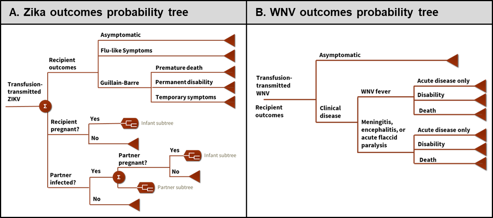
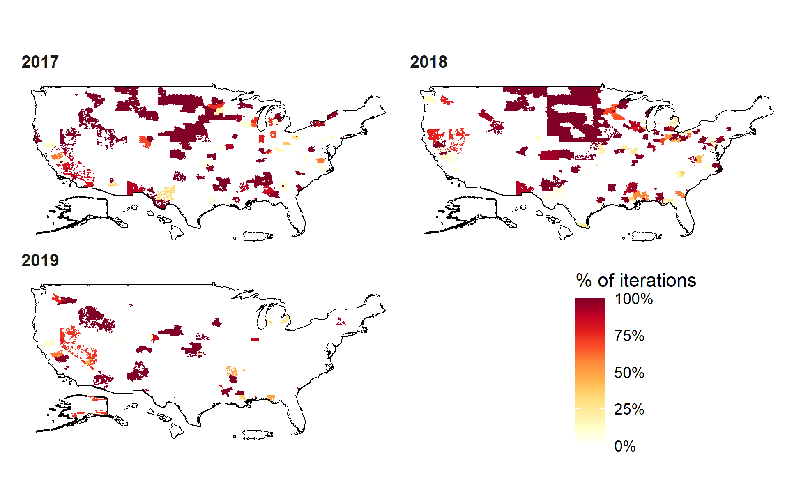

\newcommand{\E}{\mathbb{E}}
\newcommand{\Prob}{\mathbb{P}}
\newcommand{\C}{\mathcal{C}}
\newcommand{\ind}{\mathbb{1}}
\newcommand{\1}{\textbf{1}}


#### Blinded submission

<!--
#### W. Alton Russell^1^,  Brian Custer^2,3^, Margaret L. Brandeau^1^

<br> <br>

#### Running head: TBD

#### Word count: TBD 

<br> <br>

^1^Department of Management Science and Engineering, Stanford University, Stanford, CA

^2^Vitalant Research Institute, San Francisco, CA

^3^The University of California, San Francisco, San Francisco, CA   

<br> <br>

  

Corresponding author:   W. Alton Russell, Department of Management Science and Engineering, Stanford University, Stanford, CA, altonr@stanford.edu

<br> <br>

Abstract word count: XX

Text word count: XX

<br> <br>

Acknowledgements: Alton Russell was supported by a dissertation grant from Vitalant Research Institute as well by the Hsieh Family Fellowship, a Stanford Interdisciplinary Graduate Fellowship.


#####
-->

# Abstract

A safe supply of blood for transfusion is a critical component of the healthcare system in all countries. Most health systems manage the risk of transfusion-transmissible infections (TTIs) through a portfolio of blood safety interventions. These portfolios must be updated periodically to reflect shifting epidemiological conditions, emerging infectious diseases, and new technologies. However, the number of available blood safety portfolios grows exponentially with the number of available interventions, making it impossible for policymakers to evaluate all feasible portfolios without the assistance of a computer model. We develop a novel optimization model for evaluating blood safety portfolios that enables systematic comparison of all feasible portfolios of deferral, testing, and modification interventions to identify the portfolio that is preferred from a cost-utility perspective. We present structural properties that reduce the state space and required computation time in certain cases, and we develop a linear approximation of the model. We apply the model to retrospectively evaluate U.S. blood safety policies for Zika and West Nile virus for the years 2017, 2018, and 2019, defining donor groups based on season and geography. We leverage structural properties to efficiently find an optimal solution. We find that the optimal portfolio varies geographically, seasonally, and over time. Additionally, we show that for this problem the approximated model yields the same optimal solution as the exact model. Our method enables systematic identification of the optimal blood safety portfolio in any setting and any time period, thereby supporting decision makers in efforts to ensure the safety of the blood supply.

<br>

**Keywords:** Blood safety, public health policy, binary integer programming, cost-effectiveness

#####

# Highlights


* We develop a flexible optimization model for identifying the optimal portfolio of blood safety interventions for a given time and place.

* This is the first model capable of identifying the optimal combination of interventions across three classes: donor deferrals, disease marker tests, and risk-reducing modifications.

* We apply the framework to retrospectively evaluate the optimal policy for Zika virus and West Nile virus in the United States from 2017-2019, finding that the optimal policy varies considerably by geography, season, and year.

#####

# 1. Introduction

> A safe supply of blood for transfusion is a critical component of the healthcare system in high-, middle-, and low-income countries alike [@WHOBlood2019]. In most health systems, the risk of transfusion-transmissible infections (TTIs) is managed through a portfolio of blood safety interventions. These portfolios consist of three types of interventions. *Donor deferral policies* turn away potential donors who have characteristics associated with increased risk for harboring a TTI. *Disease marker tests* are used to screen out donations with detectable disease markers and to defer donors from future donation. *Risk-reducing modifications* like pathogen inactivation or leukoreduction reduce the likelihood that a TTI, if present in a transfused donation, is transmitted to a recipient. Blood safety portfolios should be periodically reassessed because of shifting epidemiological conditions, emerging infectious diseases, and new technologies. However, the number of available blood safety portfolios grows exponentially with the number of available interventions, making it impossible for policymakers to systematically enumerate, much less evaluate, all feasible portfolios without the assistance of a computer model. 

> Decision analytic modeling has played a limited role in consistently informing decisions regarding blood safety portfolios. Because the health and economic consequences of a blood safety intervention depend on local epidemiological conditions, the existing blood safety portfolio, and the larger healthcare system, analyses that have been conducted for blood safety interventions are limited to specific jurisdictions at specific times. Most studies have been cost-utility analyses that incorporate relevant risks, costs, and health consequences. These studies typically consider adding or changing one intervention while keeping others constant. Such analyses have been conducted to evaluate disease marker tests [@Russell2019; @Custer2005; @Jackson2003; @Bish2015b; @Sanchez2016; @Teljeur2012; @Russell2020wp], pathogen inactivation technologies (a new category of risk-reducing modifications) [@Bell2003; @Pereira1999; @Custer2010; @Agapova2015], and donor deferral policies [@deKort2014]. Methods have recently been proposed to systematically select a portfolio of disease marker tests for a specific context, assuming that deferral and modification interventions are held constant [@Bish2014; @Bish2011; @Bish2018]. These optimization-based frameworks are designed to ensure that risk is sufficiently reduced but are not designed to evaluate changes in deferral or modification interventions and may not be consistent with finding the optimal policy from a cost-utility perspective. 

> In this paper, we develop a new framework for evaluating blood safety portfolios that uses a definition of optimality that is consistent with standard cost-utility analysis methods [@Neumann2016]. In this framework, health outcomes are expressed as costs, and the optimal set of blood safety interventions minimizes the net present monetary cost of the blood safety portfolio and of any infectious donations that are released. Unlike currently available methods, this framework enables the systematic comparison of all feasible portfolios of deferral, testing, and modification interventions to identify the portfolio that is preferred from a cost-utility perspective.

> In the following sections, we derive our model by first introducing a simple model and progressively adding complexity. The model is a binary integer program (whether to implement each possible blood safety intervention). We present structural properties that reduce the state space and required computation time to find an optimal solution in certain cases, and we suggest a heuristic solution approach for problems that are too large to be solved exactly. We apply the model to retrospectively analyze U.S. policies for two TTIs that have been difficult to manage due to geographical and seasonal variations in prevalence and infectiousness, Zika virus and West Nile virus. We conclude with a discussion of implications and potential extensions of our modeling framework.

# 2. Model Specification

> In this section we derive our model by first developing the components for donor deferral, risk-reducing modification, and disease marker testing. All notation is summarized in Table 1.

## 2.1 Donor deferral model

> We begin with a simplified model for deciding whether to accept a donation based on risk of a single TTI. A donation may be infectious for the TTI ($y=1$) or not ($y=0$), and the decision is to accept ($z=1$) or reject ($z=0$) the donation. If the donation is rejected (also called deferring the donor), a replacement cost $d$ is incurred because another donor must be recruited to meet demand. If the donation is accepted, a processing cost $w$ is incurred. We assume $w < d$; otherwise, the optimal decision would be to always reject donations regardless of blood safety concerns.

> If the donation is accepted and is infectious for the TTI ($z=1, y=1$) then, in the absence of testing or modification interventions, an infectious donation is released for transfusion. Because donations are typically processed into multiple components, one infectious donation can expose multiple recipients to infection. We use the variable $c$ to represent the expected net monetary cost of releasing an infectious donation. We estimate this cost as $c = l + \gamma q$, where $l$ is the net present expected cost of a breakthrough infectious donation, $\gamma$ is the decision maker's willingness to pay to avert the loss of one quality-adjusted life year (QALY), and $q$ is the net present expected QALYs lost. Estimating $c$ is a nontrivial exercise; its value depends on the TTI, the donor's stage of infection, transfusion recipient characteristics, and how recipient exposures are treated in a particular health system. 

> Using the above notation, we express the cost function $\C(y,z)$ as:

$$
\C(y,z) = \ind_{\{z=0\}}d + \ind_{\{z=1\}}w + \ind_{\{z=1, y=1\}}c.
$$
For TTIs of concern, we assume $c > d$ (the net monetary cost of releasing an infectious donation exceeds the replacement cost of rejecting a donation), which ensures that the optimal decision is to reject a donation if it is known to be infectious. In practice, a blood center does not know whether a donation will be infectious, but several methods are available for estimating the risk, which we denote by $p = \Prob(y=1)$. 

> Given $p$, the optimal policy is to choose $z$ (accept or reject) such that the expected cost $\E [\C(z)]$ is minimized:

$$
\min_z \quad \E [\C(z \mid p)] = (1-z)d + z\big(pc + w\big).
$$

From this equation, one can see that a decision maker should be indifferent between rejecting and accepting the donation when $p = \frac{d-w}{c}$. When $p < \frac{d-w}{c}$, the optimal decision is to accept the donation ($z=1$), and when $p > \frac{d-w}{c}$, the optimal decision is to reject the donation ($z=0$).

> Policymakers are typically concerned about multiple TTIs. We now consider multiple TTIs indexed by $k=1, ..., K$. We define a vector $\textbf{y}$ where entry $y_k \in \{0, 1\}$ indicates whether the potential donation is infectious for TTI $k$, and a vector $\textbf{c}$ where entry $c_k = l_k + \gamma  q_k$ ($c_k \geq 0$) represents the expected cost of releasing a donation that is infectious for TTI $k$. Our new cost function is

$$
\C(\textbf{y},z) = \ind_{\{z=0\}}d + \ind_{\{z=1\}}[w + \textbf{y}^\top \textbf{c}].
$$
Taking the expectation, we obtain
$$
\E[\C(z \mid \textbf{p})] = (1-z)d + z\big(w + \textbf{p}^\top \textbf{c}\big),
$$

where $\textbf{p}$ is a vector for which $p_k = \Prob(y_k=1)$. The decision maker should reject the donation when $\textbf{p}^\top \textbf{c} > d - w$, accept when $\textbf{p}^\top \textbf{c} < d - w$, and be indifferent when $\textbf{p}^\top \textbf{c} = d - w$.

> Finally, we consider the case of deferral with multiple TTIs and donor groups. Rather than deciding whether to accept the entire potential donor population, policymakers often consider various donor groups, defined based on factors such as geographic location or the donor's response to a pre-donation questionnaire.  Donor groups may be defined in ways that facilitate temporary or lifetime deferrals (e.g., "travel to Mexico within the past 60 days" or "ever tested positive for HIV"). While less common, donor groups could also be based on factors related to the replacement cost of rejecting a donor (e.g., a rare blood type).

> We assume that the potential donor population has been segmented into $I$ mutually exclusive and collectively exhaustive groups indexed by $i$, and the decision to accept or reject donations from a specific group is represented by a vector $\textbf{z}$ with elements $z_i \in \{0, 1\}$. We introduce a prevalence matrix $\textbf{P}$ with rows that correspond to donor groups and with columns that correspond to TTIs. Entry $p_{ik}$ represents the risk of infectiousness for TTI $k$ in donations from donor group $i$ (i.e., $\Prob(y_k = 1 \mid i=i)$). It is possible that donor groups have different replacement and processing costs, so we define $\textbf{d}$ where $d_i$ represents the replacement cost of a donation from group $i$ and $\textbf{w}$ where $w_i$ represents the cost of processing a donation from group $i$. Finally, we define $\textbf{n}$ where $n_i$ is the estimated number of donors from each group to present for donation in the period of analysis. Using this notation, the total expected cost of a given deferral policy is

$$
\E[C(\textbf{z} \mid \textbf{P})] =  \big((\1-\textbf{z} )\circ \textbf{n}\big)^\top  \textbf{d} + (\textbf{z} \circ \textbf{n})^\top(\textbf{w} + \textbf{P} \textbf{c}),
$$
where the $\circ$ operator indicates element-wise multiplication and $\1$ is a vector of all 1's, in this case with length $I$.

## 2.2 Disease marker testing model

> We now consider disease marker testing starting with the case of one test for one TTI. We introduce a binary decision variable $a$, where $a=1$ if the test is used and 0 otherwise. The test has an associated cost $\phi$, sensitivity $r$, and specificity $q$. The probability of a positive test result is $r p+(1-q)(1-p)$ and the probability of a false negative is $(1-r)p$. We assume the blood center will always dispose of donations that test positive for a TTI, incurring a per donation cost of $g$. The constant $g$ should reflect the costs of any confirmatory testing, donor notification and counseling, and the cost of replacing the donation. Expected cost is

$$
\E [\C(z, a \mid p)] = (1-z)d + z\bigg(w + a\phi + ag\big(r p+(1-q)(1-p)\big) + a(1-r)pc + (1-a)pc \bigg).
$$
Note that not using a test is equivalent to using a test with sensitivity of 0 and specificity of 1; the expression $ra$ will equal $r$ when $a=1$ and $0$ when $a=0$ and the expression $1+a(q-1)$ will equal $q$ when $a=1$ and will equal $1$ when $a=0$. Using these, we can simplify the cost function as

$$
\E [\C(z, a \mid p)] = (1-z)d + z\bigg(w + a\phi + ag(rp + (1-q)(1-p)) + (1-ra)pc  \bigg).
$$

For the case of one test that can detect multiple TTIs (such as multiplex tests), we define $\textbf{r}$ where $r_k$ is the sensitivity for detecting TTI $k$, $\textbf{q}$ where $q_k$ is the specificity for detecting TTI $k$, and $\textbf{p}$ is as defined above. The probability that a single test returns a negative result is $(1-p)q+p(1-r)$. The probability that *any* TTI tests positive is one minus the probability that *all* TTIs test negative and is computed as $s_1 = a\big (1 - \prod_{k=1}^K \big[(1-p_k)  q_k+ p_k (1-r_k)\big]\big)$. Using $s_1$, the expected cost for one test and multiple TTIs is

$$
\E [\C(z, a \mid \textbf{p})] = (1-z)d + z\Big(w + a\phi  + (1-s_1) ((\1-a \textbf{r}) \circ \textbf{p})^\top \textbf{c} + g  s_1 \Big).
$$

If a test does not detect disease $k$, this can be modeled by setting the sensitivity to 0 and specificity to 1 ($r_k=0$, $q_k=1$).

> We now consider multiple tests and multiple TTIs. We assume that tests are independent conditional on the true disease state of the donation (i.e., errors are uncorrelated). This means that given that a donation is infectious (not infectious) for a disease, the probability that a test will yield a false negative (false positive) is independent of other tests. This assumption is made in most, if not all, decision analytic models for blood safety, including cost-effectiveness analyses [@Russell2019; @Custer2005; @Jackson2003; @Marshall2004; @Bish2015b] and studies of optimal blood safety test selection [@Bish2014; @Bish2011; @Bish2018]. We define a matrix $\textbf{Q}$ where $q_{jk}$ is the sensitivity of test $j$ for TTI $k$ and a matrix $\textbf{R}$ where $r_{jk}$ is the specificity of test $j$ for TTI $k$, and a vector $\boldsymbol{\phi}$ where $\phi_j$ is the cost of test $j$. We use the decision variable $\textbf{a}$ where $a_j=1$ when disease marker test $j$ is used. 

> Assuming that every available test is used, the probability of any positive result is $1 - \prod_{k=1}^{K} \prod_{j=1}^{J} [(1 - p_k) q_{jk} + p_k (1 - r_{jk})]$. Replacing $\textbf{R}_{jk}$ and $\textbf{Q}_{jk}$ with expressions that evaluate correctly when $a_j = 0$, we obtain $s_2 = 1 - \prod_{k=1}^{K} \prod_{j=1}^{J} [ (1 - p_k) (1 + a_j(q_{jk} - 1)) + p_k (1 - a_j r_{jk})]$. 

> To calculate the probability of a false negative test result for each TTI, we take the element-wise product of $\textbf{p}$ and the following vector:

$$
\textbf{v}_1 = \begin{bmatrix}  \prod_{j=1}^J 1-r_{j1} a_j \\ \vdots \\ \prod_{j=1}^J 1-r_{jk} a_j \\ \vdots \\  \prod_{j=1}^J 1-r_{jK} a_j \end{bmatrix} .
$$

> Using $\textbf{v}_1$ and $s_2$, the expected cost function for multiple tests and multiple TTIs is

$$
\E [\C(z, \textbf{a} \mid \textbf{p})] = (1-z)d + z\bigg(w + \textbf{a}^\top \boldsymbol{\phi}+ (1- s_2) (\textbf{v}_1 \circ \textbf{p})^\top \textbf{c}\Big)  + g s_2 \bigg).
$$

> Finally, we develop an expected cost function for the case of multiple tests, TTIs, and donor groups. We define the decision variable $\textbf{A}$ where $a_{ji} = 1$ if test $j$ is used on donor group $i$. To calculate the risk of each TTI in each group after tests are applied, we take the element-wise product of $\textbf{P}$ and the following matrix:

$$
\textbf{B}_1 = \begin{bmatrix} 
    \prod_{j=1}^J 1-r_{j1} a_{j1} &  & \dots \\
    \vdots & \prod_{j=1}^J 1-r_{jk} a_{ji} &\ddots \\
    \prod_{j=1}^J 1-r_{j1} a_{jI} &        & \prod_{j=1}^J 1-r_{jK} a_{jI}
    \end{bmatrix}.
$$

Additionally, we define a vector that represents the probability that a unit is disposed of in each donor group:

$$
\textbf{v}_2 = \begin{bmatrix} 
1 -  \prod_{k=1}^K \prod_{j=1}^J (1- p_{1k})(1+a_{j1} (q_{jk} - 1)) + p_{1k}(1- a_{j1} r_{jk}) \\
\vdots \\
1 -  \prod_{k=1}^K \prod_{j=1}^J (1- p_{ik})(1+a_{ji} (q_{jk} - 1)) + p_{ik}(1- a_{ji} r_{jk}) \\
\vdots \\
1 -  \prod_{k=1}^K \prod_{j=1}^J (1- p_{Ik})(1+a_{jI} (q_{jk} - 1)) + p_{Ik}(1- a_{jI} r_{jk})
\end{bmatrix}.
$$

> Using $\textbf{B}_1$ and $\textbf{v}_2$, the expected cost function for multiple donor groups, TTIs, and tests is

$$
\E [\C(\textbf{z}, \textbf{A} \mid \textbf{P})] = \big((\1-\textbf{z} )\circ \textbf{n}\big)^\top  \textbf{d} + (\textbf{z} \circ \textbf{n})^\top \Big(\textbf{w} +  \textbf{A}^\top\boldsymbol{\phi} + (1- \textbf{v}_2) \circ [(\textbf{B}_1 \circ \textbf{P} ) \textbf{c}] + g\textbf{v}_2 \Big).
$$

## 2.3 Risk-reducing modification model

> Risk-reducing modifications (e.g., pathogen inactivation or leukoreduction) can decrease the risk of TTI in components derived from blood donations. We first consider one available modification and one TTI. We define $h \in [0,1]$ as the risk-reduction multiplier for the modification and $\psi$ as the per-donation cost. Often, modifications are applied to only some of the components derived from a donation rather than the whole donation. For example, pathogen inactivation is currently FDA approved for platelet and plasma components but not red blood cells [@Staley2019]. In this case $h$ can be scaled proportionally to the fraction of components modified, or the same TTI in different components can be modeled as different TTIs (e.g. HIV in platelets vs. HIV in red blood cells). Because not applying a modification is equivalent to applying a modification with a risk multiplier of 1, we use the expression $1 + m(h-1)$, which equals 1 when $m=0$ and $h$ when $m=1$. Expected cost is

$$
\E [\C(z, m \mid p)] = (1-z)d + z\bigg(w + m\psi + (1 + m(h-1))pC \bigg).
$$

> A modification can sometimes reduce the risk of multiple TTIs. We model this by introducing $\textbf{h}$ where $h_k$ is the risk-reduction multiplier for TTI $k$. The expected cost for a single modification with multiple TTIs is

$$
\E [\C(z, m \mid \textbf{p})] = (1-z)d + z\bigg(w + m\psi + \big((\1+m(\textbf{h}-\1)) \circ \textbf{p}\big)^\top \textbf{c} \bigg).
$$

If a modification does not reduce risk for disease $k$, this can be modeled by setting the risk-reduction multiplier to 1 ($h_k=1$).

> Often multiple modifications are available, each of which might reduce the risk for multiple TTIs. To model this, we define the vector $\boldsymbol\psi$ where $\psi_l$ is the cost for modification $l$, and $\textbf{H}$ where $h_{lk}$ is the risk-reduction multiplier for modification $l$ and TTI $k$. We replace the single decision variable $m$ with the vector $\textbf{m}$ where $m_l=1$ if modification $l$ is added to the portfolio. We assumed that combinations of modifications would have multiplicative rather than additive effects because we assume that the mechanistic targets of each modification (e.g., pathogen inactivation, leukoreduction) are different. The product of risk-reducing multipliers for each modification in use can be calculated as follows:

$$
\textbf{v}_3 = \begin{bmatrix} 
    \prod_{l=1}^L 1 + m_{l} (h_{l1} - 1) \\
    \vdots \\
    \prod_{l=1}^L 1 + m_{l} (h_{lk} - 1) \\
    \vdots \\
    \prod_{l=1}^L 1 + m_{l} ( h_{lK} - 1) 
    \end{bmatrix} .
$$


Using this, the new expected cost is

$$
\E [\C(z, \textbf{m} \mid \textbf{p})] = (1-z)d + z\bigg(w + \textbf{m}^\top \boldsymbol\psi + \big(\textbf{v}_3 \circ \textbf{p}\big)^\top \textbf{c} \bigg).
$$

> Lastly, we integrate the model for multiple modifications with the model for multiple donor groups. We define a new decision variable $\textbf{M}$ where $m_{li}=1$ if modification $l$ is used on donor group $i$. Because each element in $\textbf{P}$ must be multiplied by the product of any risk-reduction modifiers that are used in that sub-population, we define the following matrix:


$$
\textbf{B}_2 = \begin{bmatrix} 
    \prod_{l=1}^L 1 + m_{l1} (h_{l1} - 1) &  & \dots \\
    \vdots & \prod_{l=1}^L 1 + m_{li} (h_{lk} - 1) &\ddots \\
    \prod_{l=1}^L 1 + m_{lI} ( h_{l1} - 1) &        & \prod_{l=1}^L 1 + m_{lI} ( h_{lK} - 1) 
    \end{bmatrix}.
$$

Using this, the expected cost with multiple donor groups and modifications is

$$
\E [\C(\textbf{z}, \textbf{M} \mid \textbf{P})] = \big((\1-\textbf{z} )\circ \textbf{n}\big)^\top  \textbf{d} + (\textbf{z} \circ \textbf{n})^\top \Big(\textbf{w} +  \textbf{M}^\top \boldsymbol{\psi} + (\textbf{B}_2 \circ \textbf{P} ) \textbf{c} \Big).
$$

## 2.4 Optimal portfolio model

> We can now write the expected cost function for a portfolio containing any combination of donor deferral policies, disease marker tests, and risk-reducing modifications:

$$
\E [\C(\textbf{z}, \textbf{M}, \textbf{A} \mid \textbf{P})] = \big((\1-\textbf{z} )\circ \textbf{n}\big)^\top  \textbf{d} + (\textbf{z} \circ \textbf{n})^\top \Big(\textbf{w} +  \textbf{A}^\top\boldsymbol{\phi} + \textbf{M}^\top \boldsymbol{\psi} + (1- \textbf{v}_2) \circ [(\textbf{B}_1 \circ \textbf{B}_2 \circ \textbf{P} ) \textbf{c}] + g\textbf{v}_2 \Big).
$$

This cost function expresses the net present net monetary cost of a policy (all future costs are discounted to the present when calculating $\textbf{c}$). The first term in the above expression is the cost of deferral if a donation is deferred. The second term is the cost incurred if the donation is not deferred and includes (in the bracketed term) the costs of processing, testing, and modifying a donation plus the expected cost incurred from release of any infectious donations.

> The optimal combination of interventions solves the following optimization problem:

$$
\begin{aligned}
\min_{\textbf{z}, \textbf{M}, \textbf{A}} \quad & \E [\C(\textbf{z}, \textbf{M}, \textbf{A} \mid \textbf{P})]\\
\textrm{s.t.} \quad & m_{li} = a_{ji} = 0 \quad \forall l,j \quad \text{ when } \quad z_i=0
\end{aligned}
$$
The constraint ensures that no tests or modifications are applied to deferred donor groups. 

> The above formulation allows each non-deferred donor group to receive a tailored portfolio of tests and modifications, but many health systems use the same set of tests and modifications for all accepted donations regardless of donor group. Such policies may produce less benefit at a fixed willingness-to-pay as compared to tailored policies, but they are easier to implement and might be perceived as fairer. To consider only universal testing and modification policies, two additional constraints can be introduced:

$$
\begin{aligned}
\min_{\textbf{z}, \textbf{M}, \textbf{A}} \quad & \E [\C(\textbf{z}, \textbf{M}, \textbf{A} \mid \textbf{P})]\\
\textrm{s.t.} \quad & m_{li} = a_{ji} = 0 \quad \forall l,j \quad \text{ when } \quad z_i=0\\
& m_{li_1} = m_{li_2} \quad \forall i_1, i_2 \quad \text{when} \quad z_{i_1} = z_{i_2} = 1\\
& a_{ji_1} = a_{ji_2} \quad \forall i_1, i_2 \quad \text{when} \quad z_{i_1} = z_{i_2} = 1
\end{aligned}
$$


> The cost function can be used to derive many other performance measures, summarized in Table 2, that may be more interpretable to policymakers. These include, for example, the number of donors deferred, the donation yield, and the number of infectious donations released over a given time horizon. Performance measures can also be used to impose additional constraints on the optimization problem. For instance, one could limit the number of donors deferred ($\big((\1-\textbf{z} )\circ \textbf{n}\big)^\top  \textbf{1} \leq \pi$, where $\pi$ is an upper bound) or the total budget for tests and modifications ($(\textbf{z} \circ \textbf{n})^\top (\textbf{A}^\top \boldsymbol{\phi} + \textbf{M}^\top \boldsymbol{\psi}) \leq \rho$, where $\rho$ is an upper bound).


# 3. Optimal portfolio model solution

> The optimal portfolio model is a binary integer program, and its exact solution can be found using exhaustive search. If tailored testing and modification policies for each donor group are allowed, there will be $\sum_{i=0}^I \binom{I}{i} 2^{i(L+J)}$ feasible policies. If only universal testing and modification policies are considered, the feasible state space will be $1+\sum_{i=1}^I \binom{I}{i} 2^{(L+J)}$ which is smaller by a factor of approximately $2^I$. Because the state space increases exponentially in the number of available interventions, exhaustive search is not feasible for larger problems. Here we describe structural properties that allow for more efficient identification of the optimal policy in certain cases. 

## 3.1 Tailored policies

When policies can be tailored to individual donor groups, the objective function is linearly separable, and we can solve a single, smaller optimization problem for each donor group. In this case we can identify the optimal portfolio by evaluating $I \times (1 + 2^{L+J})$ policies, rather than the $\sum_{i=0}^I \binom{I}{i} 2^{i(L+J)}$ evaluated by exhaustive search.

## 3.2 Elimination of infeasible tests or modifications

> Eliminating some tests or modifications from consideration in advance can considerably reduce the time needed to find a solution. We can do so by leveraging the following theorem.


**Theorem 1:** *If use of a single test or modification is not preferred over a 'no interventions' scenario in any donor group then it cannot be part of an optimal portfolio.*


To see why this theorem holds, consider the following. Tests and modifications reduce the cost function by reducing the multipliers on the expected cost of releasing an infectious donation (i.e., making elements of $(1- \textbf{v}_2) \circ [(\textbf{B}_1 \circ \textbf{B}_2 \circ \textbf{P} ) \textbf{c}]$ smaller by decreasing one or more entries in $(1 - \textbf{v}_2)$ and $\textbf{B}_1$ [tests] or $\textbf{B}_2$ [modifications]). Addition of a test or modification will generate the greatest reduction in expected cost when the term  $(1- \textbf{v}_2) \circ [(\textbf{B}_1 \circ \textbf{B}_2 \circ \textbf{P} ) \textbf{c}]$ is largest, i.e., when no interventions are in use. Therefore, any test or modification that is part of an optimal portfolio must be preferred (i.e., yield a lower objective function value) compared to use of no intervention in at least one donor group. 

> To apply this theorem, we use a simple equation to calculate the per-donor incremental objective function cost of each test or modification as compared to using no intervention. We let $\gamma_{ji}^{test}$ represent the cost of using only test $j$ (no other tests or modifications) compared to using no interventions in donor group $i$. Similarly, we let $\gamma_{li}^{mod}$ denote the cost of using only modification $l$ compared to using no interventions in donor group $i$. These quantities can be computed for test $j^*$ and modification $l^*$ in donor group $i^*$ as:


\[
\begin{align}
\gamma^\text{test}_{j, i} (j^*,i^*) &= \textbf{w} +  \phi_{j^*} + (1-s^{i^*j^*}) ((\1 - \textbf{r}_{*j^*}) \circ \textbf{p}_{*i^*} ) \textbf{c} + gs^{i^*j^*} - (\textbf{w} + \textbf{p}_{*i^*} \textbf{c})\\
&= \phi_{j^*} + gs^{i^*j^*} + (1-s^{i^*j^*}) ((\1 - \textbf{r}_{*j^*}) \circ \textbf{p}_{*i^*} ) \textbf{c}  - \textbf{p}_{*i^*} \textbf{c}\\
&=\phi_{j^*} + gs^{i^*j^*} -  (1-s^{i^*j^*}) (\textbf{r}_{*j^*} \circ \textbf{p}_{*i^*} )  \textbf{c}\\
\gamma^\text{mod}_{li} (l^*,i^*) &= w + \phi_{l^*} + ( \textbf{h}_{{*l^*}} \circ \textbf{p}_{*i^*})\textbf{c} - (\textbf{w} + \textbf{p}_{*i^*} \textbf{c})\\
&= \phi_{l^*} - ((\1 - \textbf{h}_{{*l^*}}) \circ \textbf{p}_{*i^*})\textbf{c}
\end{align}
\]

where $\textbf{p}_{*i^*}$, $\textbf{r}_{*j^*}$, and $\textbf{h}_{*l^*}$ indicate the $i^*$th, $j^*$th, and $l^*$th rows of $\textbf{P}$, $\textbf{R}$, and $\textbf{H}$, respectively. The term $s^{i^*j^*}$ is the percent of donations removed by testing when only test $j^*$ is used in donor group $i^*$ and is computed as $s^{i^*j^*} = \det \text{diag} [(\textbf{q}_{*j^*}(1 - \textbf{p}_{*i^*}) + (1-\textbf{r}_{*j^*}) \textbf{p}_{*i^*} )]$. The derivation of this equation along with a weaker simplification that can be useful for evaluating the potential benefit of developing a new test or modification are shown in the Supplement (Section A).

In the case where tests and modifications are tailored by donor group, a test or modification can be removed from consideration for any donor groups for which the associated $\gamma_{ji}^{test}$ or $\gamma_{li}^{mod}$ is positive. Additionally, tests or modifications can be removed from consideration across all donor groups if $\gamma_{ji}^{test}$ or $\gamma_{li}^{mod}$ is positive across all donor groups, even if the state space has additional constraints (e.g., when only universal testing and modification policies are under consideration). Calculating this incremental cost for all tests and modifications across all donor groups before running the binary integer program requires $I(L+J)$ calculations. Each test or modification removed from consideration reduces the state space for the binary integer program by approximately a factor of 2. The Supplement (Section B) includes a tutorial on applying this theorem to solve both the tailored and universal versions of the portfolio problem with example R code.

## 3.3 Mapping prevalence to the optimal policy

> When donor groups are identical except for the number of donors ($n_i$) and the prevalence of each TTI ($p_{ik}$), as is often the case, then the optimal policy $\pi = (z, \textbf{m}, \textbf{a})$ will depend only on prevalence. In that case, a $k$-dimensional function $f(\textbf{p})$ mapping the prevalence by TTI to the optimal policy ($\pi^*$) can be defined as follows:

$$
\pi^* = f(\textbf{p}), \quad  \text{where} \text{ } f(\textbf{p}) = {\arg\min}_{\textbf{m}, \textbf{a}, z} \E [\C(z, \textbf{m}, \textbf{a}, \textbf{p}) ].
$$

When the number of donor groups is large relative to the number of tests and modifications, it can be more efficient to solve or approximate this function than to explicitly evaluate each donor group separately. Exact and approximate methods for learning this function are provided in the Supplement (Section C).

## 3.4 Linear approximation by excluding some test costs

> For a given policy, the objective function cost is a nonlinear function of prevalence due to the term $\mathbf{v}_2$, the proportion of donations removed by testing in each group, which can include high-order polynomial expressions. In most real-world settings, only a small fraction of donations will be removed by testing. Because of this, many cost-utility analyses only include the up-front test cost and savings associated with reducing infections in transfusion recipients, assuming that costs such as those for confirmatory testing and replacing donations that test positive are negligible [@Jackson2003; @Marshall2004; @Custer2005]. In our framework, this is equivalent to setting $\textbf{v}_2 = 0$, which yields an approximation of the cost function that is linear in TTI prevalence:

$$
\tilde{\E} [\C(\textbf{P}) \mid \pi] = \big((\1-\textbf{z} )\circ \textbf{n}\big)^\top  \textbf{d} + (\textbf{z} \circ \textbf{n})^\top \Big(\textbf{w} +  \textbf{A}^\top\boldsymbol{\phi} + \textbf{M}^\top \boldsymbol{\psi} + (\textbf{B}_1 \circ \textbf{B}_2 \circ \textbf{P} ) \textbf{c}  \Big).
$$
Because this approximation is linear in $\textbf{P}$, the resulting problem can be solved for each policy as a linear integer program, a class of problems for which many efficient solution techniques are available [@Genova2011]. Differences between $\tilde{\E} [\C(\textbf{p}) \mid \pi]$ and $\E [\C(\textbf{p}) \mid \pi]$ will be largest when elements of $\textbf{v}_2$ are large, which can occur when testing policies are used and prevalence and test sensitivity are high, test specificity is low, or many tests are used.


# 4. Case study: West Nile and Zika Virus in the U.S.

> Both West Nile virus (WNV) and Zika virus are most often transmitted by mosquitos but can also be transmitted by blood transfusion [@Busch2019]. For both diseases, more than 70% of infected individuals never exhibit symptoms [@Duffy2009; @Petersen2013], creating a high risk of collecting a donation from a donor who is unaware of their infection. Incidence of both viruses varies geographically, seasonally, and annually, largely due to differences in mosquito populations, necessitating regular reassessment of blood safety policy. Available interventions include nucleic acid testing (NAT), pathogen inactivation, and donor deferral. Currently, the United States mandates year-round mini-pooled (MP-)NAT testing for both Zika and WNV in all areas and requires that regions temporarily escalate to individual donation (ID-)NAT for WNV following the detection of a confirmed positive donation [@FDA2018; @FDA2009].


## 4.1 Model instantiation

> We applied our model to identify the optimal combinations of blood safety interventions for preventing transfusion-transmitted Zika and WNV in blood products derived from whole blood donations in the U.S. We considered four screening tests (ID-NAT and MP-NAT for Zika and WNV) and one risk-reducing modification (pathogen inactivation in plasma components). We segmented donors into groups based on location and season: season and geography are major risk factors for both diseases, and the time of year and location of a blood donation can be directly observed. We identified the optimal portfolio separately for 2017, 2018, and 2019, and we compared these portfolios to no intervention and to universal MP-NAT for Zika and WNV. Parameter values, shown in Table 3, were derived from the academic literature, reports from AABB and the Centers for Disease Control and Prevention (CDC), and personal communications with blood safety experts. The optimization model was programmed in R. To estimate the harms of releasing a Zika- or WNV-infectious donation into the blood supply we developed microsimulation models of transfusion recipient outcomes in Python.

### Tests and modifications

> We evaluated ID-NAT and MP-NAT for both WNV and Zika. In MP-NAT, the test is run on a pooled sample of 6 or 16 donations, reflecting the pool size in the two high-throughput NAT platforms used for blood donation testing in the United States (Grifols Panther and Roche Cobas), with subsequent individual donation testing for any minipool that is initially reactive. The two platforms used for MP-NAT have a similar cost per reportable result and similar sensitivity and specificity, so we consider them interchangeably as a generic MP-NAT testing intervention. MP-NAT can reduce the number of tests run per sample and therefore has a lower per-donation cost than ID-NAT [@Ellingson2017a], but also a lower sensitivity. However, because the minipooled testing procedure requires both a reactive minipool and a subsequent reactive ID-NAT test, the risk of a false positive is much smaller than with ID-NAT.

> Pathogen inactivation  (PI) is a modification that can greatly reduce the transmission risk for many types of viruses and bacteria, including lipid-enveloped RNA viruses like Zika and WNV [@Prowse2012]. PI is currently only approved in the U.S. for treating plasma or platelet components, not whole blood donations or red cell components. Because platelet PI is typically done for apheresis rather than whole blood-derived platelets in the U.S., we only included PI of whole blood-derived plasma as a possible blood safety intervention. We assumed that PI decreases risk of transmission by plasma exposure by 99% for both Zika and WNV. Based on our calculations using the 2015 National Blood Collection and Utilization Survey [@Ellingson2017], plasma exposure accounts for 36% of the transfusion-transmission risk of an infectious whole blood donation, yielding a per-donation risk reduction multiplier of approximately 65%.

### Donor groups

> Donor segmentation should be based on factors that are easy to observe or elicit from potential donors, well-correlated with disease risk, and allow risk estimation across donor groups.  AABB biovigilance reports contain the donation date and zip code for all donations reactive for WNV or Zika for the years 2017, 2018, and 2019 [@AABB2020A; @AABB2020B]. We segmented U.S. donors, including those in Puerto Rico, geographically by 3-digit zip code because prevalence estimation would be less robust with a more granular segmentation, and a less granular segmentation would allow for less distinction by risk. We also segmented donors seasonally. Based on an analysis of confirmed positive cases, we defined the high mosquito season as April to September (Supplemental Figure S1). To estimate the number of people in each 3-digit zip code for each year 2017-2019, we multiplied 2010 U.S. census population estimates by the estimated population change for each state [@Census2020]. We estimated the total number of annual whole blood donations from the 2015 National Blood Collection and Utilization Survey (NBCUS) [@Ellingson2017] for the 50 states and the District of Columbia and from a previous analysis for Puerto Rico [@Russell2019]. We assumed that the number of donations collected in each zip code was proportional to population and evenly distributed across the high and low mosquito seasons. We treated initially reactive donations that did not undergo confirmatory testing as fractions of a case, equal to the positive predictive value for that TTI in that year. 

> To analyze how donor segmentation impacts the optimal portfolio, we also performed an analysis where donors were segmented by state instead of by 3-digit zip code. In this analysis Puerto Rico and Washington D.C. were treated as states, and the probability of an infectious blood donation each year was based on CDC data on viremic blood donations interdicted by testing [@CDC_WNV2020; @CDC_ZIKV2020]. The risk assigned to a state was assumed to be proportional to the number of CDC-reported symptomatic cases for that area [@CDC_WNV2020; @CDC_ZIKV2020]. Supplemental Table S3 shows data for the state-level donor groups. A link to the public repository containing similar data for zip code-level donor groups will be included in the unblinded manuscript.

### Costs and QALYs

> A 2014 analysis in the Netherlands estimated that the cost of a donation visit resulting in deferral cost the donor €16 in lost time and transportation and cost the blood center €2.65 -- €31.82 depending on whether the donor was a routine donor or a first-time donor who needed to be recruited [@deKort2014]. The cost of recruiting, inviting, and evaluating a replacement donor was €2.58 -- €31.25, yielding a total deferral cost of €21.23 for routine donors and €79.07 for first-time donors. Donors who are deferred are less likely to present to donate in the future than those who donate successfully [@Custer2004], an additional cost not captured in the 2014 analysis. No data were available for the U.S., so we assumed that the replacement cost for a deferred donor in the U.S. was $90. We also assumed a donation processing cost of $20 and a donation disposal cost of $60, which reflects confirmatory testing and donor notification costs.

> To estimate the societal costs (medical expenses and productivity loss due to illness and death) and QALYs lost that result from transfusion transmission, we developed separate microsimulations for each disease (Zika and WNV). Figure 1 shows the decision tree structures for the two models and Supplemental Tables S1 and S2 show all model parameters. In these models, adapted from a prior study [@Russell2019], we simulated individual transfusion recipients whose age, sex, and number of red blood cell, platelet, and plasma components transfused followed a similar distribution to transfusion recipients in the U.S. The expected post-transfusion survival for each recipient was calculated as a function of age and the number and type of blood components transfused [@Russell2019]. For the Zika model (Figure 1A), we adapted parameters including probabilities, costs, and QALY multipliers for Zika fever and more severe sequelae from the prior publication, updating costs to 2019 US dollars using the personal healthcare component of the National Health Expenditure Data provided by the Centers for Medicare and Medicaid Services [@CMS2019]. We used Consumer Expenditure Surveys from the U.S. Bureau of Labor Statistics [@USBLS2020] to estimate age-specific productivity loss due to illness or premature death (for premature death, consumption was netted from productivity). The Zika model also captured costs and QALY losses due to secondary sexual or congenital transmission of Zika to a transfusion recipient's sexual partner or offspring (Figure 1A). For the WNV model (Figure 1B), recipients could experience asymptomatic infection, acute WNV fever, or one of three neurological diseases (meningitis, encephalitis, or acute flaccid paralysis). Secondary transmission was not modeled. Transfusion recipients experiencing acute disease were also at risk for long-term disability. We developed the WNV model using parameter values from a recent cost-effectiveness analysis of a WNV vaccine [@Shankar2017] and a study of the costs of WNV infection [@Staples2014], updating costs to 2019 US dollars. In both microsimulations, future costs and QALYs lost were discounted to the present using an annual discount rate of 3% [@Neumann2016].

> The recipient microsimulations estimate the outcomes for recipients who receive different numbers and types of whole blood-derived components. We estimated the average outcome by component type with the following weighted average approach:

$$
\bar{O^k_u} = \frac{ \sum_i h^u_i O^k_i}{\sum_{i} h_i^u} \quad \text{for} \quad u=1,2,3
$$

where outcome $O^k$ is cost incurred or QALYs lost due to disease $k$, $u$ is the blood component type, $i$ indexes individual transfusion recipients, and $h_i^u$ is the number units of component $u$ transfused to recipient $i$. To estimate the expected net health costs of releasing an infectious donation, the average number of components transfused per whole blood donation collected was estimated from the 2015 NBCUS [@Ellingson2017] and the component-specific probability of transfusion transmission for both WNV and Zika was estimated from prior studies [@Russell2019; @Custer2005b]. The expected value of the outcomes (cost and QALY loss) per donation were calculated as follows:

$$
\bar{O}^{k} = \sum_u  ( \zeta^k_u )( \lambda_u) \bar{O}^k_u
$$
where $\zeta^k_u$ is the probability that disease $k$ is transmitted to a recipient exposed to an infectious component of type $u$, and $\lambda_u$ is the average number of units of component type $u$ produced per whole blood donation. We used this method to estimate both costs and QALYs lost, which were used to calculate net health cost assuming a willingness-to-pay threshold of $1 million per QALY in the base case [@Custer2009].


### Uncertainty analysis

> We performed probabilistic sensitivity analysis by repeating the analysis 10,000 times using input parameters randomly sampled from the probability distributions listed in Table 3 and Supplemental Tables S1 and S2. We calculated performance metrics and tracked how often each intervention was part of the optimal portfolio for each donor group across all 10,000 iterations. Prevalence and willingness-to-pay were not varied in probabilistic sensitivity analysis but were analyzed in scenario analysis. To do so, we first estimated the optimal policy for a single donor group as a function of WNV and Zika prevalence by computing the optimal policy for 10,000 pairs of WNV and Zika prevalence values. To assess the impact of varying willingness-to-pay, we repeated this analysis for values of $100,000 and $10,000,000 per QALY, in addition to the base case value of $1,000,000 per QALY. In another scenario analysis, we assessed the impact of using the linear approximation described in section 3.4, which ignores the impact of removing donations testing positive. For this analysis we estimated the optimal policy as a function of prevalence, and we compared the optimal policy by zip code identified using the linear approximation to that identified using the full cost function. Lastly, we performed a scenario analysis using uniform distributions on all of the optimization model parameters. For that scenario, we sampled the net monetary cost of a releasing a WNV- or Zika-infectious donation from a uniform distribution between the 1st and 99th percentiles of the outputs of the microsimulations.

## 4.2 Results of case study
```{r setup, include = FALSE}
knitr::opts_knit$set(root.dir = "..")
```


```{r read_process_data, include = FALSE}


#library(googlesheets4)
library(readxl)
library(data.table)
library(scales)
library(flextable)
library(officer)
library(gmp) #for bigz for evaluating numbers too large for r

options(Encoding="UTF-8")

param_table_WNV <- data.table(read_excel("data/params.xlsx", sheet = "wnv_nmc"))
param_table_ZIKV <- data.table(read_excel("data/params.xlsx", sheet = "zikv_nmc"))
#params <- data.table(read_sheet("1Yjfq0SINstVPrszWYx9uJEYcqChxvGM1RIoR8uZe-sw", sheet = "params"))
donor_groups_state <- data.table(read_excel("data/params.xlsx", sheet = "donor_groups"))
params_raw <- read_excel("data/params.xlsx", sheet = "params")
params <- data.table(params_raw)
donor_groups_zip3 <- fread('data/donor_groups_zip3.csv')
# Translate variable sheet into matrices for analysis
vars = unique(params$key)
for (var in vars){
  if(is.na(params[key == var]$row_idx[1])){
    eval(call("<-", as.name(var), params[key == var, Basecase]))
  } else {
    eval(call("<-", as.name(var), matrix(params[key == var, Basecase], ncol = params[key == var, max(col_idx)])))
  }
}

K = length(c_k) #number of diseases
J = length(R_jk[,1])
L = length(c_mod_l)

# dollar_format(largest_with_cents = 1e2)

# Read in results
basecase_states <- fread("results/opt_by_state_basecase.csv")
basecase_zip <- fread("results/opt_by_zip3_basecase.csv")

psa_metrics_zip <- fread("results/PSA_zip3_metrics_combined.csv")
psa_percents_zip <- fread("results/PSA_zip3_opt_by_group_combined.csv")[ , lapply(.SD, sum), .SD = 3:8, by = c("group", "year")]
psa_percents_zip[ , z := (10000 - z)/10000]
psa_percents_zip[, c("a1", "a2", "a3", "a4", "m1") :=lapply(.SD, function(x) x/10000), .SDcols=4:8]
psa_percents_zip[ , STUSPS := substr(group, 1, 2)]
psa_percents_zip[ , season := substr(group, 13, 13)]
psa_percents_zip[ , zip3 := substr(group, 4, 6)]

#State-level scenario
psa_metrics_states <- fread("results/PSA_metrics_combined.csv")
psa_percents_states <- fread("results/PSA_opt_by_group_combined.csv")[ , lapply(.SD, sum), .SD = 3:8, by = c("group", "year")]
psa_percents_states[ , z := (10000 - z)/10000]
psa_percents_states[, c("a1", "a2", "a3", "a4", "m1") :=lapply(.SD, function(x) x/10000), .SDcols=4:8]
psa_percents_states[ , STUSPS := substr(group, 1, 2)]
psa_percents_states[ , season := substr(group, 4, 4)]


# Microsim output
WNV_basecase <- colMeans(fread("NMC_sim/output/WNV_basecase_1e7_output.csv"))
ZIKV_basecase <- colMeans(fread("NMC_sim/output/ZIKV_basecase_1e7_output.csv"))
WNV_PSA <- fread("results/PSA_WNV_NMC.csv")
ZIKV_PSA <- fread("results/PSA_ZIKV_NMC.csv")
# 
# twosig <- function(value){
#   return()
# }

cash <- function(value){
  return(dollar(value, largest_with_cents = 1e2))
}

I_peryear = nrow(psa_percents_zip)
n_pol = 0; for(i in 1:I_peryear){ n_pol = as.bigz(n_pol + choose(I_peryear, i)*2^(i*(L+J)))}

n_pol <- paste0(substr(n_pol, 1, 1),".",substr(n_pol, 2, 3), "e", nchar(as.character(n_pol)) - 1)
```

```{r summarize_data, include = FALSE, eval = FALSE}
#BASECASE
#Zips in which each test used by year/season
basecase_zip[ , sum(a1), by = c("year", "season")]
basecase_zip[ , sum(a2), by = c("year", "season")]
basecase_zip[ , sum(a3), by = c("year", "season")]
basecase_zip[ , sum(a4), by = c("year", "season")]
#Any test
basecase_zip[a1+a2+a3+a4 > 0, .N, by = c("year", "season")]

# PSA iterations:, times either WNV test used in high mosquito season
psa_percents_zip[a3+a4 > 0 & season == "H", .N, by=year]

# Zika residual risk percent reduction 
temp <- dcast(psa_metrics_zip[resid_risk1 > 0], year+iter~policy, value.var = "resid_risk1")[, reduct_opt := ifelse(is.na(1-Optimal/`No intervention`), 0, 1-Optimal/`No intervention`)]
temp[, reduct_univMP := ifelse(is.na(1-`Universal MP-NAT`/`No intervention`), 0, 1-`Universal MP-NAT`/`No intervention`)]
quantile(temp$reduct_opt, c(0.025, 0.975), na.rm = TRUE)
quantile(temp$reduct_univMP, c(0.025, 0.975), na.rm = TRUE)

# WNV residual risk percent reduction
temp <- dcast(psa_metrics_zip, year+iter~policy, value.var = "resid_risk2")[, reduct_opt := (1-Optimal/`No intervention`)]
temp[, reduct_univMP := ifelse(is.na(1-`Universal MP-NAT`/`No intervention`), 0, 1-`Universal MP-NAT`/`No intervention`)]
quantile(temp$reduct_opt, c(0.025, 0.975), na.rm = TRUE)
quantile(temp$reduct_univMP, c(0.025, 0.975), na.rm = TRUE)

# NMC Zip
temp <- dcast(psa_metrics_zip, year+iter~policy, value.var = "downsteam_NMC")[, reduct_opt := (1-Optimal/`No intervention`)]
quantile(temp$reduct_opt, c(0.025, 0.975), na.rm = TRUE)

# NMC state
temp <- dcast(psa_metrics_states, year+iter~policy, value.var = "downsteam_NMC")[, reduct_opt := (1-Optimal/`No intervention`)]
quantile(temp$reduct_opt, c(0.025, 0.975), na.rm = TRUE)


```


> Releasing a Zika-infectious donation would result in an estimated average loss of `r signif(ZIKV_basecase["QALYL_per_donation"], 2)` QALYs (95% CrI, `r signif(quantile(ZIKV_PSA$QALYL_per_donation, 0.025), 2)` -- `r signif(quantile(ZIKV_PSA$QALYL_per_donation, 0.975), 2)` QALYs) and `r cash(ZIKV_basecase["cost_per_donation"])` in societal costs (95% CrI, `r cash(quantile(ZIKV_PSA$cost_per_donation, 0.025))` -- `r cash(quantile(ZIKV_PSA$cost_per_donation, 0.975))`). Releasing a WNV-infectious donation would result in an estimated average loss of `r signif(WNV_basecase["QALYL_per_donation"], 2)` QALYs (95% CrI, `r signif(quantile(WNV_PSA$QALYL_per_donation, 0.025), 2)` -- `r signif(quantile(WNV_PSA$QALYL_per_donation, 0.975), 2)` QALYs) and `r cash(WNV_basecase["cost_per_donation"])` in societal costs (95% CrI, `r cash(quantile(WNV_PSA$cost_per_donation, 0.025))` -- `r cash(quantile(WNV_PSA$cost_per_donation, 0.975))`). Using a willingness-to-pay of \$1 million per QALY gained, the estimated expected net monetary cost of releasing an infectious donation for transfusion was `r cash(ZIKV_basecase["NMC_per_donation"])` (95% CrI, `r cash(quantile(ZIKV_PSA$NMC_per_donation, 0.025))` -- `r cash(quantile(ZIKV_PSA$NMC_per_donation, 0.975))`) for Zika and `r cash(WNV_basecase["NMC_per_donation"])` (95% CrI, `r cash(quantile(WNV_PSA$NMC_per_donation, 0.025))` -- `r cash(quantile(WNV_PSA$NMC_per_donation, 0.975))`) for WNV. 

> Each year there were `r n_pol` possible portfolios tailored by season and 3-digit zip code. Linear separability allowed us to identify the optimal portfolio by evaluating 32 policies for each of the `r 2*length(unique(psa_percents_zip$zip3))` zip code and season combinations. We further reduced the number of policies evaluated by pre-determining that the optimal policy in donor groups with no Zika or WNV-infectious donations must be no intervention, which was the case for most zip codes during the high mosquito season (76% in 2017, 72% in 2018, and 91% in 2019) and for even more zip codes during the low mosquito season (95% in 2017, 96% in 2018, and 99% in 2019). The number of remaining donor groups for which all policies were evaluated was 257 for 2017, 285 for 2018, and 82 for 2019.

> In the  base case analysis, WNV testing was optimal in many of the remaining zip codes during the high mosquito season (118 zip codes in 2017; 134 in 2018; 40 in 2019) and was optimal during the low mosquito season in one zip code each year. In most cases WNV MP-NAT was optimal; ID-NAT was optimal in a small number of zip codes that had higher WNV risk during the high mosquito season (1 in 2017; 8 in 2018; 1 in 2019). In probabilistic sensitivity analysis (PSA), all four tests were part of the optimal portfolio in some iterations for some years, and the geographical distribution of areas for which screening was optimal varied considerably from year to year (Figure 2; Supplemental Table S5). Pathogen inactivation and donor deferral were not part of the optimal portfolio in the base case nor in any PSA iteration.

> Table 4 compares the performance of the optimal policy each year to no intervention and universal MP-NAT. The optimal portfolio reduced test costs by more than 95% compared to universal MP-NAT screening each year and prevented fewer infectious donations from being released (0% -- 14% each year for Zika; 51% -- 83% each year for WNV) than did universal MP-NAT (97% -- 99% each year for Zika; 92% -- 98% each year for WNV). Sensitivity analysis showed that when using uniform distributions, the expected value of each metric was similar to the original distributions, although the standard deviation around each estimate was slightly larger (Supplemental Figure S2). The optimal policy by zip code was also similar between the primary and the uniform distribution scenarios (Supplemental Figure S3).

> The optimal policy for each donor group was a function of Zika and WNV prevalence (Figure 3). When prevalence for both diseases was low, using no intervention was optimal, and when prevalence became sufficiently high, it became optimal to defer donors. Various testing combinations were optimal for intermediate prevalence levels, and the optimal policy was to switch to more expensive, more sensitive tests as prevalence increased. As Figure 3 shows, increasing the willingness-to-pay threshold makes it optimal to apply more aggressive interventions at lower prevalence levels. 

> Figure 4 shows six per-donation performance measures for the optimal policy as a function of Zika and WNV prevalence. This figure shows how residual risk for Zika and WNV gradually increases with prevalence, although discontinuities in these metrics exist at the boundaries where the optimal testing policy changes. The downstream net monetary cost exhibits similar discontinuities because it is a function of the residual risk for each disease. The overall objective function value can range from the donation processing cost (\$20) when TTI prevalence is 0 to the donor deferral replacement cost (\$90) at sufficiently high TTI prevalence. By definition, the objective function value of two policies is equal at the boundary between the policy regions for which they are optimal. Therefore, the objective function value plot does not exhibit discontinuities at the boundaries where the optimal policy changes as with the other performance metrics. 

> The linear approximation excludes costs associated with removing donations that test positive, shown in Figure 4b. At lower prevalence levels, these costs were close to zero and the linear approximation yielded the same solution as the full cost function (Figure 5). As the prevalence of Zika and WNV approached levels that triggered donor deferral in the full model solution, these costs grew. As a result, the linear approximation solution differed from the solution to the full cost function at high prevalence levels because it was not optimal to switch to a donor deferral policy. However, the differences between the full and approximate solutions were negligible for the prevalence levels seen in our zip code- and season-based donor groups; the approximate and full cost functions led to the same optimal policy for every donor group across all years 2017-2019 (Figure 5). This suggests that the linear approximation may yield optimal or near-optimal solutions in many applications of the framework.

> In the base case of the state-level analysis, the only intervention that was part of the optimal portfolio was WNV MP-NAT, which was optimal during the high mosquito season in five states in 2017 (ND, SD, NE, NV, and MS) and in five states in 2018 (ND, SD, NE, MT, and IA). In 2019 it was optimal to use no intervention. In PSA, Zika testing was optimal for some iterations in Puerto Rico in 2017 (with MP-NAT preferred in 19.6% of iterations and ID-NAT preferred in 0.94%). For many states, WNV MP- or ID-NAT was optimal in some PSA iterations (Supplemental Figure S4; Table S6). Compared to the optimal zip code-level solution, the state-level solution had a lower test cost but reduced a much smaller proportion of the cost of releasing infectious donations compared to no testing (0% -- 50% for state-level donor groups, compared to 51% -- 83% for zip code-level donor groups; Supplemental Table S4). This is because grouping donors at the state level allows for less distinction in risk – and thus less distinction in the corresponding policy – than grouping donors at the zip code level.


#####

# 5. Discussion

> Selecting a portfolio of blood safety interventions is a substantial challenge for blood collection agencies and regulatory bodies worldwide. Epidemiologic variations lead to changes in TTI risk across populations and over time, and the characteristics of available interventions change as economic conditions shift and new technologies become available. Thus, blood safety portfolios must be optimized for local conditions and reassessed periodically. Our framework allows us to identify the optimal portfolio from a set of deferral, testing, or modification interventions for any set of TTIs, and our methods for simplifying the problem make the solution of the model more tractable.

> Our evaluation of interventions for WNV and Zika in the U.S. in 2017, 2018, and 2019 found that the optimal portfolio varied considerably by season, year, and geographic region. Our analysis was limited to whole blood donations. A similar analysis could be performed for apheresis platelet, plasma, or red blood cell component collections. Use of plasma pathogen inactivation was never optimal in our analysis, but our analysis considered only two of the many pathogens that could be inactivated, which include emerging TTIs and TTIs for which tests are not available. Inclusion of such benefits could make PI more attractive. Similarly, donor deferral was not optimal for any donor group in our analysis, but inclusion of more TTIs could make donor deferral more attractive. Importantly, our case study was a retrospective analysis of what would have been optimal given perfect information about prevalence. To best inform policymaking, our framework would need to be applied to projections of current and future risks instead of past risks. 


> Our framework is designed to identify the optimal portfolio of all interventions for all TTIs of concern in a given jurisdiction. However, a comprehensive analysis will require significant effort. Most blood safety cost-effectiveness analyses evaluate the downstream societal costs and QALY losses for a single TTI [@Russell2019; @Custer2005; @Bish2015b; @Sanchez2016; @Teljeur2012]. Evaluating all interventions will require a similar analysis for each TTI for which risk is impacted. As we demonstrated by comparing performance of state- and zip code-level donor groups, donor segmentation can impact performance of the optimal policy. Donor segmentation becomes more challenging when TTIs with different types of risk factors are considered in the same analysis. For example, geography and season are natural dimensions for segmenting donors based on WNV and Zika risk, but behavioral risk factors are far more relevant for HIV and hepatitis C virus, two major TTIs. Appropriate definition of donor groups, particularly when considering TTIs with different types of risk factors, is an important area for further research.

> By identifying the portfolio that minimizes net present monetary costs, our framework is consistent with cost-effectiveness analysis, the most common means of evaluating blood safety interventions. Policymakers may have additional considerations, such as fixed intervention budgets or a limit on the acceptable level of risk. Such considerations could be incorporated into the model through additional constraints or modifications of the cost function. Many assumptions in our model are simplifications of reality. For instance, the model assumes independence across tests and modifications, while in reality tests for the same TTI may be correlated, particularly when they test for the same disease marker (e.g., MP-NAT and ID-NAT both detect viral DNA or RNA). Additionally, we assumed a single test for any given disease marker because multiple tests for the same disease marker are not routinely used in practice. If simultaneous use of such tests is under consideration, one could calculate the expected performance measures for a combination of correlated tests (e.g., ID-NAT + MP-NAT for the same disease) and treat this combination of two tests as a single test in our optimization framework. We also assumed that the risk reduction from multiple modifications is multiplicative, but a similar approach of representing two or more modifications as a single modification could be used in situations where this assumption is not acceptable.

> Additionally, our framework assumes that the cost of replacing a donation does not depend on how many donations need to be replaced. However, the donation replacement cost may increase at higher deferral rates due to the difficulty of recruiting new donors once the regular donor pool is exhausted. Our framework could be modified to address such considerations but doing so may change the structural properties in ways that make solution of the model less tractable. Additionally, for MP-NAT testing, we evaluated a generic minipool test with parameters approximating those of the two high-throughput NAT platforms used in the United States. Future analyses could optimize minipool size by evaluating each candidate minipool separately based on the estimated cost, sensitivity, and specificity. Finally, while our framework is designed to maximize expected utility, it could be combined with methods such as robust and stochastic optimization to incorporate different objectives and utility functions. 

> Our optimization framework could be a valuable tool to support blood safety policymaking. In 2010, the Alliance of Blood Operators convened representatives of blood agencies and regulators from the United States, Canada, Australia, and Europe to establish the blood safety risk-based decision-making (RBDM) framework [@Stein2011]. Our model could be used within the RBDM framework to elucidate the opportunity cost of all possible portfolios, allowing policymakers to optimize the overall blood safety portfolio instead of looking at each intervention in isolation. As shown in our case study, our model can be used to evaluate the effectiveness of tailoring the set of tests or modifications used for specific donor groups. In the past, the same tests or modifications were applied universally to all collected donations. Recently, however, Canada's use of an algorithm to target West Nile virus testing and the United States' policy of only testing first-time donors for Chagas disease demonstrate a growing appetite for tailoring tests and modifications to different donor groups [@Busch2019; @Devine2015]. Thus far the RBDM framework has been applied to one-time decisions. In the future, health systems could continually monitor and update their blood safety portfolio by developing a portfolio model of all diseases and interventions, integrating sophisticated disease surveillance models that estimate the risk of diseases across donor groups, and continually updating their model in light of new information. In this way, safety of the blood supply can be ensured now and in the future.

#####

# References

<div id="refs"></div>

#####

####### Table 1. Summary of notation

* $p, m, a$: single variable
* $\textbf{p}, \textbf{m}, \textbf{a}$ with elements $p_k, m_n, a_j$: vector
* $\textbf{P}, \textbf{M}, \textbf{A}$ with elements $p_{ik}, m_{ni}, a_{ji}$: matrix
* $\ind$: indicator variable
* $\1$: vector for which every entry is 1
* $\Prob(x = y)$: probability $x$ equals $y$
* $A \circ B$: Hadamard (element-wise) product of same-dimensioned vectors or matrices

###### Indices

* $k=1,..., K$: transfusion-transmissible infections (TTIs)
* $i=1,..., I$: segments of the donor population
* $j=1,..., J$: available disease marker tests
* $l=1,..., L$: available risk-reducing modifications

###### Decision variables

* $\textbf{z}$ where $z_i \in \{0, 1\}$: 1 if donations from donor group $i$ are accepted
* $\textbf{M}$ where $m_{li} \in \{0, 1\}$: 1 if modification $l$ is used in donations from donors in group $i$
* $\textbf{A}$ where $a_{ji} \in \{0, 1\}$: 1 if disease marker test $j$ is used for donations from donors in group $i$

###### Parameters related to transfusion-transmissible infections (TTIs)

* $\textbf{y}$ where $y_k \in \{0, 1\}$: 1 if a donor is infectious with TTI $k$
* $\textbf{p}$ where $p_k \in [0,1]$: probability that a donor is infectious with TTI $k$
* $\textbf{c}$ where $c_k > 0$: net health cost of releasing a donation infectious for TTI $k$

###### Parameters related to donor groups

* $\textbf{P}$ where $p_{ik} \in [0,1]$: probability a donation from donor group $i$ will be infectious for TTI $k$
* $\textbf{d}$ where $d_i \geq 0$: cost of replacing a deferred donation from a deferred donor from group $i$
* $\textbf{w}$ where $w_i \geq 0$: cost of processing a donation for a donor from group $i$
* $\textbf{n}$ where $n_i \in \mathbb{N}$: number of donors in subgroup $i$

###### Parameters related to disease marker tests

* $\boldsymbol{\phi}$ where $\phi_j > 0$: per-donation cost of disease marker test $j$
* $\textbf{R}$ where $r_{jk} \in [0,1]$: sensitivity of test $j$ for TTI $k$
* $\textbf{Q}$ where $q_{jk} \in [0,1]$: specificity of test $j$ for TTI $k$
* $g \geq 0$: disposal cost for collected donations that test positive

###### Parameters related to modification interventions

* $\boldsymbol{\psi}$ where $\psi_l > 0$: per-donation cost of modification intervention $l$
* $\textbf{H}$ where $h_{lk} \in [0,1]$: percent reduction in risk of TTI $k$ from modification intervention $l$

#####

####### Table 2. Key policy measures


| **Measure** | **Formula** |
|-------------|-------------|
| Number of donors deferred  | $(\1-\textbf{z} )\circ \textbf{n}$ |
| Risk reduction for TTI $k$ in group $i$ by testing ($I \times K$)  | $(1-\textbf{v}_2)\textbf{B}_1$ |
| Risk reduction for TTI $k$ in group $i$ by modifications ($I \times K$) | $\textbf{B}_2$  |
| Residual risk for TTI $k$ in group $i$ (returns $I \times K$) | $(1-\textbf{v}_2)\textbf{B}_1 \circ \textbf{B}_2 \circ \textbf{P}$ |
| Donation yield | $(\textbf{z} \circ (1 - \textbf{v}_2)  )^\top \textbf{n}$ |
| Residual risk of infection for TTI $k$ ($K \times 1$) | $(\textbf{B}_1 \circ \textbf{B}_2 \circ \textbf{P})^\top (\textbf{z} \circ (1- \textbf{v}_2)  \circ \textbf{n}) / (\textbf{z} \circ (1 - \textbf{v}_2)  )^\top \textbf{n}$ |
| Number of infectious donations released for TTI $k$ ($K \times 1$) | $(\textbf{B}_1 \circ \textbf{B}_2 \circ \textbf{P})^\top (\textbf{z} \circ (1- \textbf{v}_2)  \circ \textbf{n})$ |
| Total modification cost | $(\textbf{z} \circ \textbf{n})^\top (\textbf{A}^\top \boldsymbol{\phi})$  |
| Total cost of initial tests  | $(\textbf{z} \circ \textbf{n})^\top (\textbf{M}^\top \boldsymbol{\psi})$ |
| Total donor replacement cost | $\big((\1-\textbf{z} )\circ \textbf{n}\big)^\top  \textbf{d}$ |
| Total processing cost | $(\textbf{z} \circ \textbf{n})^\top \textbf{w}$ |
| Total cost due to released infectious donations | $(\textbf{z} \circ \textbf{n})^\top \Big( (1- \textbf{v}_2) \circ [(\textbf{B}_1 \circ \textbf{P} ) \textbf{c}] \Big)$ |
| Total cost due to removed donations testing positive | $g (\textbf{z} \circ \textbf{v}_2)^\top \textbf{n}$ |
| Number of donations testing positive | $(\textbf{z} \circ \textbf{v}_2)^\top \textbf{n}$ |


#####


####### Table 3. Parameters for optimization model


``` {r include = FALSE}

params_raw$basecase_formatted <- ifelse(params_raw$Category == "Cost",  
                                        dollar(params_raw$Basecase, largest_with_cents = 1e2), 
                                        ifelse(params_raw$key == "H_lk", 
                                               signif(params_raw$Basecase,5), 
                                               params_raw$Basecase))
params_raw$Low <- ifelse(params_raw$key == "H_lk", 
                         signif(params_raw$Low, 5), 
                         params_raw$Low)
params_raw$High <- ifelse(params_raw$key == "H_lk", 
                          signif(params_raw$High, 5), 
                          params_raw$High)

params_raw$Value <- ifelse(is.na(params_raw$Low), 
                           params_raw$basecase_formatted, 
                           paste0(params_raw$basecase_formatted, " (", params_raw$Low, "–", params_raw$High, ")"))
params_raw <- params_raw[params_raw$Source != "NA", ]

t3 <- flextable(params_raw, col_keys = c("Parameter", "Value", "Distribution", "Source*"))
t3 <-  compose(t3, j = 1, 
               value = as_paragraph(Parameter,
                                    ifelse(!is.na(Param_var), ", "," "),
                                    as_chunk(Param_var, props = fp_text(italic = TRUE)),
                                    
                                    as_sub(Param_sub)
                                    ))

t3 <- set_header_labels(t3, values = list(Value = "Value (range)"))
t3 <- theme_box(t3)
t3 <- fontsize(t3, size = 10, part = "all")
t3 <- font(t3, fontname = "Times", part = "all")
t3 <- width(t3, j=1, 3.2)
t3 <- width(t3, j=2, 1.9)
t3 <- width(t3, j=3, .9)
t3 <- width(t3, j=4, .8)

```


`r t3`

::: {custom-style="Compact"}
| Abbreviations: FFP, fresh frozen plasma; ID-, individual donation; MP-, minipooled; NAT, nucleic acid testing; PI, pathogen inactivation; Tri, triangular distribution; WNV, West Nile virus. **A:** assumption based in part on [@deKort2014]; **B:** assumed costs same as Zika; **C:** personal communication with Dr. Michael Busch from Vitalant Research Institute/UCSF; **D:** calculated from [@Ellingson2017] and [@Custer2010]. 

† these parameters are used in the calculation of $c$, the net monetary cost of failing to interdict an infectious donation, together with output from the recipient-level microsimulation.
:::

#####

####### Table 4. Performance of optimal policy compared to universal testing and no testing

::: {custom-style="Compact"}
| Base case values reported with 95% credible interval from probabilistic sensitivity analysis
:::

``` {r echo = FALSE, warning = FALSE}

# str(basecase_states)
# str(psa_metrics_states)
don_per_year = 10327046

# basecase_zip[ , year := substr(group, 1, 4)]

opt_metrics <- basecase_zip[ , lapply(.SD, sum), by = year, .SDcols = c(12:16)]
opt_metrics[ , resid_risk1 := basecase_zip[ , sum(resid_risk1*yield)/sum(yield), by = year][ , 2]]
opt_metrics[ , resid_risk2 := basecase_zip[ , sum(resid_risk2*yield)/sum(yield), by = year][ , 2]]
opt_metrics[ , policy := "Optimal"]
basecase_metrics_zip <- fread("results/basecase_policy_comparison_zip3.csv")

basecase_metrics_zip <- rbind(basecase_metrics_zip, 
                          opt_metrics)
basecase_metrics_zip[ , Inf_donations_released1 := resid_risk1*don_per_year]
basecase_metrics_zip[ , Inf_donations_released2 := resid_risk2*don_per_year]

psa_metrics_zip[ , policy := factor(policy, levels = c("Optimal", "No intervention", "Universal MP-NAT"))]
basecase_metrics_zip[ , policy := factor(policy, levels = c("Optimal", "No intervention", "Universal MP-NAT"))]
psa_metrics_zip[ , resid_risk1 := ifelse(is.na(resid_risk1), 0, resid_risk1)]
psa_metrics_zip[ , resid_risk2 := ifelse(is.na(resid_risk2), 0, resid_risk2)]

psa_metric_lb <- psa_metrics_zip[, lapply(.SD, quantile, probs = c(0.025)), .SDcols = c(4:10), by = c("year", "policy")]
psa_metric_ub <- psa_metrics_zip[ , lapply(.SD, quantile, probs = c(0.975)), .SDcols = c(4:10), by = c("year", "policy")]
psa_metric_lb[ , Inf_donations_released1 := resid_risk1*don_per_year]
psa_metric_lb[ , Inf_donations_released2 := resid_risk2*don_per_year]
psa_metric_ub[ , Inf_donations_released1 := resid_risk1*don_per_year]
psa_metric_ub[ , Inf_donations_released2 := resid_risk2*don_per_year]

setorder(psa_metric_lb, policy, year)
setorder(psa_metric_ub, policy, year)
setorder(basecase_metrics_zip, policy, year)

concat_w_range <- function(col_name, type){
  if(type == "dollarM"){
    return(paste0(paste0(lapply(signif(basecase_metrics_zip[ , get(col_name)]/1e6, 3), dollar)),
                              "M (", 
                              paste0(lapply(signif(psa_metric_lb[ , get(col_name)]/1e6, 3), dollar)),
                              "M–",
                              paste0(lapply(signif(psa_metric_ub[ , get(col_name)]/1e6, 3), dollar)),
                              "M)"))
  } else if (type == "sci") {
    return(paste0(formatC(basecase_metrics_zip[ , get(col_name)], format="e", digits=2), 
                           " (", 
                           formatC(psa_metric_lb[ , get(col_name)], format="e", digits=2), 
                           "–",
                           formatC(psa_metric_ub[ , get(col_name)], format="e", digits=2), 
                           ")"))
  } else if (type == "num") {
     return(paste0(formatC(basecase_metrics_zip[ , get(col_name)]/1e6, format="f", big.mark = ",", digits=2), 
                           "M (", 
                           formatC(psa_metric_lb[ , get(col_name)]/1e6, format="f", big.mark = ",", digits=2),
                           "M—",
                           formatC(psa_metric_ub[ , get(col_name)]/1e6, format="f", big.mark = ",", digits=2),
                           "M)"))
  } else if (type == "int"){
    return(paste0(formatC(basecase_metrics_zip[ , get(col_name)], format="f", big.mark = ",", digits=2), 
                           " (", 
                           formatC(psa_metric_lb[ , get(col_name)], format="f", big.mark = ",", digits=2),
                           "–",
                           formatC(psa_metric_ub[ , get(col_name)], format="f", big.mark = ",", digits=2),
                           ")"))
  } else {
    return(NA)
  }
}

metrics <- basecase_metrics_zip[ , 1:2]
metrics[ , obj_cost := concat_w_range("obj_cost", type = "dollarM")]
#metrics[ , yield := concat_w_range("yield", type = "num")]
metrics[ , test_cost := concat_w_range("test_cost", type = "dollarM")]
#metrics[ , mod_cost := concat_w_range("mod_cost", type = "dollarM")]
metrics[ , downsteam_NMC := concat_w_range("downsteam_NMC", type = "dollarM")]
metrics[ , resid_risk1 := concat_w_range("resid_risk1", type = "sci")]
metrics[ , resid_risk2 := concat_w_range("resid_risk2",type = "sci")]
metrics[ , Inf_donations_released1 := concat_w_range("Inf_donations_released1", type = "int")]
metrics[ , Inf_donations_released2 := concat_w_range("Inf_donations_released2", type = "int")]


colnames(metrics) <- c("year", 
                       "policy",
                       "Objective function value", 
                       "Test cost", 
                       "Net monetary cost of released infectious donations", 
                       "Zika residual risk", 
                       "WNV residual risk",
                       "Zika-infectious donations released",
                       "WNV-infectious donations released")

metrics <- dcast(melt(metrics, id.vars = c("year", "policy")),  variable + year ~ policy, value.var = "value")

dt.t4 <- data.table(as_grouped_data(metrics, groups = "variable"))
dt.t4[ , year := ifelse(is.na(year), levels(variable)[variable], year)]
dt.t4[ , Optimal := ifelse(is.na(Optimal), levels(variable)[variable], Optimal)]
dt.t4[ , `No intervention` := ifelse(is.na(`No intervention`), levels(variable)[variable], `No intervention`)]
dt.t4[ , `Universal MP-NAT` := ifelse(is.na(`Universal MP-NAT`), levels(variable)[variable], `Universal MP-NAT`)]
dt.t4[ , variable := NULL]

t4 <- flextable(dt.t4)
t4 <- set_header_labels(t4, values = list(year = "Year"))
t4 <- fontsize(t4, size = 10, part = "all")
t4 <- font(t4, fontname = "Times", part = "all")
t4 <- merge_h(t4, i = c(1, 5, 9, 13, 17, 21, 25))
t4 <- width(t4, j=1, 0.5)
t4<- width(t4, j=2:4, 2)
t4 <- theme_box(t4)
t4 <- bg(t4, i = c(1, 5, 9, 13, 17, 21, 25), bg = "#DDDDDD")
t4 <- align(t4, i = c(1, 5, 9, 13, 17, 21, 25), align = "center" )
t4 <- bold(t4, i = c(1, 5, 9, 13, 17, 21, 25))
t4

```

::: {custom-style="Compact"}
| Abbreviations: MP-NAT, minipooled nucleic acid testing; WNV, West Nile virus.
:::


#####

####### Figure 1. Probability trees simulated in the recipient outcomes microsimulation for Zika (A) and for West Nile virus (B). 

::: {custom-style="Compact"}
| Infant and partner subtrees for the Zika microsimulation are reported in @Russell2019.
:::

::: {custom-style="Figure"}

:::
::: {custom-style="Compact"}
| Abbreviations: WNV, West Nile virus; ZIKV, Zika virus.
:::

#####

####### Figure 2. Chloropleth maps showing percentage of probabilistic sensitivity analysis iterations for which West Nile virus testing during high mosquito season was optimal by 3-digit zip code in 2017, 2018, and 2019
::: {custom-style="Compact"}
| WNV testing (with either ID-NAT or MP-NAT) during high mosquito season was optimal in some PSA iterations in 169 zip codes in 2017; 197 in 2018, and 64 in 2019. WNV testing during the low mosquito season and Zika testing during both seasons were optimal for far fewer zip codes (see Supplemental Table S3). Some zip codes encompass non-contiguous areas because federal lands are not assigned zip codes.
:::

::: {custom-style="Figure"}

:::

#####

####### Figure 3. Optimal policy as a function of West Nile virus and Zika prevalence for various willingness-to-pay levels
::: {custom-style="Compact"}
| The optimal policy for an individual donor group was identified for all 10,000 combinations of 100 Zika and 100 WNV prevalence values, evenly spaced on a logarithmic scale from 1e-6 to 0.3. In the three scenarios, net monetary cost of releasing a Zika- or WNV-infectious donation was re-calculated with a different willingness to pay per QALY gained. Abbreviations: -ID, individual donation nucleic acid testing; -MP, minipooled nucleic acid testing; QALY, quality-adjusted life year; WNV, West Nile virus. 

:::

::: {custom-style="Figure"}

:::


#####

####### Figure 4. Per-donation performance metrics for the optimal portfolio as a function of Zika and West Nile virus prevalence

::: {custom-style="Compact"}
| Grey indicates that the performance measure is undefined for those sets of Zika and WNV prevalence. Abbreviations: WNV, West Nile virus.
:::

::: {custom-style="Figure"}
| 
:::

#####

####### Figure 5. Optimal policy by prevalence with exact and approximate cost functions

::: {custom-style="Compact"}
| The approximate cost function ignores the impact of removing and replacing donations testing positive on the objective function (e.g., sets $v_2 = 1$) but maintains the risk-reduction from testing. Each 3-digit zip code is plotted according to WNV and Zika prevalence as point. Prevalences of 0 were rounded up to 1e-6 so they could be plotted on a logarithmic scale. For all 3-digit zip codes, the optimal policy was the same whether the full cost function or linear approximation was used. 
:::

::: {custom-style="Figure"}
| 
:::


#####
\setcounter{page}{0}
######## Optimal portfolios of blood safety interventions: test, defer or modify?

######## Supplement
<!-- 
#### W. Alton Russell,  Brian Custer, Margaret L. Brandeau
-->


## A. Calculating the incremental cost of interventions compared to a 'no intervention' scenario

> We can reduce the search space by eliminating some tests or modifications from consideration before running the binary integer program. To do so, we leverage the fact that a test or modification that is not preferred over ‘no intervention’ (i.e., objective function cost of intervention alone is greater than the objective function cost of ‘no intervention’) cannot be part of the optimal portfolio for a specific donor group. This is only true for the tailored portfolio problem. However, if a test or modification was not preferred over ‘no intervention’ in *any* donor group then it cannot be part of the optimal portfolio even when additional constraints are added, as with the universal portfolio problem.

We will let $\gamma_{ji}^{test}$ denote the cost of using only test $j$ (no other tests or modifications) compared to using no interventions in donor group $i$. Similarly, we let $\gamma_{li}^{mod}$ denote the cost of using only modification $l$ compared to using no interventions. These quantities can be computed as:
\[
\begin{align}
\gamma^\text{test}_{j^*, i^*} =& \E [\C(z_{i^*} = 1, z_{\neg i^*} = 0, a_{j^*} = 1, a_{\neg j^*} = 0, \textbf{M} = \textbf{0}, \textbf{n} = \1)] - \\
  &\E [\C(z_{i^*} = 1, z_{\neg i^*} = 0, \textbf{A} = \textbf{0}, \textbf{M} = \textbf{0}, \textbf{n} = \1)] \\
\gamma^\text{mod}_{l^*, i^*} =& \E [\C(z_{i^*} = 1, z_{\neg i^*} = 0, m_{l^*} = 1, m_{\neg l^*} = 0, \textbf{A} = \textbf{0}, \textbf{n} = \1)] - \\
  &\E [\C(z_i^* = 1, z_{\neg i^*} = 0, \textbf{A} = \textbf{0}, \textbf{M} = \textbf{0}, \textbf{n} = \1)] \\
\end{align}
\]

The expected cost components of these expressions can be simplified as:

\[
\begin{align}
\E [\C(z_{i^*} = 1, z_{\neg i^*} = 0, \textbf{A} = \textbf{0}, \textbf{M} = \textbf{0}, \textbf{n} = \1)] &= \textbf{w} + \textbf{p}_{*i^*} \textbf{c}\\
\E [\C(z_i^* = 1, z_{\neg i^*} = 0, a_j^* = 1, a_{\neg j^*} = 0, \textbf{M} = \textbf{0}, \textbf{n} = \1)] &= \textbf{w} +  a_{j^*} \phi_{j^*} +\\
&(1-s^{i^*j^*}) ((\1 - \textbf{r}_{*j^*}) \circ \textbf{p}_{*i^*} ) \textbf{c} + \\
&gs^{i^*j^*}\\
\E [\C(z_{i^*} = 1, z_{\neg i^*} = 0, \textbf{A} = \textbf{0}, m_{l^*} = 1, m_{\neg l^*} = 0, \textbf{n} = \1)] &= w + m_{l^*} \phi_{l^*} + ( \textbf{h}_{{*l^*}} \circ \textbf{p}_{*i^*})\textbf{c}
\end{align}
\]


where $\textbf{p}_{*i^*}$, $\textbf{r}_{*j^*}$, and $\textbf{h}_{*l^*}$ indicate the $i^*$th, $j^*$th, and $l^*$th rows of $\textbf{P}$, $\textbf{R}$, and $\textbf{H}$, respectively. The term $s^{i^*j^*}$ is the percent of donations removed by testing when only test $j^*$ is used in donor group $i^*$ and is computed as $s^{i^*j^*} = \det \text{diag} [(\textbf{q}_{*j^*}(1 - \textbf{p}_{*i^*}) + (1-\textbf{r}_{*j^*}) \textbf{p}_{*i^*} )]$.

Using these, we can now calculate $\gamma^\text{test}_{ji}$ and $\gamma^\text{mod}_{li}$:

\[
\begin{align}
\gamma^\text{test}_{j, i} (j^*,i^*) &= \textbf{w} +  \phi_{j^*} + (1-s^{i^*j^*}) ((\1 - \textbf{r}_{*j^*}) \circ \textbf{p}_{*i^*} ) \textbf{c} + gs^{i^*j^*} - (\textbf{w} + \textbf{p}_{*i^*} \textbf{c})\\
&= \phi_{j^*} + gs^{i^*j^*} + (1-s^{i^*j^*}) ((\1 - \textbf{r}_{*j^*}) \circ \textbf{p}_{*i^*} ) \textbf{c}  - \textbf{p}_{*i^*} \textbf{c}\\
&=\phi_{j^*} + gs^{i^*j^*} -  (1-s^{i^*j^*}) (\textbf{r}_{*j^*} \circ \textbf{p}_{*i^*} )  \textbf{c}\\
\gamma^\text{mod}_{li} (l^*,i^*) &= w + \phi_{l^*} + ( \textbf{h}_{{*l^*}} \circ \textbf{p}_{*i^*})\textbf{c} - (\textbf{w} + \textbf{p}_{*i^*} \textbf{c})\\
&= \phi_{l^*} - ((\1 - \textbf{h}_{{*l^*}}) \circ \textbf{p}_{*i^*})\textbf{c}
\end{align}
\]

> In some situations, a policymaker needs to decide whether to pursue development of a novel test or modification (for example, this was the case when the nucleic acid test for Zika was developed in 2016). One can determine whether it will ever be cost-effective to develop such a test or modification by making pessimistic assumptions about the risk of disease in the donor populations and optimistic assumptions about the efficacy and costs of an intervention. For a given test (with index $\hat{j}$) or a given modification (with index $\hat{l}$) that influences risk for only one disease (with index $\hat{k}$), the following is a necessary but not sufficient condition for use of the intervention to be preferred to using no intervention:

$$
\begin{align}
\boldsymbol{\phi}_\hat{j} < \textbf{c}_\hat{k} \max_i [p_{i \hat{k}}] \quad &\text{for tests,}\\
\boldsymbol{\psi}_\hat{l} < \textbf{c}_\hat{k} \max_i [p_{i \hat{k}}] \quad &\text{for modifications.}
\end{align}
$$

The quantity $\textbf{c}_\hat{k} \max_i [p_{i \hat{k}}]$ is the value of the intervention assuming it eliminates all risk of infection for disease $\hat{k}$ in the donor group with the highest risk, without incurring any additional costs (e.g., replacing donations that test positive). If the per-donation cost of a test ($\boldsymbol{\phi}_\hat{j}$) or modification ($\boldsymbol{\psi}_\hat{l}$) is not below that quantity, the intervention can be removed from consideration.

> For interventions that reduce the risk for multiple diseases we can use a generalization requiring for the inequality to hold for all donor groups (unless the analyst identifies one donor group which has the highest risk for all diseases influenced by the intervention). The conditions for interventions influencing risk for multiple diseases are:

$$
\begin{align}
\boldsymbol{\phi}_{\hat{j}} < [\textbf{P}(\textbf{c} \circ \boldsymbol{\omega}_{\hat{j}})]_i  \quad \forall i \quad &\text{for tests,}\\
\boldsymbol{\psi}_{\hat{l}} < [\textbf{P}(\textbf{c} \circ \boldsymbol{\omega}_{\hat{l}})]_i \quad \forall i \quad &\text{for modifications.}
\end{align}
$$
where $\boldsymbol{\omega}_{\hat{j}} = \1_{r_{\hat{j}k > 0}}$ indicates the diseases a given test can detect and $\boldsymbol{\omega}_{\hat{l}} = \1_{h_{\hat{l}k > 0}}$ indicates the diseases for which the modification reduces risk.

> While these conditions were derived for eliminating interventions from consideration with the optimal portfolio model, they can be applied on their own to eliminate tests and modifications from consideration.


<br>

## B. Solution methods for implementation of tailored policies and elimination of infeasible interventions


> We demonstrate how the tailored and universal blood safety portfolio problems can be solved, using the solution methods described in Sections 3.1 and 3.2 of the paper. We include an implementation in R, for which we use the following packages and source files:

```{r import_functions}
library(data.table)
library(knitr)
source("portfolio_functions.R")

```

The file `portfolio_functions.R` contains the expected cost function for the optimal portfolio model.

```
cost_portfolio_main(z_i, M_li, A_ji, 
                    c_k, P_ik, d_i, w_i, n_i, c_test_j, R_jk, Q_jk, 
                    g, c_mod_l, H_lk, 
                    full_output = 0)

```

The first three function parameters for this R function are the decision variables:

* `z_i` ($\textbf{z}$), a vector whose entries indicate whether donor group $i$ is defered (0) or accepted (1).
* `M_li` ($\textbf{M}$), a matrix whose entries indicate whether modification $l$ is applied to donor group $i$ (1 if applied).
* `A_ji` ($\textbf{A}$), a matrix whose entries indicate whether test $j$ is applied to donor group $i$ (1 if applied).

The next 11 function parameters are model parameters:

* `c_k` ($\textbf{c}$), a matrix whose entries indicate the expected net present monetary cost of releasing a donation infectious with disease $k$.
* `P_ik` ($\textbf{P}$), a matrix whose entries indicate the prevalence of disease $k$ among donors from group $i$.
* `d_i` ($\textbf{d}$), a vector whose entries indicate the cost of replacing a deferred donor from group $i$.
* `w_i` ($\textbf{w}$), a vector whose entries indicate the cost of processing a donation from donor group $i$.
* `n_i` ($\textbf{n}$), a vector whose entries indicate the number of donors in donor group $i$.
* `c_test_j` ($\boldsymbol\phi$), a vector whose entries indicate the per-donation cost of applying test $j$.
* `R_jk` ($\textbf{R}$), a matrix whose entries indicate the sensitivity of test $j$ for disease $k$ (set to 0 if test $j$ cannot detect disease $k$).
* `Q_jk` ($\textbf{Q}$), a matrix whose entries indicate the specificity of test $j$ for disease $k$ (set to 1 if test $j$ cannot detect disease $k$).
* `g` ($g$) the cost of removing a donation that tests positive, including confirmatory testing and donor notification costs.
* `c_mod_l` ($\boldsymbol\psi$), a vector whose entries indicate the per-donation cost of applying modification $l$.
* `H_lk` ($\textbf{H}$), a matrix whose entries indicate the risk-reducing multiplier for modification $l$ on disease $k$ (set to 1 if modification $l$ does not reduce risk for disease $k$).

Finally, the function parameter `full_output` can be set to 1 if the user wishes to return 5 additional performance metrics in addition to the value of the cost function. Those are the testing cost, modification cost, net monetary cost of released infectious donations, and the average residual risk of releasing infectious donations. The last two metrics are reported separately for each disease and are returned as $1 \times K$ vectors.

### Example problem

To demonstrate the solution methods, we construct an example problem with hypothetical donor groups, diseases, tests, and modifications:

```{r params}
I = 6 #donor groups
J = 4 #4 tests
K = 5 #5 diseases
L = 2 #2 modifications

c_k = matrix(c(120000, 20000, 60000, 39000, 84000),
             ncol = 1)

P_ik = matrix(c(1e-4, 1e-5, 1e-3, 1e-6, 1e-7,
                5e-4, 7e-5, 1e-3, 1e-6, 1e-7,
                1e-4, 1e-5, 1e-3, 1e-5, 1e-7,
                2e-3, 1e-5, 9e-3, 1e-6, 1e-7,
                1e-4, 1e-5, 4e-3, 1e-6, 1e-7,
                1e-4, 1e-5, 1e-3, 1e-6, 1e-3),
              nrow = I, 
              ncol = K, 
              byrow = TRUE
)

d_i = matrix(rep(90, I),
             ncol = 1)

w_i = matrix(rep(20, I),
             ncol = 1)
        

n_i = matrix(c(7736, 600, 450, 580, 534, 100),
             ncol = 1)

c_test_j = matrix(c(10, 9, 4, 7),
                  ncol = 1)

R_jk = matrix(c(0,   0,   0,  .97,  0, # Disease 4
                .95, .95, 0,  .95,  0, # Diseases 1, 2, and 4 multiplex 
                0,   0,   .91, 0,   0,  #Disease 3 less sensitive
                0,   0,   .98, 0,   0), # Disease 3 more sensitive
              nrow = J,
              ncol = K,
              byrow = TRUE
              )

Q_jk = matrix(c(1,   1,   1,   .97,   1,  # Disease 4
                .95, .95, 1,   .95,   1,  # Diseases 1, 2, and 4 multiplex 
                1,   1,   .99,  1,    1,  #Disease 3 less sensitive
                1,   1,   .96,  1,    1), # Disease 3 more sensitive
              nrow = J,
              ncol = K,
              byrow = TRUE
              )

g = 60

c_mod_l =matrix(c(220, 75),
                ncol = 1)

H_lk = matrix(c(.6, .6, .8, 1, .75,
                1, 1, 1, 1, .05),
              nrow = L,
              ncol = K,
              byrow = TRUE
              )

```


As an example, we can calculate the expected cost function (and related performance metrics) with no intervention: 

```{r }

z_i = matrix(rep(1, I), ncol=1)

M_li = matrix(rep(0, I*L), nrow = L, ncol = I, byrow = TRUE)

A_ji = matrix(rep(0, I*J), nrow = J, ncol = I, byrow = TRUE)

noint_metrics <- cost_portfolio_main(z_i, M_li, A_ji, 
                    c_k, P_ik, d_i, w_i, n_i, c_test_j, R_jk, Q_jk, g, c_mod_l, H_lk, 
                    full_output = 1)

kable(noint_metrics)
```


We can calculate the same performance metrics for a policy of using all tests and modifications:

```{r }

z_i = matrix(rep(1, I), ncol=1)

M_li = matrix(rep(1, I*L),  nrow = L, ncol = I, byrow = TRUE)

A_ji = matrix(rep(1, I*J), nrow = J, ncol = I, byrow = TRUE)

all_tests_mods_metrics <- cost_portfolio_main(z_i, M_li, A_ji, 
                    c_k, P_ik, d_i, w_i, n_i, c_test_j, R_jk, Q_jk, g, c_mod_l, H_lk, 
                    full_output = 1)

kable(all_tests_mods_metrics)

```

Comparing these two strategies, we see that 'All tests and modifications' decreases the yield, leads to high test and modification costs, and reduces the downstream net monetary cost by `r round(100*(1 -  1.023505e+04 / 1.267311e+06), 1)`%, by reducing the residual risk for each of the diseases. However, the combined test and modification costs exceed $3 million, leading to a higher overall objective cost. Most likely, the optimal portfolio uses a more limited combination of deferrals, testing, and modifications.

> We consider two classes of the optimal portfolio problem. In the **tailored portfolios** problem, policymakers are willing to apply a different set of tests and/or modifications to each of the donor groups that are not deferred. The number of feasible policies can be calculated as $\sum_{i=0}^I \binom{I}{i} 2^{i(L+J)}$:

``` {r }
n_pol = 0
for (i in 1:I){
  n_pol = n_pol + choose(I, i)*2^(i*(L+J))
}
print(paste0(n_pol, " policies to evaluate"))
```

Policymakers may prefer not to deal with the complexity of differential testing by donor group. In that case, we can solve the problem as a **uniform test/modification policy** problem, and the number of feasible policies can be calculated as $1+\sum_{i=1}^I \binom{I}{i} 2^{(L+J)}$

``` {r }
n_pol = 1
for (i in 1:I){
  n_pol = n_pol + choose(I, i)*2^(L+J)
}
print(paste0(n_pol, " policies to evaluate"))
```

<br>

### Reducing solution space for tailored policies

When tailored policies are allowed, we can take advantage of the fact that each donor group can be linearly separated in the objective function. To do so, we solve the problem for each donor group separately and then take the best policy from each group. Doing this allows us to evaluate just $I (1+ 2^{L+J})$ policies:
``` {r }
n_pol = I*(1+2^(L+J))
print(paste0(n_pol, " policies to evaluate"))
```

<br>

### Eliminating infeasible interventions

> We can reduce the search space further by eliminating some tests or modifications from consideration before running the binary integer program. To do so, we calculate $\gamma_{ji}^{test}$ and $\gamma_{li}^{mod}$ as described in Section A above. We define the functions `inc_obj_cost_single_test` and `inc_obj_cost_single_mod` to calculate $\gamma^\text{test}_{j,i}$ and $\gamma^\text{mod}_{l,i}$, respectively:


```{r}
#For specific test, assess the incremental objective cost compared to 'no intervention 
#  separately for each donor group
inc_obj_cost_single_test <- function(c_k, P_ik, d_i, w_i, c_test, r_k, q_k, g){
  vals = matrix(NA, nrow = nrow(P_ik))
  for (i in 1:nrow(vals)){
    #Calc percent donations removed by testing
    s <- 1 - prod( q_k*(1-matrix(P_ik[i , ])) + (1- r_k) * matrix(P_ik[i , ]))
    #calc per-donor incremental cost of single test vs no intervention
    vals[i] <- c_test + g*s - (1-s)*t(r_k*matrix(P_ik[i , ])) %*% c_k 
  }
  return(vals)
}

#For specific mod, assess the incremental objective cost compared to 'no intervention 
#  separately for each donor group
inc_obj_cost_single_mod <- function(c_k, p_k, d_i, w_i, c_mod, h_k, g){
  vals = matrix(NA, nrow = nrow(P_ik))
  for (i in 1:nrow(vals)){
    #Calc per-donor incremental cost of single modification vs. no intervention
    vals[i] = c_mod - t((1-h_k)*matrix(P_ik[i , ])) %*% c_k 
  }
  return(vals)
}

```

Next, we use these functions to calculate $\gamma^\text{test}_{j,i}$ and $\gamma^\text{mod}_{l,i}$ for our example problem:

```{r}

gamma_test_ji <- matrix(NA, nrow = J, ncol = I)
row.names(gamma_test_ji) <- paste0("Test ", 1:J)
colnames(gamma_test_ji) <- paste0("Group ", 1:I)
#Loop through tests
for (j in 1:J){
  vals <- inc_obj_cost_single_test(c_k = c_k, 
                  P_ik,
                  d_i, 
                  w_i, 
                  c_test = c_test_j[j], 
                  r_k = matrix(R_jk[j, ]), 
                  q_k = matrix(Q_jk[j, ]), 
                  g)
  print(paste0("Test ", j, " lowers costs in ", length(vals[vals < 0]), 
              " of ", length(vals), " donor groups.", ifelse(length(vals[vals < 0]) == 0, paste0(" Can eliminate test ", j, "."),"")
              )
  )
  gamma_test_ji[j, ] <- vals
}

gamma_mod_li <- matrix(NA, nrow = L, ncol = I)
row.names(gamma_mod_li) <- paste0("Mod ", 1:L)
colnames(gamma_mod_li) <- paste0("Group ", 1:I)
#Loop through mods
for (l in 1:L){
  vals <- inc_obj_cost_single_mod(c_k = c_k, 
                  P_ik,
                  d_i, 
                  w_i, 
                  c_mod = c_mod_l[l], 
                  h_k = matrix(H_lk[l, ]),  
                  g)
  print(paste0("Mod ", l, " lowers costs in ", length(vals[vals < 0]), 
              " of ", length(vals), " donor groups.", ifelse(length(vals[vals < 0]) == 0, paste0(" Can eliminate mod ", l, "."),"" )
              )
  )
  gamma_mod_li[l, ] <- vals
}

```

We obtain the following values for $\gamma^\text{test}_{ji}$: 

`r kable(gamma_test_ji, digits = 1)`

<br>

and for $\gamma^{\text{mod}}_{li}$:

`r kable(gamma_mod_li, digits = 1)`

<br>

> We see that test 1 and modification 1 can be eliminated for all donor groups. Additionally, for the tailored portfolio problem, we can eliminate all policies that use test 2 in donor groups 1, 3, 5, and 6, and we can eliminate policies that use modification 2 in all donor groups but group 6.

> If the number of donor groups is large relative to the number of tests and modifications, one can construct a hypothetical 'maximum prevalence' donor group by taking the maximum prevalence for each disease across each donor group (i.e., $\textbf{p}^{\tilde{i}}_k = \max_i \textbf{P}_{i, k}$) and assessing each intervention on this hypothetical donor group. The advantage is that this computes in $L+J$ iterations intead of $I(L+J)$, but the disadvantage is that it may fail to eliminate some interventions that impact risk for multiple diseases (multiplex tests, pathogen reduction).

> In our example problem, we were able to eliminate two infeasible interventions (test 1 and modification 1), decreasing our search space by approximately a factor of 4 (from 390 to 102 tailored policies if assessed for each donor group separately; from 4033 to 1009 uniform policies).

<br> 

### Solving the example portfolio problem

> We start by solving the tailored portfolio problem where we allow each non-deferred donor group to receive a unique combination of tests and modifications. We construct a matrix whose rows correspond to each possible policy for a single donor group: 


```{r, warning=FALSE}
#Enumerate all tailored policies for each donor group
pols_tailored_per_donor_group <- as.matrix(rbind(expand.grid(z_i = 1, a1 = 0, a2 = 0:1, a3 = 0:1, a4 = 0:1, m1 = 0, m2 = 0:1),
                                   c(rep(0, 7))))


kable(pols_tailored_per_donor_group)
```

We iterate over each donor group, evaluating our objective function for each policy and identifying the universal portfolio policy that minimizes our objective function.

```{r}
opt_tailored_pol <- list(); #opt_tailored_metrics <- list()
for (i in 1:I){
  min_obj_cost <- 1e20
  for (pol in 1:nrow(pols_tailored_per_donor_group)){
    obj_cost <- cost_portfolio_main(z_i = matrix(pols_tailored_per_donor_group[pol, 1]),
                             A_ji = matrix(pols_tailored_per_donor_group[pol, 2:5]),
                             M_li = matrix(pols_tailored_per_donor_group[pol, 6:7]),
                             c_k = c_k, 
                             P_ik =  matrix(P_ik[i, ], nrow = 1),
                             d_i = matrix(d_i[i]), 
                             w_i = matrix(w_i[i]), 
                             n_i = matrix(n_i[i]),
                             c_test_j = c_test_j, 
                             R_jk = R_jk, 
                             Q_jk = Q_jk, 
                             g = g, 
                             c_mod_l = c_mod_l, 
                             H_lk = H_lk, 
                             full_output = 0)
    if (obj_cost < min_obj_cost){
      min_obj_cost = obj_cost
      opt_tailored_pol[[paste0("z", i)]] <- pols_tailored_per_donor_group[pol, ]
    }
  }
}

opt_tailored_pol <- data.table(matrix(unlist(opt_tailored_pol), byrow = TRUE, nrow=I))
colnames(opt_tailored_pol) <- colnames(pols_tailored_per_donor_group)
opt_tailored_pol[,"i" := row.names(opt_tailored_pol)]

#Optimal policy
kable(setcolorder(opt_tailored_pol, "i"))
```


From this we conclude that the optimal tailored policy is to use test 2 in donor groups 2 and 4; test 3 in donor groups 1, 2, 3, and 4; test 4 in donor groups 4 and 5, and to defer donor group 6. 

> Next we assess the optimal universal policy, where any donor group not deferred receives the same set of tests and modifications. Again we start by creating a list of all feasible donor groups:

```{r, warning=FALSE}
#Enumerate all universal policies
# Specify all combinations of deferral policies (0=defer)
defer_options <- expand.grid(replicate(I, 0:1, simplify = FALSE))
names(defer_options) <- paste0("z",1:I)
tests_and_mods <- pols_tailored_per_donor_group[-1,-1]
pols_universal <- matrix(NA,
                         nrow = 0, ncol = I + J + L)
colnames(pols_universal) <- c(names(defer_options), colnames(tests_and_mods))

for (row in 1:nrow(defer_options)){
  if(sum(defer_options[row,]) == 0 ){
    pols_universal <- rbind(pols_universal,
                            rep(0, ncol(pols_universal)))
  } else {
    pols_universal <- rbind(pols_universal,
                            cbind(
                              defer_options[row, ],
                              tests_and_mods
                            )
                            )
  }
}

#print first 3 rows of policy matrix to show structure
kable(head(pols_universal, 3)) 
#Numer of rows in policy matrix
nrow(pols_universal)

```


Next, we iterate over each policy to identify the policy that minimizes the objective function value:

```{r}
min_obj_cost <- 1e20
for (pol in 1:nrow(pols_universal)){
  output <- cost_portfolio_main(z_i = matrix(unlist(pols_universal[pol, 1:6]), ncol = 1),
                           A_ji = outer(unlist(pols_universal[pol, 7:10]),
                                        unlist(pols_universal[pol, 1:6])),
                           M_li = outer(unlist(pols_universal[pol, 11:12]),
                                        unlist(pols_universal[pol, 1:6])),
                           c_k = c_k, 
                           P_ik =  P_ik,
                           d_i =d_i,
                           w_i = w_i,
                           n_i = n_i,
                           c_test_j = c_test_j, 
                           R_jk = R_jk, 
                           Q_jk = Q_jk, 
                           g = g, 
                           c_mod_l = c_mod_l, 
                           H_lk = H_lk, 
                           full_output = 1)
  if (output["obj_cost"] < min_obj_cost){
    min_obj_cost = output["obj_cost"]
    opt_universal_metrics <- output
    opt_universal_policy <- pols_universal[pol, ]
  }
}

#Optimal policy
kable(opt_universal_policy)

```

We conclude from this that the optimal universal policy is to defer donor groups 2, 4, and 6 and to apply test 3 to all collected donations.


> Finally, we can compare performance metrics for our optimal tailored and universal portfolio to the two benchmark policies we created above: the 'all tests and modifications' scenario, and 'no intervention scenario':

```{r}
opt_tailored_metrics <- cost_portfolio_main(
   z_i = as.matrix(opt_tailored_pol[, 2]),
   A_ji = t(as.matrix(opt_tailored_pol[, 3:6])),
   M_li = t(as.matrix(opt_tailored_pol[, 7:8])),
   c_k = c_k, 
   P_ik =  P_ik,
   d_i =d_i,
   w_i = w_i,
   n_i = n_i,
   c_test_j = c_test_j, 
   R_jk = R_jk, 
   Q_jk = Q_jk, 
   g = g, 
   c_mod_l = c_mod_l, 
   H_lk = H_lk, 
   full_output = 1)


metrics_to_row <- function(metrics, pol_name){
  cbind(pol = pol_name, data.frame(lapply(metrics, function(x) t(data.frame(x)))))
}

dt_metrics <- rbind(metrics_to_row(noint_metrics, "No intervention"),
                    metrics_to_row(all_tests_mods_metrics, "All test/mods"),
                    metrics_to_row(opt_universal_metrics, "Opt. universal"),
                    metrics_to_row(opt_tailored_metrics, "Opt. tailored"))

kable(dt_metrics[, 1:6], row.names = FALSE)

```

Compared to the optimal universal policy, the optimal tailored policy has a lower objective function value, a higher donation yield (because no donor groups are deferred),  a slightly higher test cost, and a higher net monetary cost due to released infectious donations. For both portfolios, the objective function value is a fraction of the objective function value from either of the benchmarks.


#####

## C. Methods for mapping prevalence to the optimal policy

> When donor groups are identical except for the number of donors ($n_i$) and the prevalence of each TTI ($p_{ik}$), a $k$-dimensional function $f(\textbf{p})$ mapping the prevalence by TTI to the optimal policy can be defined as follows:

$$
(\textbf{m}, \textbf{a}, z)^* = f(\textbf{p}), \quad  \text{where} \text{ } f(\textbf{p}) = {\arg\min}_{\textbf{m}, \textbf{a}, z} \E [\C(z, \textbf{m}, \textbf{a}, \textbf{p}) ].
$$

For notational convenience, we define a policy $\pi$ as a set of decision variables $\pi = (z, \textbf{m}, \textbf{a})$. For a given policy and a single donor group, expected cost as a function of prevalence is:

$$
\E [\C(\textbf{p}) \mid \pi] = (1- z)d + z \Big[w +  \textbf{a}^\top\boldsymbol{\phi} + \textbf{m}^\top \boldsymbol{\psi} + \big(1- s_2\big)\big(\textbf{v}_1 \circ \textbf{v}_3 \circ \textbf{p} \big)^\top \textbf{c} + gs_2(\textbf{a},\textbf{p}) \Big],
$$

where vectors $\textbf{v}_1$ and $\textbf{v}_3$ are functions of $\pi$ and the constant $s_2$ is a function of both $\pi$ and $\textbf{p}$. By grouping terms that are constant in $\textbf{p}$, this can be rewritten as

$$
\E [\C(\textbf{p}) \mid \pi] =  \alpha(\pi) +   \big(1- s_2(\textbf{a},\textbf{p})\big) \beta(\pi) \textbf{p}+ gs_2(\textbf{a},\textbf{p}) \Big],
$$

where $\alpha(\pi) = (1- z)d + z \Big[w +  \textbf{a}^\top\boldsymbol{\phi} + \textbf{m}^\top \boldsymbol{\psi} \Big]$ and $\beta(\pi) =  z (\textbf{v}_1 \circ \textbf{v}_3 \circ \textbf{c} )^\top$.

> For a policy $\pi$, we define its 'policy region' as the $k$-dimensional set of prevalence values for which $\E [\C(\textbf{p}) \mid \pi] = \min_{\pi'} \E [\C(\textbf{p}) \mid \pi']$. For two policies $\pi_1$ and $\pi_2$, the $k$-dimensional 'pairwise decision boundary' (PDB) between their respective policy regions is the solution to $\E [\C(\textbf{p}) \mid \pi_1] = \E [\C(\textbf{p}) \mid \pi_2]$. Policy regions can be identified through the following procedure:

1. Solve for the PDB for each unique pairing of policies ($0.5T(T-1)$ pairs)

2. Divide the prevalence space into mutually exclusive and collectively exhaustive PBD-regions, indexed by $g$, and identify $\Lambda_g$, the optimal policy for each region, by evaluating any point in the region ($\Lambda_g = {\arg\min}_{\Lambda} \E [\C(\textbf{p} \mid \Lambda) ]$ for any $\textbf{p}$ in PDB region $g$).

3. Aggregate PBDs for which $\Lambda_g = \Lambda_t$ into policy region $\Lambda_t$.

Alternatively, decision boundaries could be approximated through grid search or other search algorithms.


#####

####### Table S1. Parameter values for the microsimulation of transfusion-transmitted Zika outcomes

::: {custom-style="Compact"}
| Where distribution parameters are not specified, the distribution was fit to the range, using the endpoints as 0.025 and 0.975 quantiles except in the case of triangular distribution, where the range was used as the minimum and maximum. Parameters without distributions were not varied in sensitivity analysis. 
:::

``` {r echo = FALSE, warning = FALSE}
library(flextable)
library(officer)

dt.ts2 <- param_table_ZIKV[Category != "Stage2", c("Category", "Parameter", "Index", "Basecase", "Low", "High", "Distribution", "Param1", "Param2","Source")]
dt.ts2[ , basecase_formatted := ifelse(Category == "Cost",  dollar(Basecase, largest_with_cents = 1e2), signif(Basecase, 3))]
dt.ts2[ , Low := ifelse(Category == "Cost",  dollar(Low, largest_with_cents = 1e2), signif(Low, 3))]
dt.ts2[ , High := ifelse(Category == "Cost",  dollar(High, largest_with_cents = 1e2), signif(High, 3))]
dt.ts2[ , Value := ifelse(is.na(Low), basecase_formatted, paste0(basecase_formatted, " (", Low, "–", High, ")"))]
dt.ts2[ , Distribution := ifelse(is.na(Param1), Distribution, ifelse(is.na(Param2), paste0(Distribution, " (", formatC(Param1), ")"), paste0(Distribution, " (", formatC(Param1), ", ", formatC(Param2), ")")))]
dt.ts2[ , Value_dist := ifelse(is.na(Distribution), Value, paste0(Value, "; ", Distribution))]
dt.ts2 <- dt.ts2[ , !c("Basecase", "Low", "High", "Param1", "Param2")]
dt.ts2[ , Index := ifelse(is.na(Index), "", Index)]

#dt.ts2 <- as_grouped_data(dt.ts2, groups = "Parameter")


ts2_prob <- flextable(dt.ts2[Category == "Probability"], col_keys = c("Parameter", "Index", "Value_dist"))
ts2_prob <- align(ts2_prob, align = "left", part = "all")
ts2_prob <- set_header_labels(ts2_prob, values = list(Parameter = "Probability", Index = "Age, low", Value_dist = "Value (range); distribution"))
ts2_prob <- fontsize(ts2_prob, size = 10, part = "all")
ts2_prob <- font(ts2_prob, fontname = "Times", part = "all")
ts2_prob <- merge_v(ts2_prob, j = "Parameter")
ts2_prob <- theme_box(ts2_prob)
ts2_prob <- width(ts2_prob, 1, 2.4)
ts2_prob <- width(ts2_prob, 2, 0.7)
ts2_prob <- width(ts2_prob, 3, 3.5)
ts2_prob <- hline_bottom(ts2_prob, border = fp_border(width=0))

ts2_cost <- flextable(dt.ts2[Category == "Cost"], col_keys = c("Parameter", "Index", "Value_dist"))
ts2_cost <- align(ts2_cost, align = "left", part = "all")
ts2_cost <- set_header_labels(ts2_cost, values = list(Parameter = "Cost (2019 USD)", Index = "Age, low", Value_dist = "Value (range); distribution"))
ts2_cost <- fontsize(ts2_cost, size = 10, part = "all")
ts2_cost <- font(ts2_cost, fontname = "Times", part = "all")
ts2_cost <- merge_v(ts2_cost, j = "Parameter")
ts2_cost <- theme_box(ts2_cost)
ts2_cost <- width(ts2_cost, 1, 2.4)
ts2_cost <- width(ts2_cost, 2, 0.7)
ts2_cost <- width(ts2_cost, 3, 3.5)
ts2_cost <- hline_bottom(ts2_cost, border = fp_border(width=0))

ts2_util <- flextable(dt.ts2[Category == "Utility"], col_keys = c("Parameter", "Index", "Value_dist"))
ts2_util <- align(ts2_util, align = "left", part = "all")
ts2_util <- set_header_labels(ts2_util, values = list(Parameter = "Health state utility", Index = "Age, low", Value_dist = "Value (range); distribution"))
ts2_util <- fontsize(ts2_util, size = 10, part = "all")
ts2_util <- font(ts2_util, fontname = "Times", part = "all")
ts2_util <- merge_v(ts2_util, j = "Parameter")
ts2_util <- theme_box(ts2_util)
ts2_util <- width(ts2_util, 1, 2.4)
ts2_util <- width(ts2_util, 2, 0.7)
ts2_util <- width(ts2_util, 3, 3.5)
ts2_util <- hline_bottom(ts2_util, border = fp_border(width=0))

ts2_dur <- flextable(dt.ts2[Category == "Duration"], col_keys = c("Parameter", "Index", "Value_dist"))
ts2_dur <- align(ts2_dur, align = "left", part = "all")
ts2_dur <- set_header_labels(ts2_dur, values = list(Parameter = "Duration (years)", Index = "Age, low", Value_dist = "Value (range); distribution"))
ts2_dur <- fontsize(ts2_dur, size = 10, part = "all")
ts2_dur <- font(ts2_dur, fontname = "Times", part = "all")
ts2_dur <- merge_v(ts2_dur, j = "Parameter")
ts2_dur <- theme_box(ts2_dur)
ts2_dur <- width(ts2_dur, 1, 2.4)
ts2_dur <- width(ts2_dur, 2, 0.7)
ts2_dur <- width(ts2_dur, 3, 3.5)
#ts2_dur <- hline_bottom(ts2_dur, border = fp_border(width=0))


```

`r ts2_prob`

::: {custom-style="hidden_line"}
| .
:::

`r ts2_cost`

::: {custom-style="hidden_line"}
| .
:::

`r ts2_util`

::: {custom-style="hidden_line"}
| .
:::

`r ts2_dur`

Abbreviations: PSA, probabilistic sensitivity analysis; USD, United States dollars.

#####


####### Table S2. Parameter values for the microsimulation of transfusion-transmitted WNV outcomes

::: {custom-style="Compact"}
| Where distribution parameters are not specified, the distribution was fit to the range, using them as 0.025 and 0.975 quantiles except in the case of triangular distribution, where the range was used as the minimum and maximum. Parameters without distributions were not varied in sensitivity analysis. 
:::


``` {r echo = FALSE, warning = FALSE}

# dt.ts3 <- param_table_WNV[Category != "Stage2", c("Category", "Parameter", "Index", "Basecase", "Low", "High", "Distribution", "Param1", "Param2","Source")]
# dt.ts3[ , basecase_formatted := ifelse(Category == "Cost",  dollar(Basecase, largest_with_cents = 1e2), Basecase)]
# dt.ts3[ , Value := ifelse(is.na(Low), basecase_formatted, paste0(basecase_formatted, " (", Low, "–", High, ")"))]
# 
# dt.ts3[ , Distribution := ifelse(is.na(Param1), Distribution, ifelse(is.na(Param2), paste0(Distribution, " (", formatC(Param1), ")"), paste0(Distribution, " (", formatC(Param1), ", ", Param2, ")")))]
# dt.ts3 <- dt.ts3[ , !c("Basecase", "Low", "High", "Param1", "Param2")]
# dt.ts3[ , Index := ifelse(is.na(Index), "", Index)]

dt.ts3 <- param_table_WNV[Category != "Stage2", c("Category", "Parameter", "Index", "Basecase", "Low", "High", "Distribution", "Param1", "Param2","Source")]
dt.ts3[ , basecase_formatted := ifelse(Category == "Cost",  dollar(Basecase, largest_with_cents = 1e2), signif(Basecase, 3))]
dt.ts3[ , Low := ifelse(Category == "Cost",  dollar(Low, largest_with_cents = 1e2), signif(Low, 3))]
dt.ts3[ , High := ifelse(Category == "Cost",  dollar(High, largest_with_cents = 1e2), signif(High, 3))]
dt.ts3[ , Value := ifelse(is.na(Low), basecase_formatted, paste0(basecase_formatted, " (", Low, "–", High, ")"))]
dt.ts3[ , Distribution := ifelse(is.na(Param1), Distribution, ifelse(is.na(Param2), paste0(Distribution, " (", formatC(Param1), ")"), paste0(Distribution, " (", formatC(Param1), ", ", formatC(Param2), ")")))]
dt.ts3[ , Value_dist := ifelse(is.na(Distribution), Value, paste0(Value, "; ", Distribution))]
dt.ts3 <- dt.ts3[ , !c("Basecase", "Low", "High", "Param1", "Param2")]
dt.ts3[ , Index := ifelse(is.na(Index), "", Index)]

#dt.ts3 <- as_grouped_data(dt.ts3, groups = "Parameter")


dt.ts3 <- param_table_WNV[Category != "Stage2", c("Category", "Parameter", "Index", "Basecase", "Low", "High", "Distribution", "Param1", "Param2","Source")]
dt.ts3[ , basecase_formatted := ifelse(Category == "Cost",  dollar(Basecase, largest_with_cents = 1e2), signif(Basecase, 3))]
dt.ts3[ , Low := ifelse(Category == "Cost",  dollar(Low, largest_with_cents = 1e2), signif(Low, 3))]
dt.ts3[ , High := ifelse(Category == "Cost",  dollar(High, largest_with_cents = 1e2), signif(High, 3))]
dt.ts3[ , Value := ifelse(is.na(Low), basecase_formatted, paste0(basecase_formatted, " (", Low, "–", High, ")"))]
dt.ts3[ , Distribution := ifelse(is.na(Param1), Distribution, ifelse(is.na(Param2), paste0(Distribution, " (", formatC(Param1), ")"), paste0(Distribution, " (", formatC(Param1), ", ", formatC(Param2), ")")))]
dt.ts3[ , Value_dist := ifelse(is.na(Distribution), Value, paste0(Value, "; ", Distribution))]
dt.ts3 <- dt.ts3[ , !c("Basecase", "Low", "High", "Param1", "Param2")]
dt.ts3[ , Index := ifelse(is.na(Index), "", Index)]

ts3_prob <- flextable(dt.ts3[Category == "Probability"], col_keys = c("Parameter", "Index", "Value_dist"))
ts3_prob <- align(ts3_prob, align = "left", part = "all")
ts3_prob <- set_header_labels(ts3_prob, values = list(Parameter = "Probability", Index = "Age, low", Value_dist = "Value (range); distribution"))
ts3_prob <- fontsize(ts3_prob, size = 10, part = "all")
ts3_prob <- font(ts3_prob, fontname = "Times", part = "all")
ts3_prob <- merge_v(ts3_prob, j = "Parameter")
ts3_prob <- theme_box(ts3_prob)
ts3_prob <- width(ts3_prob, 1, 2.4)
ts3_prob <- width(ts3_prob, 2, 0.7)
ts3_prob <- width(ts3_prob, 3, 3.5)
ts3_prob <- hline_bottom(ts3_prob, border = fp_border(width=0))

ts3_cost <- flextable(dt.ts3[Category == "Cost"], col_keys = c("Parameter", "Index", "Value_dist"))
ts3_cost <- align(ts3_cost, align = "left", part = "all")
ts3_cost <- set_header_labels(ts3_cost, values = list(Parameter = "Cost (2019 USD)", Index = "Age, low", Value_dist = "Value (range); distribution"))
ts3_cost <- fontsize(ts3_cost, size = 10, part = "all")
ts3_cost <- font(ts3_cost, fontname = "Times", part = "all")
ts3_cost <- merge_v(ts3_cost, j = "Parameter")
ts3_cost <- theme_box(ts3_cost)
ts3_cost <- width(ts3_cost, 1, 2.4)
ts3_cost <- width(ts3_cost, 2, 0.7)
ts3_cost <- width(ts3_cost, 3, 3.5)
ts3_cost <- hline_bottom(ts3_cost, border = fp_border(width=0))

ts3_util <- flextable(dt.ts3[Category == "Utility"], col_keys = c("Parameter", "Index", "Value_dist"))
ts3_util <- align(ts3_util, align = "left", part = "all")
ts3_util <- set_header_labels(ts3_util, values = list(Parameter = "Health state utility", Index = "Age, low", Value_dist = "Value (range); distribution"))
ts3_util <- fontsize(ts3_util, size = 10, part = "all")
ts3_util <- font(ts3_util, fontname = "Times", part = "all")
ts3_util <- merge_v(ts3_util, j = "Parameter")
ts3_util <- theme_box(ts3_util)
ts3_util <- width(ts3_util, 1, 2.4)
ts3_util <- width(ts3_util, 2, 0.7)
ts3_util <- width(ts3_util, 3, 3.5)
ts3_util <- hline_bottom(ts3_util, border = fp_border(width=0))

ts3_dur <- flextable(dt.ts3[Category == "Duration"], col_keys = c("Parameter", "Index", "Value_dist"))
ts3_dur <- align(ts3_dur, align = "left", part = "all")
ts3_dur <- set_header_labels(ts3_dur, values = list(Parameter = "Duration (years)", Index = "Age, low", Value_dist = "Value (range); distribution"))
ts3_dur <- fontsize(ts3_dur, size = 10, part = "all")
ts3_dur <- font(ts3_dur, fontname = "Times", part = "all")
ts3_dur <- merge_v(ts3_dur, j = "Parameter")
ts3_dur <- theme_box(ts3_dur)
ts3_dur <- width(ts3_dur, 1, 2.4)
ts3_dur <- width(ts3_dur, 2, 0.7)
ts3_dur <- width(ts3_dur, 3, 3.5)
#ts3_dur <- hline_bottom(ts3_dur, border = fp_border(width=0))


```


`r ts3_prob`

::: {custom-style="hidden_line"}
| .
:::

`r ts3_cost`


::: {custom-style="hidden_line"}
| .
:::

`r ts3_util`

::: {custom-style="hidden_line"}
| .
:::

`r ts3_dur`

Abbreviations: AFP, acute flaccid paralysis, PSA, probabilistic sensitivity analysis, USD, United States dollars; WNV, West Nile virus

#####
####### Table S3. Number of donors and prevalence of Zika and West Nile virus by state-level donor group

::: {custom-style="Compact"}
| Donor groups defined by state-level geographic area (also includes Washington D.C. and Puerto Rico), year, and season. Prevalence estimated by weighting the nucleic acid test-reactive donations by the case reports from the Centers for Disease Control and Prevention. Similar data for the donor groups stratified by 3-digit zip code are provided in a CSV file in a public repository (link in manuscript) due to table size. 
:::

``` {r echo = FALSE, warning = FALSE}
library(flextable)
donor_groups_state[, area := paste0(state, " (", Abbreviation, ")")]
donor_groups_state[, numDonor := round(numDonor)]
donor_groups_state[ , pZIKV := formatC(pZIKV, digits = 2)]
donor_groups_state[ , pWNV := formatC(pWNV, digits = 2)]

dt_ts1 <- unique(donor_groups_state[ , c("area", "year", "numDonor")])
dt_ts1[ , numDonor := 2*numDonor]
setorder(dt_ts1, area, year)
dt_ts1_ZIKV <- dcast(donor_groups_state, area + year ~season, value.var = "pZIKV")
dt_ts1_WNV <- dcast(donor_groups_state, area + year ~season, value.var = "pWNV")

dt_ts1[ , pWNV_H := dt_ts1_WNV$High]; dt_ts1[ , pWNV_L := dt_ts1_WNV$Low]
dt_ts1[ , pZIKV_H := dt_ts1_ZIKV$High]; dt_ts1[ , pZIKV_L := dt_ts1_ZIKV$Low]
# for (row in nrow(dt_ts1):2){
#  if (dt_ts1[row, "area"] == dt_ts1[row-1, "area"]){
#    dt_ts1[row, area := NA] 
#  }
# }

ts1 <- flextable(dt_ts1)
ts1 <- set_header_labels(ts1, values = list(area = "", year = "Year", numDonor = "Donors, N", pZIKV_L = "Low season", pZIKV_H = "High season",pWNV_L = "Low season", pWNV_H = "High season"))
ts1 <- add_header(ts1, area = "Geographic area", year = "Year", numDonor = "Donors, N", pZIKV_L = "Zika prevalence", pZIKV_H = "Zika prevalence",pWNV_L = "WNV prevalence", pWNV_H = "WNV prevalence")
ts1 <- fontsize(ts1, size = 10, part = "all")
ts1 <- font(ts1, fontname = "Times", part = "all")
ts1 <- merge_h(ts1, part = "header")
ts1 <- merge_v(ts1, j = 2:3, part = "header")
ts1 <- merge_v(ts1, j=1, part = "body")
ts1 <- border(ts1, i = 1, j = 1, border.bottom = fp_border(width=1, color = "white"), part = "header")
#ts1 <- autofit(ts1)
ts1 <- theme_box(ts1)
ts1 <- width(ts1, j=1, 1.3)
ts1 <- width(ts1, j=2, 0.5)
ts1 <- width(ts1, j=3, 0.7)
ts1 <- width(ts1, j=4:7, 1)

ts1


```

Abbreviations: WNV, West Nile virus.

#####


####### Table S4. State-level donor groups where testing was optimal in some PSA iterations, excluding West Nile virus testing during the high mosquito season.


``` {r echo = FALSE, warning = FALSE}

psa_percents_zip[ , zip3 := substr(group, 4, 6)]
psa_percents_zip[ , a1 := 100*a1]
psa_percents_zip[ , a2 := 100*a2]
psa_percents_zip[ , a3 := 100*a3]
psa_percents_zip[ , a4 := 100*a4]
dt <- dcast(psa_percents_zip, zip3 + STUSPS + year ~ season, value.var = c("a1", "a2", "a3", "a4"))
dt[, WNVH := a3_H+a4_H]
dt[, WNVL := a3_L+a4_L]
dt[, ZIKVH := a1_H+a2_H]
dt[, ZIKVL := a1_L+a2_L]
dt <- dt[WNVL+ZIKVH+ZIKVL > 0, c("STUSPS", "zip3", "year", "a1_H", "a2_H", "a1_L",  "a2_L", "a3_L", "a4_L")]


ts4 <- flextable(dt)
ts4 <- add_header_row(ts4, values = c("", "", "", rep("High mosquito season", 2), rep("Low mosquito season", 4)))
ts4 <- merge_h(ts4, part = "header")
ts4 <- align(ts4, align = "left", part = "all")
ts4 <- set_header_labels(ts4, values = list(STUSPS = "State", year = "Year", zip3 = "Zip code", a1_H = "Zika ID-NAT", a1_L = "Zika ID-NAT", 
                                            a2_H = "Zika MP-NAT", a2_L = "Zika MP-NAT",
                                            a3_L = "WNV ID-NAT", a4_L = "WNV MP-NAT"))
ts4 <- fontsize(ts4, size = 10, part = "all")
ts4 <- font(ts4, fontname = "Times", part = "all")
ts4 <- theme_box(ts4)

ts4 <- width(ts4, c(1,2,3), 0.5)
ts4 <- width(ts4, c(4,5), 0.8)
ts4 <- width(ts4, c(6,7,8,9), 0.75)
ts4 <- colformat_num(ts4, j = 4:9, suffix = "%", digits = 1)
#ts4 <- autofit(ts4)
ts4


```
Abbreviations: ID-, individual donation; MP- minipooled; NAT, nucleic acid test; WNV, West Nile virus.

#####

####### Table S5. Performance of optimal policy compared to universal testing and no testing in state-level analysis

::: {custom-style="Compact"}
| Base case values reported with 95% credible interval from probabilistic sensitivity analysis. Comparator policies differ slightly from the zip code level analysis due to use of CDC data instead of AABB data for calculating prevalence.
:::

``` {r echo = FALSE, warning = FALSE}

# str(basecase_states)
# str(psa_metrics_states)
don_per_year = 10327046

basecase_states[ , year := substr(group, 1, 4)]

opt_metrics <- basecase_states[ , lapply(.SD, sum), by = year, .SDcols = c(11:14, 17)]
opt_metrics[ , resid_risk1 := basecase_states[ , sum(resid_risk1*yield)/sum(yield), by = year][ , 2]]
opt_metrics[ , resid_risk2 := basecase_states[ , sum(resid_risk2*yield)/sum(yield), by = year][ , 2]]
opt_metrics[ , policy := "Optimal"]
basecase_metrics <- fread("results/basecase_policy_comparison.csv")

basecase_metrics <- rbind(basecase_metrics, 
                          opt_metrics)
basecase_metrics[ , Inf_donations_released1 := resid_risk1*don_per_year]
basecase_metrics[ , Inf_donations_released2 := resid_risk2*don_per_year]

psa_metrics_states[ , policy := factor(policy, levels = c("Optimal", "No intervention", "Universal MP-NAT"))]
basecase_metrics[ , policy := factor(policy, levels = c("Optimal", "No intervention", "Universal MP-NAT"))]


psa_metric_lb <- psa_metrics_states[, lapply(.SD, quantile, probs = c(0.025)), .SDcols = c(4:10), by = c("year", "policy")]
psa_metric_ub <- psa_metrics_states[ , lapply(.SD, quantile, probs = c(0.975)), .SDcols = c(4:10), by = c("year", "policy")]
psa_metric_lb[ , Inf_donations_released1 := resid_risk1*don_per_year]
psa_metric_lb[ , Inf_donations_released2 := resid_risk2*don_per_year]
psa_metric_ub[ , Inf_donations_released1 := resid_risk1*don_per_year]
psa_metric_ub[ , Inf_donations_released2 := resid_risk2*don_per_year]

setorder(psa_metric_lb, policy, year)
setorder(psa_metric_ub, policy, year)
setorder(basecase_metrics, policy, year)


concat_w_range <- function(col_name, type){
  if(type == "dollarM"){
    return(paste0(paste0(lapply(signif(basecase_metrics[ , get(col_name)]/1e6, 3), dollar)),
                              "M (", 
                              paste0(lapply(signif(psa_metric_lb[ , get(col_name)]/1e6, 3), dollar)),
                              "M–",
                              paste0(lapply(signif(psa_metric_ub[ , get(col_name)]/1e6, 3), dollar)),
                              "M)"))
  } else if (type == "sci") {
    return(paste0(formatC(basecase_metrics[ , get(col_name)], format="e", digits=2), 
                           " (", 
                           formatC(psa_metric_lb[ , get(col_name)], format="e", digits=2), 
                           "–",
                           formatC(psa_metric_ub[ , get(col_name)], format="e", digits=2), 
                           ")"))
  } else if (type == "num") {
     return(paste0(formatC(basecase_metrics[ , get(col_name)]/1e6, format="f", big.mark = ",", digits=2), 
                           "M (", 
                           formatC(psa_metric_lb[ , get(col_name)]/1e6, format="f", big.mark = ",", digits=2),
                           "M—",
                           formatC(psa_metric_ub[ , get(col_name)]/1e6, format="f", big.mark = ",", digits=2),
                           "M)"))
  } else if (type == "int"){
    return(paste0(formatC(basecase_metrics[ , get(col_name)], format="f", big.mark = ",", digits=2), 
                           " (", 
                           formatC(psa_metric_lb[ , get(col_name)], format="f", big.mark = ",", digits=2),
                           "–",
                           formatC(psa_metric_ub[ , get(col_name)], format="f", big.mark = ",", digits=2),
                           ")"))
  } else {
    return(NA)
  }
}


metrics <- basecase_metrics[ , 1:2]
metrics[ , obj_cost := concat_w_range("obj_cost", type = "dollarM")]
#metrics[ , yield := concat_w_range("yield", type = "num")]
metrics[ , test_cost := concat_w_range("test_cost", type = "dollarM")]
#metrics[ , mod_cost := concat_w_range("mod_cost", type = "dollarM")]
metrics[ , downsteam_NMC := concat_w_range("downsteam_NMC", type = "dollarM")]
metrics[ , resid_risk1 := concat_w_range("resid_risk1", type = "sci")]
metrics[ , resid_risk2 := concat_w_range("resid_risk2",type = "sci")]
metrics[ , Inf_donations_released1 := concat_w_range("Inf_donations_released1", type = "int")]
metrics[ , Inf_donations_released2 := concat_w_range("Inf_donations_released2", type = "int")]


colnames(metrics) <- c("year", 
                       "policy",
                       "Objective function value", 
                       "Test cost", 
                       "Net monetary cost of released infectious donations", 
                       "Zika residual risk", 
                       "WNV residual risk",
                       "Zika-infectious donations released",
                       "WNV-infectious donations released")

metrics <- dcast(melt(metrics, id.vars = c("year", "policy")),  variable + year ~ policy, value.var = "value")

dt.ts5 <- data.table(as_grouped_data(metrics, groups = "variable"))
dt.ts5[ , year := ifelse(is.na(year), levels(variable)[variable], year)]
dt.ts5[ , Optimal := ifelse(is.na(Optimal), levels(variable)[variable], Optimal)]
dt.ts5[ , `No intervention` := ifelse(is.na(`No intervention`), levels(variable)[variable], `No intervention`)]
dt.ts5[ , `Universal MP-NAT` := ifelse(is.na(`Universal MP-NAT`), levels(variable)[variable], `Universal MP-NAT`)]
dt.ts5[ , variable := NULL]

ts5 <- flextable(dt.ts5)
ts5 <- set_header_labels(ts5, values = list(year = "Year"))
ts5 <- fontsize(ts5, size = 10, part = "all")
ts5 <- font(ts5, fontname = "Times", part = "all")
ts5 <- merge_h(ts5, i = c(1, 5, 9, 13, 17, 21, 25))
ts5 <- width(ts5, j=1, 0.5)
ts5<- width(ts5, j=2:4, 2)
ts5 <- theme_box(ts5)
ts5 <- bg(ts5, i = c(1, 5, 9, 13, 17, 21, 25), bg = "#DDDDDD")
ts5 <- align(ts5, i = c(1, 5, 9, 13, 17, 21, 25), align = "center" )
ts5 <- bold(ts5, i = c(1, 5, 9, 13, 17, 21, 25))
ts5

```

Abbreviations: MP-NAT, minipooled nucleic acid testing; WNV, West Nile virus.

#####

####### Table S6. Percent of time intervention part of optimal portfolio across 10,000 probabilistic sensitivity analysis iterations in state-level analysis

::: {custom-style="Compact"}
| For all geographic areas not shown, the optimal policy was to use no intervention across all PSA iterations. 
:::

``` {r echo = FALSE, warning = FALSE}
library(flextable)

# Filter to only the states with at least one intervention in at least one PSA iteration
psa_percents_int <- psa_percents_states[z+a1+a2+a3+a4+m1 > 0]
# Add 'pol_summary' field which summarizes PSA results
psa_percents_int[ , pol_summary := ""]
for (row in 1:nrow(psa_percents_int)){
  if (psa_percents_int[row, z] > 0) {
    psa_percents_int[row, pol_summary := paste0(pol_summary, "Deferred, ", 100*z, "%\n")]
  }
  if (psa_percents_int[row, a1] > 0) {
    psa_percents_int[row, pol_summary := paste0(pol_summary, "Zika ID-NAT, ", 100*a1, "%\n")]
  }  
  if (psa_percents_int[row, a2] > 0) {
    psa_percents_int[row, pol_summary := paste0(pol_summary, "Zika MP-NAT, ", 100*a2, "%\n")]
  }  
  if (psa_percents_int[row, a3] > 0) {
    psa_percents_int[row, pol_summary := paste0(pol_summary, "WNV ID-NAT, ", 100*a3, "%\n")]
    } 
  if (psa_percents_int[row, a4] > 0) {
    psa_percents_int[row, pol_summary := paste0(pol_summary, "WNV MP-NAT, ", 100*a4, "%\n")]
  } 
  if (psa_percents_int[row, m1] > 0) {
    psa_percents_int[row, pol_summary := paste0(pol_summary, "FFP PI,", 100*m1, "%\n")]
  } 
}
# Remove trailing \n
psa_percents_int[ , pol_summary := ifelse(nchar(pol_summary) > 0, substr(pol_summary, 1, nchar(pol_summary) - 1), pol_summary)]


dt.ts6 <- psa_percents_int[, c("STUSPS", "year", "pol_summary")]
dt.ts6 <- dcast(dt.ts6, STUSPS ~ year, value.var = "pol_summary")
setnames(dt.ts6, "STUSPS", "State*")

ts6 <- flextable(dt.ts6)
ts6 <- width(ts6, j = 1, width = 1)
ts6 <- width(ts6, j = 2:4, width = 1.8)
ts6 <- fontsize(ts6, size = 10, part = "all")
ts6 <- font(ts6, fontname = "Times", part = "all")
ts6 <- theme_box(ts6)
ts6
```
::: {custom-style="Compact"}
| Abbreviations: ID-, individual donation; MP- minipooled; NAT, nucleic acid testing; PSA, probabilistic sensitivity analysis; WNV, West Nile virus.
|
| *State and territory names are indicated using the STUSPS (State United States Postal Service) abbreviations.
:::


####### Figure S1. Distribution of confirmed positive blood donations by month for West Nile virus and Zika virus in 2017, 2018, and 2019. High mosquito season was defined as April to September.

::: {custom-style="Figure"}
| 
:::


#####


``` {r unif_compare_metrics, echo = FALSE, warning = FALSE, eval = FALSE}
library(ggplot2)
# str(basecase_states)
# str(psa_metrics_states)
don_per_year = 10327046

#Uniform PSA distributions scenario
psa_metrics_unif <- fread("results/PSA_unif_metric_combined.csv")
psa_percents_unif <- fread("results/PSA_unif_opt_by_group_combined.csv")[ , lapply(.SD, sum), .SD = 3:8, by = c("group", "year")]
psa_percents_unif[ , z := (10000 - z)/10000]
psa_percents_unif[, c("a1", "a2", "a3", "a4", "m1") :=lapply(.SD, function(x) x/10000), .SDcols=4:8]
psa_percents_unif[ , STUSPS := substr(group, 1, 2)]
psa_percents_unif[ , season := substr(group, 13, 13)]
psa_percents_unif[ , zip3 := substr(group, 4, 6)]

psa_metrics_unif[ , policy := factor(policy, levels = c("Optimal", "No intervention", "Universal MP-NAT"))]
psa_metrics_unif[ , resid_risk1 := ifelse(is.na(resid_risk1), 0, resid_risk1)]
psa_metrics_unif[ , resid_risk2 := ifelse(is.na(resid_risk2), 0, resid_risk2)]


psa_metrics_compare <- rbind(
  cbind(psa_metrics_zip, scenario = "Main"),
  cbind(psa_metrics_unif, scenario = "Uniform")
)

colnames(psa_metrics_compare) <- c("iter",
                                   "policy", 
                       "year",
                       "Objective function value", 
                       "Yield",
                       "Test cost",
                       "Modification cost",
                       "NMC of released\ninfectious donations", 
                       "Zika residual risk", 
                       "WNV residual risk",
                       "scenario")

psa_metrics_compare <- melt(psa_metrics_compare, id.vars = c("iter", "policy", "year", "scenario"), variable.name = "metric")

psa_metrics_compare <- psa_metrics_compare[policy == "Optimal"]
psa_metrics_compare <- psa_metrics_compare[metric != "Modification cost"]

ggplot(psa_metrics_compare)+
  geom_violin(aes(x = scenario, y = value, fill = scenario), alpha = 0.5, color = NA)+
  facet_grid(rows = vars(metric), cols = vars(year), scales = "free")+
  stat_summary(aes(x = scenario, y = value), fun.data=mean_sdl,
                 geom="pointrange")+
  theme_bw()+
  ylab("")

ggsave("../results/fig_metric_compare_unif.png",
       width = 7,
       height = 9,
       units = "in")
```

####### Figure S2. Comparison of metrics for the main probabilistic sensitivity analysis compared to a scenario analysis using uniform distributions. Abbreviations: NMC, net monetary cost.

::: {custom-style="Figure"}
| 
:::


#####


####### Figure S3. Comparison of percent iterations where West Nile Virus testing during the high mosquito season was optimal by 3-diget zip code for the main probabilistic sensitivity analysis (PSA) compared to a scenario analysis using uniform distributions.

::: {custom-style="Figure"}
| 
:::

#####

####### Figure S4. Hexbin map showing percent of probabilistic sensitivity analysis iterations for which WNV testing during high mosquito season was optimal by geographic area in 2017, 2018, and 2019

::: {custom-style="Figure"}
| 
:::